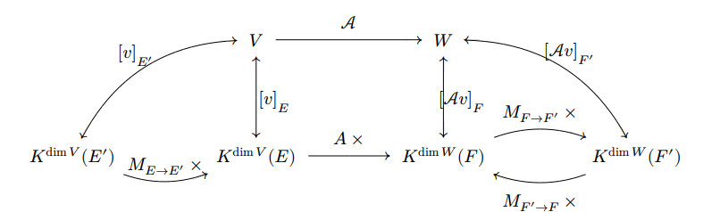

# tickets

## Принятые обозначения

Если $A\in K^{ n \times m}$ (например, $A\in \mathbb{R}^{n	\times m}$), то $A[i,]$ — $i$-я строка, $A[,j]$ — $j$-й столбец, а элемент матрицы можно писать как $A[i,j]$ или $a_{ij}\in A$. Наборы всех строк и столбцов будем обозначать так:
$$
\{A[i,]\}_{i=1}^n,\qquad \{A[,j]\}_{j=1}^m.
$$

## 1. Свойства матриц перехода между базисами

Опр.: $\varepsilon$ - базис $\Leftrightarrow$ $f_{\varepsilon}$ - биекция

$[v]_{\varepsilon} = f_{\varepsilon}^{-1} (v)$

Пусть $e=(e_1,\dots,e_n)$, $f=(f_1,\dots,f_n)$ — базисы $V$. Матрица перехода $\mathcal{M}_{e\to f}$ определяется равенством
$$
f=e\mathcal{M}_{e\to f}.
$$
Её столбец $\mathcal{M}_{e\to f}[,j]$ — координаты $f_j$ в базисе $e$.

Свойства:
$$
\mathcal{M}_{e\to e}=E,\qquad \mathcal{M}_{f\to e}=\mathcal{M}_{e\to f}^{-1},
$$
$$
\mathcal{M}_{e\to g}=\mathcal{M}_{e\to f}\mathcal{M}_{f\to g}.
$$

Доказательство обратимости: если $f=e\mathcal{M}_{e\to f}$, то столбцы $\{\mathcal{M}_{e\to f}[,j]\}_{j=1}^n$ — координаты базиса $f$, значит линейно независимы. Поэтому $\mathcal{M}_{e\to f}\in GL_n(K)$.

Пример: если $f_1=e_1+e_2,\ f_2=e_1-e_2$, то
$$
\mathcal{M}_{e\to f}=
\begin{pmatrix}
1&1\\
1&-1
\end{pmatrix}.
$$

---

## 2. Изменение координат вектора при замене базиса

Пусть $f=e\mathcal{M}_{e\to f}$. Тогда для любого $x\in V$:
$$
x=e[x]_e=f[x]_f=e\mathcal{M}_{e\to f}[x]_f.
$$
Так как $e$ — базис, получаем:
$$
[x]_e=\mathcal{M}_{e\to f}[x]_f.
$$
Отсюда
$$
[x]_f=\mathcal{M}_{e\to f}^{-1}[x]_e=\mathcal{M}_{f\to e}[x]_e.
$$

Главная ловушка: $\mathcal{M}_{e\to f}$ составлена из координат нового базиса $f$ в старом $e$, но переводит координаты вектора из нового базиса в старый.

---

## 3. Ранг набора векторов. Столбцовый и строчный ранг матрицы

Ранг набора $v_1,\dots,v_m$:
$$
\mathrm{rank}(v_1,\dots,v_m)=\dim\langle v_1,\dots,v_m\rangle.
$$
То есть это максимальное число линно независимых векторов, выбираемых из набора.

Пр.: $\mathrm{rank} (v_1, \dots, v_n)$ всегда совпадает с максимальной ЛНС векторов среди $\{v_i\}^n$

$\triangleright$

$$
Let \; \{v_{ij}\}^n - \max \text{ЛНС, состоящая в-в набора} \; v_1, \dots, v_n \\

(!): <v_{ij}>^l = V \\

v \in V \Rightarrow v_{i1}, \dots, v_{il}, v - \text{ЛНС} \Rightarrow \\

\Rightarrow v \in <v_{ij}>^l \Rightarrow v_{ij} - \text{базис} V

\tag*{$\blacksquare$}
$$

Для матрицы $A\in K^{n\times m}$:

- столбцовый ранг — ранг набора столбцов $\{A[,j]\}_{j=1}^m$;
- строчный ранг — ранг набора строк $\{A[i,]\}_{i=1}^n$.

Всегда
$$
\mathrm{rank} A\le \min(m,n).
$$

Элементарные преобразования строк соответствуют умножению слева на обратимую матрицу и не меняют ранг. Элементарные преобразования столбцов соответствуют умножению справа на обратимую матрицу.

---

## 4. Равенство столбцового и строчного ранга

Теорема: для любой матрицы столбцовый ранг равен строчному.

Доказательство. Приведём матрицу $A$ элементарными преобразованиями строк к ступенчатому виду $B$. В ступенчатой матрице число ненулевых строк равно числу ведущих столбцов. Ненулевые строки образуют базис пространства строк, а ведущие столбцы отвечают независимым направлениям столбцов. Значит строчный и столбцовый ранги $B$ равны. Так как элементарные преобразования не меняют ранг, равенство верно и для $A$.

Итог: можно говорить просто «ранг матрицы».

---

## 5. Ранг произведения матриц. Связь ранга с PDQ-разложением

Для совместимых матриц:
$$
\mathrm{rank}(AB)\le \mathrm{rank} A,\qquad \mathrm{rank}(AB)\le \mathrm{rank} B.
$$

Первое неравенство: столбцы $\{(AB)[,j]\}_{j=1}^k$ являются линейными комбинациями столбцов $\{A[,j]\}_{j=1}^n$, значит
$$
\langle \{(AB)[,j]\}_{j=1}^k\rangle\subseteq \langle \{A[,j]\}_{j=1}^n\rangle.
$$

Второе: $AB$ — композиция
$$
K^k\xrightarrow{B}K^n\xrightarrow{A}K^m,
$$
а образ композиции не может иметь размерность больше образа первого отображения.

Сл.: $U \in \mathrm{GL}_n(K) \Rightarrow \mathrm{rank}(UA) = \mathrm{rank}(A)$

Пр.: $U \in M_n(K) \Rightarrow (U \in \mathrm{GL}_n(K) \Leftrightarrow \mathrm{rank}A = n)$

PDQ-разложение:
$$
PAQ=D=
\begin{pmatrix}
E_r&0\\
0&0
\end{pmatrix},
$$
где $P,Q$ обратимы. Тогда
$$
\mathrm{rank} A=r.
$$
Умножение на обратимые матрицы не меняет ранг, а ранг $D$ равен числу единиц в диагональном блоке.

---

## 6. Условия, эквивалентные обратимости матрицы

Для $A\in M_n(K)$ эквивалентны:

1. $A$ обратима.
2. $\det A\ne0$.
3. $\mathrm{rank} A=n$.
4. Столбцы $\{A[,j]\}_{j=1}^n$ образуют базис $K^n$.
5. Строки $\{A[i,]\}_{i=1}^n$ образуют базис $K^n$.
6. $\ker A=\{0\}$.
7. $Ax=b$ имеет единственное решение для любого $b$.
8. $x\mapsto Ax$ инъективно.
9. $x\mapsto Ax$ сюръективно.
10. $x\mapsto Ax$ биективно.

1-2-3-4-5-6-7-8

8-5-9

9-5-8

8-9+8-10-1

Доказательство цепочкой: обратимость даёт нулевое ядро; нулевое ядро означает независимость столбцов $\{A[,j]\}_{j=1}^n$; $n$ независимых столбцов в $K^n$ образуют базис; значит отображение сюръективно; в конечной размерности инъективность и сюръективность эквивалентны. Связь с определителем следует из
$$
A\operatorname{adj}A=(\det A)E.
$$

---

## 7. Минорный ранг

Минор порядка $r$ — определитель некоторой $r\times r$-подматрицы.

Минорный ранг — максимальный порядок ненулевого минора.

Теорема:
$$
\mathrm{rank} A=\max\{r:\text{у }A\text{ есть ненулевой минор порядка }r\}.
$$

Доказательство. Пусть $\mathrm{rank} A=r$. Тогда среди $\{A[,j]\}_{j=1}^m$ есть $r$ линейно независимых столбцов. В подматрице из этих столбцов есть $r$ линейно независимых строк. Соответствующая квадратная $r\times r$-матрица имеет ранг $r$, значит её определитель ненулевой. Если бы был ненулевой минор порядка $s>r$, то соответствующая подматрица имела бы ранг $s$, значит $\mathrm{rank} A\ge s$, противоречие.

### BETTER

Теорема: $A \in K^{m \times n}, \mathrm{rank} A = r \Rightarrow \exists M \subseteq A \neq 0 \; \text{порядка} \; r \; \And \; \not\exists M \subseteq A \; \text{порядка} \, > r$

$\triangleright$

$$
\mathrm{rank} A = r \Rightarrow \exists j_1, \dots, j_r: A[,j_1], \dots, A[,j_r] - \text{ЛНС} \\

\text{Let} \; A' \leftrightharpoons A[,j_k]_{k=1}^r \in K^{m \times r}, \text{ее столбцы - ЛНС} \Rightarrow \\

\Rightarrow \mathrm{rank} A' = r \Rightarrow |A'| \neq 0 = |A'[i_1, \dots, i_r]| - \text{один из миноров }\, A \, \text{порядка} \; r \\

\text{Let} \; s > r, \diamond s = \max (m,n) \Rightarrow \text{Let} \; B = A[i_1, \dots, i_s; j_1, \dots j_s] \\

A[,j_1], \dots - \text{ЛЗС} \Rightarrow \text{ее столбцы - ЛЗС} \; \Rightarrow \\

\Rightarrow B \text{- ЛЗС (все столбцы)} \Rightarrow \mathrm{rank} B \leq s \Rightarrow |B| = 0 
\tag*{$\blacksquare$}
$$

---

## 8. Теорема Кронекера-Капелли

Для системы
$$
Ax=b
$$
с расширенной матрицей $(A|b)$:
$$
Ax=b\text{ совместна}\iff \mathrm{rank} A=\mathrm{rank}(A|b).
$$

Доказательство. Пусть столбцы $A$ — это $A[,1],\dots,A[,n]$. Система означает:
$$
x_1A[,1]+\dots+x_nA[,n]=b.
$$
То есть $b$ лежит в линейной оболочке столбцов $\{A[,j]\}_{j=1}^n$. Это равносильно тому, что добавление столбца $b$ не увеличивает ранг.

Если система совместна и $x_0$ — одно решение, то все решения:
$$
x_0+\ker A.
$$

Другое доказательство. 

$\Rightarrow$

Совместна $\Rightarrow \ \exists x : $

$$A[, 1] \cdot x_1 + A[, 2] \cdot x_2 + \dots + A[, n] \cdot x_n = b$$

$$\mathrm{Lin} \{A[, i] \} = \mathrm{Lin} \{ A[, i], \ b\} \Rightarrow \ \mathrm{rk} A = \mathrm{rk} (A \ | \ b)$$

$\Leftarrow$

$\mathrm{rk} A = \mathrm{rk} (A \ | \ b) \ \Rightarrow$

$$b \in \mathrm{Lin} \{A[, i] \} \Rightarrow \exists x : $$

$$Ax = b$$

---

## 9. Внутренняя прямая сумма линейных подпространств, эквивалентные определения

Пишут
$$
V=U_1\oplus\dots\oplus U_k,
$$
если каждый $v\in V$ единственно представим как
$$
v=u_1+\dots+u_k,\qquad u_i\in U_i.
$$

Эквивалентные условия:

1. $V=U_1+\dots+U_k$ и разложение единственно.
2. Если
$$
u_1+\dots+u_k=0,\quad u_i\in U_i,
$$
то все $u_i=0$.

3.
$$
U_i\cap\sum_{j\ne i}U_j=\{0\}.
$$

4. Отображение
$$
U_1\oplus\dots\oplus U_k\to V,\quad (u_1,\dots,u_k)\mapsto u_1+\dots+u_k
$$
является изоморфизмом.

Доказательство. $\triangleright$

$1 \Rightarrow 2$

Очевидно, что у 0 - единственное разложение - 0

$2 \Rightarrow 1$

Пусть не так, 

$\exists v: $

$$v = w_1 + w_2 + \dots + w_n$$

$$v = w'_1 + w'_2 + \dots + w'_n$$

$$w_i \neq w'_i$$

$\Rightarrow$

$$0 = (w_1 - w'_1) + \dots + (w_n - w'_n)$$

Противоречие.

$1 \Rightarrow 3$

Пусть не так $\exists x \in W_k \cap \underset{i \neq k} \sum W_i $

$$x = x + 0 + \dots + 0$$

$$x = \underset {i \neq k} \sum w_k$$

Противоречие.

$3 \Rightarrow 1$

Пусть не так 

$\exists v : $

$$v = w_1 + w_2 + \dots + w_n$$

$$v = w'_1 + w'_2 + \dots + w'_n$$

Оставим только ненулевые

$$ 
0 = \underset{\neq 0} \sum (w_i - w'_i) 
$$ 

Сумма по оставшимся (их $\ge$ 2, выразим одну разность через другие $\neq0$)

$$w_i - w'_i = \underset{v_j \in W_j} \sum v_j$$

$\Rightarrow W_i \cap \underset{j \neq i} \sum W_j \neq 0$

Противоречие.

$$\tag*{$\blacksquare$}$$

---

## 10. Характеристика внутренней прямой суммы в терминах базиса

Пусть $B_i$ — базис $U_i$. Тогда
$$
V=U_1\oplus\dots\oplus U_k
$$
тогда и только тогда, когда объединение базисов
$$
B_1\cup\dots\cup B_k
$$
является базисом $V$.

Доказательство. Если сумма прямая, любой вектор раскладывается по $U_i$, а затем по $B_i$, значит объединение $B_i$ порождает $V$. Линейная независимость следует из единственности разложения нуля. Обратно, если объединение базисов — базис $V$, то координатное разложение единственно, значит сумма прямая.

Следствие:
$$
\dim V=\dim U_1+\dots+\dim U_k.
$$

---

## 11. Связь внутренней и внешней прямой суммы

Внешняя прямая сумма $U_1\oplus\dots\oplus U_k$ — это пространство кортежей
$$
(u_1,\dots,u_k),\qquad u_i\in U_i,
$$
с покомпонентными операциями.

Если $U_i\subseteq V$, есть естественное отображение:
$$
\varphi:U_1\oplus\dots\oplus U_k\to V,
$$
$$
\varphi(u_1,\dots,u_k)=u_1+\dots+u_k.
$$

Тогда $V$ является внутренней прямой суммой $U_i$ тогда и только тогда, когда $\varphi$ — изоморфизм. Сюръективность означает, что $V$ является суммой подпространств, а инъективность — что нулевой вектор имеет только тривиальное разложение.

---

## 12. Линейные отображения. Примеры. Свойство универсальности базиса. Ядро и образ

Линейное отображение $L:U\to V$:
$$
L(x+y)=L(x)+L(y),\qquad L(\lambda x)=\lambda L(x).
$$

Примеры: умножение на матрицу, поворот, проекция, дифференцирование многочленов, нулевое отображение, тождественное отображение.

Универсальность базиса: если $e_1,\dots,e_n$ — базис $U$, а $v_1,\dots,v_n\in V$, то существует единственное линейное $L:U\to V$, такое что
$$
L(e_i)=v_i.
$$
Если $x=\sum\alpha_i e_i$, то обязательно
$$
L(x)=\sum\alpha_i v_i.
$$

Ядро и образ:
$$
\ker L=\{x:Lx=0\},
$$
$$
\Im L=\{Lx:x\in U\}.
$$
Они являются подпространствами $V$ и $W$ соотв. ($A : V \rightarrow W$)

$\triangleright$

$$
v \in \ker A: \\

v_1,v_2 \in \ker A \Rightarrow A( \lambda_1 v_1 + \lambda_2 v_2) = \lambda_1 A(v_1) + \lambda_2 A(v_2) = \lambda_1 0 + \lambda_2 0 = 0 \\

0 \in \Im A: 0 = A(0) \\

v_1, v_2 \in \Im A \Rightarrow \lambda_1 v_1 + \lambda_2 v_2 = \lambda_1 A v_1 + \lambda_2 A v_2 = A (\lambda_1 v_1 + \lambda_2 v_2) \in \Im A \\
\tag*{$\blacksquare$}
$$

Зам: $\mathrm{Iso(V,W)} \subset \mathrm{Hom}(V,W) \supset \mathcal{L} (V,W) $

---

## 13. Связь между размерностями ядра и образа. Размерность пространства решений однородной СЛУ

Теорема о ранге и дефекте:
$$
\dim U=\dim\ker L+\dim\Im L.
$$

Доказательство. Берём базис $k_1,\dots,k_s$ ядра $\ker L$ и дополняем до базиса $U$:
$$
k_1,\dots,k_s,w_1,\dots,w_r.
$$
Тогда $L(w_1),\dots,L(w_r)$ — базис образа. Они порождают образ, потому что $L(k_i)=0$. Они независимы: если $\sum a_iL(w_i)=0$, то $\sum a_iw_i\in\ker L$, что противоречит независимости полного базиса, если не все $a_i=0$.

T: Для однородной системы $Ax=0$, где $A:K^n\to K^m$:
$$
\dim\{x:Ax=0\}=n-\mathrm{rank} A.
$$

$\triangleright$

$$
X = \{
        \begin{pmatrix}
        x_1 \\
        \vdots \\
        x_n
        \end{pmatrix} \; | \; A \cdot 
        \begin{pmatrix}
            x_1 \\
            \vdots \\
            x_n
        \end{pmatrix} = 
        \begin{pmatrix}
            0 \\
            \vdots \\
            0
        \end{pmatrix} 
    \} = \ker (A: K^n \longrightarrow K^m) \\

\dim X = \sim K^n - \dim \Im (A) = n - \dim <A[,j]>_{i=1}^n = n - \mathrm{rank} A
\tag*{$\blacksquare$}
$$

---

## 14. Инъективные и сюръективные линейные отображения. Принцип Дирихле для линейных операторов

Пр.:

$$
L\text{ инъективно}\iff \ker L=\{0\}.
$$

$\triangleright$

$$
\Rightarrow: \\

|A^{-1} (0)| \leq 1; 0 \in \ker A \Rightarrow \\

\ker A = 0

\Leftarrow: \\

\text{Let} \; A v_1 = A v_2, A(v_1 - v_2) = Av_1 - A v_2 = 0 \Rightarrow \\

\Rightarrow v_1 - v_2 \in \ker A = 0 \Rightarrow \

\Rightarrow v_1 = v_2 \Rightarrow A \in \mathrm{Inj} (V, W)
\tag*{$\blacksquare$}
$$

$$
L\text{ сюръективно}\iff \Im L=V.
$$

Пр.: $A \in \mathcal{L} (V, W); (e_i)^n_{i=1} - \text{базис} V \Rightarrow$

1. $A \in \mathcal{Inj} \Leftrightarrow \{Ae_i\}^n - \text{ЛНС} \; W$

2. $A \in \mathcal{Surj} \Leftrightarrow \{Ae_i\}^n - \text{СО} \; W$

3. $A \in \mathcal{Bij} \Leftrightarrow \{Ae_i\}^n - \text{базис} \; W$

T (Принцип Дирихле для ВП): Если $\dim U=\dim V<\infty$, то
$$
L\text{ инъективно}\iff L\text{ сюръективно}.
$$

Доказательство:
$$
\dim U=\dim\ker L+\dim\Im L.
$$
Если ядро нулевое, то $\dim\Im L=\dim U=\dim V$, значит $\Im L=V$. Если $L$ сюръективно, то $\dim\Im L=\dim V=\dim U$, значит $\dim\ker L=0$.

Для оператора $V\to V$ это и есть линейный принцип Дирихле.

---

## 15. Изменение координат вектора под действием линейного отображения

Пусть $L:U\to V$, $e$ — базис $U$, $f$ — базис $V$. Матрица $[L]^e_f$ определяется формулой
$$
[L(x)]_f=[L]^e_f[x]_e.
$$

Её столбец $[L]^e_f[,j]$ — координаты $L(e_j)$ в базисе $f$.

Доказательство: если
$$
x=e[x]_e,
$$
то
$$
L(x)=L(e[x]_e)=L(e)[x]_e.
$$
Переходя к координатам в базисе $f$, получаем нужную формулу.

Пр.: $[A]_{E,F} = A; v \in V \Rightarrow [Av]_{F} = A[v]_E$

$\triangleright$
$$
v=E[v]_E \Rightarrow Av = (AE)[v]_E=(FA)[v]_E = F(A[v]_E) \Rightarrow
$$
$$
\Rightarrow [Av]_F = A[v]_E
\tag*{$\blacksquare$}
$$

---

## 16. Матрица линейного отображения. Матрица композиции

Для $L:U\to V$ матрица $[L]^e_f$ задаётся своими столбцами:
$$
[L]^e_f[,j]=[L(e_j)]_f,\qquad j=1,\dots,n.
$$

Пр.: Если
$$
U\xrightarrow{A}V\xrightarrow{B}W,
$$

$e,f,g -$ базисы $U,V,W$
то
$$
[B\circ A]^e_g=[B]^f_g[A]^e_f.
$$

Доказательство:
$$
Ae = f[A]_{e,f} \Rightarrow (BA)e = (BF)[A]_{e.f} = g[B]_{f,g} [A]_{e,f}
$$

$$
Bf = g[B]_{f,g} \Rightarrow g[BA]_{e,g} = g[B]_{f,g}[A]_{e,f}
$$
$g$ - базис $\Rightarrow$
$$
[BA]_{e,g} = [B]_{f,g}[A]_{e,f}
\tag*{$\blacksquare$}
$$
По единственности матрицы линейного отображения получаем формулу.

---

## 17. Изменение матрицы линейного отображения при замене базисов

Пусть $L:U\to V$. В $U$ базисы $e,e'$, в $V$ базисы $f,f'$. Тогда
$$
[L]^{e'}_{f'}=\mathcal{M}_{f'\to f}[L]^e_f\mathcal{M}_{e\to e'}.
$$

Доказательство:
$$
[x]_e=\mathcal{M}_{e\to e'}[x]_{e'},
$$
$$
[Lx]_{f'}=\mathcal{M}_{f'\to f}[Lx]_f.
$$
Тогда
$$
[Lx]_{f'}=\mathcal{M}_{f'\to f}[L]^e_f\mathcal{M}_{e\to e'}[x]_{e'}.
$$

Для оператора $A:V\to V$:
$$
[A]_{e'}=\mathcal{M}_{e'\to e}[A]_e\mathcal{M}_{e\to e'}.
$$
Это отношение подобия.

---

## 18. Пространство линейных отображений. Изоморфизм с пространством матриц

T.: $A \in \mathcal{L}(V,W); \dim V = n < \infty; \dim W = m < \infty \Rightarrow \exists E,F -$базисы $V,W:$

$$
[A]_{E,F} = \begin{pmatrix} E_r & 0 \\
0 & 0
\end{pmatrix},
$$для некоторого $r$

$\triangleright$
$$
\text{Let} \; E_0, F_0 - \text{базисы} \; V,W: [A]_{E_0, F_0} \rightleftharpoons A \Rightarrow
$$
$$
\Rightarrow \exists P, Q: P \in \mathrm{GL}_n(K), Q \in \mathrm{GL}_m(K):
$$
$$
PAQ = D = \begin{pmatrix} E_r & 0 \\
0 & 0
\end{pmatrix}
$$
$$
\exists F: \mathcal{M}_{F_0 \rightarrow F} = Q; \; \exists E: \mathcal{M}_{E_0 \rightarrow E} = P^{-1} \Rightarrow
$$
$$
\Rightarrow [A]_{E, F} = (P^{-1})^{-1} A Q = PAQ = D
\tag*{$\blacksquare$}
$$

Опр.:
$$
\operatorname{Hom}(U,V)
$$
— пространство всех линейных отображений $U\to V$. (строго говоря, гомоморфизмов, но в нашем курсе отождествляется $\mathcal{L}(V,W)$, тк. в $\mathrm{Vect}_K$ это суть одно и то же)

Операции:
$$
(L+M)(x)=Lx+Mx,\qquad (\lambda L)(x)=\lambda Lx.
$$

Если $\dim U=n,\ \dim V=m$, то выбор базисов даёт изоморфизм:
$$
\operatorname{Hom}(U,V)\cong M_{m\times n}(K),
$$
$$
L\mapsto [L]^e_f.
$$

Инъективность: одинаковые матрицы дают одинаковые образы базиса. Сюръективность: по любой матрице задаём образы базисных векторов и продолжаем линейно.

Следствие:
$$
\dim\operatorname{Hom}(U,V)=mn.
$$

---

## 19. Линейные операторы. Инвариантные подпространства

Линейный оператор — это линейное отображение, $\mathrm{Hom}(V,W) = \mathrm{End}(V)$
$$
A:V\to V.
$$
Пр.: $E$ - базис $V$, $\mathrm{End} V \underset{A \mapsto [A]_E}{\overset{\varepsilon_V}{\longrightarrow}} M_n(K)$
Легко видеть, что $\varepsilon_v \in \mathrm{Iso}(\mathrm{End} V, K)$ (колец)

Пр.: $(\mathrm{End} V, +, \cdot)$ - КА с 1 = $\varepsilon_V$
$\varepsilon_E (BA) = [BA]_{E,E} = [B]_{E,E} [A]_{E,E} = \varepsilon_E (B) \varepsilon_E (A)$

Пр.: Подпространство $U\subseteq V$ называется $A$-инвариантным, если $\forall u \in U: Au \in U$
$$
A(U)\subseteq U.
$$
Пр.: $V = W_1 \oplus W_2; (e_i)_{i=1}^m -$ базис $W_1; (e_{m+i})_{i=1}^{n-m} -$ базис $W_2; E = (e_i)_{i=1}^n \Rightarrow$ (след. эквивалентно)
	1.  $W_1 \; \And \; W_2$ A-инв
	2. $[A]_E = \begin{pmatrix}  B & 0 \\ 0 & C\end{pmatrix}, B \in M_m(K); C \in M_{n-m}(K)$
(доказывается также как и предложение в конце билета)

Опр.: $W$ - A-инв, Индуцированным оператором пространства $W$ наз.
$$
A_1 : W \underset{w \mapsto A_1w}{\longrightarrow} W
$$
Легко видеть, что $A_1 \in \mathrm{End} W$
$[A_1]_{e_1, \dots, e_m} =B; [A_2]_{e_{m+1}, \dots, e_n} =C, A_2$ - индуцировано по $W_2$

Опр.: $A, A' \in M_n(K)$ наз. подобными, если $\exists C \in \mathrm{GL}_n(K): A' = C^{1}AC$

Пр.: $C = \mathcal{M}_{E \rightarrow E'}; [A]_E = A \Rightarrow [A]_{E'} = C^{-1} A C$

Примеры:

- $\{0\}$ и $V$;
- $\langle v\rangle$, если $v$ — собственный вектор;
- $\ker A$;
- $\Im A$;
- $\ker p(A)$ и $\Im p(A)$ для многочлена $p$.

Если $U$ инвариантно, то можно рассматривать ограничение
$$
A|_U:U\to U.
$$
Пр.: В базисе, начинающемся с базиса $U$, матрица $A$ имеет блочно-верхнетреугольный вид.

---

## 20. Кольцо линейных операторов

$$
\operatorname{End}(V)=\operatorname{Hom}(V,V).
$$

Операции:

- сложение поточечно;
- умножение — композиция:
$$
(AB)(x)=A(Bx).
$$

Это ассоциативное кольцо с единицей $\operatorname{id}_V$, вообще говоря некоммутативное.

После выбора базиса $e$:
$$
\operatorname{End}(V)\cong M_n(K),
$$
$$
A\mapsto [A]_e.
$$

Причём:
$$
[A+B]=[A]+[B],
$$
$$
[\lambda A]=\lambda[A],
$$
$$
[AB]=[A][B].
$$

---

## 21. Собственные значения. Линейная независимость собственных векторов, принадлежащих разным собственным значениям. Следствия

$\lambda\in K$ — собственное значение $A$, если есть $v\ne0$:
$$
Av=\lambda v.
$$

Собственное подпространство:
$$
V_\lambda=\ker(A-\lambda E).
$$

Теорема: собственные векторы, соответствующие попарно различным собственным значениям, линейно независимы.

Доказательство: пусть есть минимальная нетривиальная зависимость
$$
\alpha_1v_1+\dots+\alpha_kv_k=0.
$$
Применяем $A$:
$$
\alpha_1\lambda_1v_1+\dots+\alpha_k\lambda_kv_k=0.
$$
Вычитаем исходное равенство, умноженное на $\lambda_k$, и получаем более короткую зависимость. Противоречие.

Следствия: если у оператора на $n$-мерном пространстве есть $n$ различных собственных значений, он диагонализируем; сумма разных собственных подпространств прямая.

---

## 22. Диагонализируемые операторы. Критерий диагонализируемости в терминах геометрических кратностей

Оператор диагонализируем, если существует базис из собственных векторов.

Геометрическая кратность:
$$
g_\lambda=\dim\ker(A-\lambda E).
$$

Критерий:
$$
A\text{ диагонализируем}\iff V=\bigoplus_\lambda V_\lambda.
$$
Эквивалентно:
$$
\sum_\lambda g_\lambda=\dim V.
$$

Доказательство: если есть базис из собственных векторов, группируем его по собственным значениям. Обратно, если сумма размерностей собственных подпространств равна $\dim V$, берём базис в каждом $V_\lambda$; их объединение — базис всего пространства.

---

## 23. Характеристический многочлен линейного оператора. Алгебраическая кратность собственного значения

Характеристический многочлен:
$$
\chi_A(t)=\det(tE-A).
$$

Он не зависит от базиса: если $B=\mathcal{M}^{-1}A\mathcal{M}$, то
$$
\det(tE-B)=\det(C^{-1}(tE-A)C)=\det(tE-A).
$$

$\lambda$ — собственное значение тогда и только тогда, когда
$$
\chi_A(\lambda)=0.
$$

Действительно:
$$
\chi_A(\lambda)=0\iff \det(\lambda E-A)=0
$$
$$
\iff \lambda E-A\text{ необратима}
$$
$$
\iff \ker(A-\lambda E)\ne0.
$$

Алгебраическая кратность $a_\lambda$ — кратность $\lambda$ как корня $\chi_A(t)$.

---

## 24. Связь между алгебраической и геометрической кратностями собственного значения

Для собственного значения $\lambda$:
$$
1\le g_\lambda\le a_\lambda.
$$

Доказательство. Пусть $g=g_\lambda$. Возьмём базис собственного подпространства $V_\lambda$ и дополним его до базиса $V$. В этом базисе:
$$
A=
\begin{pmatrix}
\lambda E_g&*\\
0&B
\end{pmatrix}.
$$
Тогда
$$
\chi_A(t)=
\det
\begin{pmatrix}
(t-\lambda)E_g&*\\
0&tE-B
\end{pmatrix}
=
(t-\lambda)^g\det(tE-B).
$$
Значит $(t-\lambda)^g$ делит характеристический многочлен, поэтому
$$
g_\lambda\le a_\lambda.
$$

Пример:
$$
\begin{pmatrix}
1&1\\
0&1
\end{pmatrix}
$$
имеет $a_1=2$, но $g_1=1$.

---

## 25. Критерий диагонализируемости в терминах геометрических и алгебраических кратностей. Примеры недиагонализируемых операторов

Критерий:
$$
A\text{ диагонализируем}
$$
тогда и только тогда, когда:

1. $\chi_A(t)$ раскладывается на линейные множители над $K$;
2. для каждого собственного значения
$$
g_\lambda=a_\lambda.
$$

Если $A$ диагонализируем, то на диагонали стоят собственные значения, и кратность $\lambda$ на диагонали равна и алгебраической, и геометрической кратности.

Обратно:
$$
\sum_\lambda g_\lambda=\sum_\lambda a_\lambda=n,
$$
значит собственных векторов хватает на базис.

Примеры недиагонализируемых:

$$
\begin{pmatrix}
1&1\\
0&1
\end{pmatrix}
$$
не диагонализируема, так как $g_1<a_1$.

Поворот плоскости на $90^\circ$ над $\mathbb R$ не диагонализируем, потому что $\chi(t)=t^2+1$ не раскладывается над $\mathbb R$.

---

## 26. Жорданова нормальная форма (формулировка теоремы)

Над алгебраически замкнутым полем всякий оператор имеет базис, в котором его матрица является прямой суммой жордановых блоков:
$$
J_m(\lambda)=
\begin{pmatrix}
\lambda&1&0&\cdots&0\\
0&\lambda&1&\cdots&0\\
\cdots&&\ddots&\ddots&\cdots\\
0&\cdots&0&\lambda&1\\
0&\cdots&0&0&\lambda
\end{pmatrix}.
$$

То есть
$$
A\sim \operatorname{diag}(J_{m_1}(\lambda_1),\dots,J_{m_s}(\lambda_s)).
$$

Жорданова форма единственна с точностью до перестановки блоков.

Оператор диагонализируем тогда и только тогда, когда все жордановы блоки имеют размер $1$.

---

## 27. Циклические подпространства

Для оператора $A$ и вектора $v$:
$$
Z(v)=\langle v,Av,A^2v,\dots\rangle
$$
— циклическое подпространство, порождённое $v$.

Оно $A$-инвариантно, потому что
$$
A(A^kv)=A^{k+1}v.
$$

Это наименьшее $A$-инвариантное подпространство, содержащее $v$: всякое инвариантное подпространство, содержащее $v$, содержит все $A^kv$.

Если
$$
v,Av,\dots,A^{r-1}v
$$
линейно независимы, а
$$
A^rv=a_0v+\dots+a_{r-1}A^{r-1}v,
$$
то эти $r$ векторов образуют базис $Z(v)$.

---

## 28. Теорема Гамильтона — Кэли

Теорема:
$$
\chi_A(A)=0.
$$

Если
$$
\chi_A(t)=t^n+c_{n-1}t^{n-1}+\dots+c_0,
$$
то
$$
A^n+c_{n-1}A^{n-1}+\dots+c_0E=0.
$$

Доказательство через ЖНФ: над алгебраическим замыканием $A\sim J$. Для многочлена $p$:
$$
p(\mathcal{M}^{-1}A\mathcal{M})=\mathcal{M}^{-1}p(A)\mathcal{M}.
$$
Значит достаточно проверить теорему для жордановых блоков. Для блока
$$
J_m(\lambda)=\lambda E+N,\qquad N^m=0.
$$
В характеристическом многочлене есть множитель $(t-\lambda)^m$, который зануляет соответствующий блок. Поэтому вся жорданова форма зануляется характеристическим многочленом.

---

## 29. Порядки элементов и циклические подгруппы

Порядок элемента $g\in G$:
$$
\operatorname{ord}(g)=\min\{n>0:g^n=e\},
$$
если такое $n$ существует. Иначе порядок бесконечен.

Циклическая подгруппа:
$$
\langle g\rangle=\{g^k:k\in\mathbb Z\}.
$$

Если $\operatorname{ord}(g)=n$, то
$$
\langle g\rangle=\{e,g,\dots,g^{n-1}\},
$$
и
$$
|\langle g\rangle|=n.
$$

Также
$$
g^a=g^b\iff a\equiv b\pmod n.
$$

Если порядок бесконечен, то все $g^k$ различны, и
$$
\langle g\rangle\cong\mathbb Z.
$$

---

## 30. Подгруппа, порождённая подмножеством

Для $S\subseteq G$:
$$
\langle S\rangle
$$
— наименьшая подгруппа $G$, содержащая $S$.

Эквивалентно:
$$
\langle S\rangle=\bigcap_{H\le G,\ S\subseteq H}H.
$$

Явно:
$$
\langle S\rangle=
\{s_1^{\varepsilon_1}\dots s_m^{\varepsilon_m}:s_i\in S,\ \varepsilon_i=\pm1\}.
$$

То есть это все конечные слова из элементов $S$ и обратных к ним.

Доказательство: любая подгруппа, содержащая $S$, обязана содержать обратные элементы и конечные произведения. Множество всех таких слов само является подгруппой.

---

## 31. Левые и правые смежные классы. Индекс подгруппы

Пусть $H\le G$.

Левый смежный класс:
$$
gH=\{gh:h\in H\}.
$$

Правый смежный класс:
$$
Hg=\{hg:h\in H\}.
$$

Свойства:

$$
g_1H=g_2H\iff g_2^{-1}g_1\in H.
$$

Левые смежные классы либо совпадают, либо не пересекаются. Все они имеют мощность $|H|$, так как
$$
H\to gH,\quad h\mapsto gh
$$
— биекция.

Индекс:
$$
[G:H]=\text{число левых смежных классов}.
$$

Если $G$ конечна:
$$
|G|=[G:H]|H|.
$$

---

## 32. Теорема Лагранжа и следствия из неё

Если $G$ — конечная группа и $H\le G$, то
$$
|H|\mid |G|.
$$

Более точно:
$$
|G|=[G:H]|H|.
$$

Доказательство: смежные классы по $H$ разбивают $G$, и каждый имеет $|H|$ элементов.

Следствия:

1. Порядок любого элемента делит порядок группы:
$$
\operatorname{ord}(g)=|\langle g\rangle|\mid |G|.
$$

2.
$$
g^{|G|}=e.
$$

3. Если $|G|=p$, где $p$ простое, то $G\cong C_p$: любой $g\ne e$ имеет порядок $p$, значит порождает всю группу.

---

## 33. Нормальные подгруппы

Подгруппа $N\le G$ нормальна, если
$$
gN=Ng
$$
для всех $g\in G$.

Эквивалентно:
$$
gNg^{-1}=N.
$$

Достаточно проверять:
$$
gng^{-1}\in N
$$
для всех $g\in G,\ n\in N$.

Примеры:

- $\{e\}$ и $G$;
- любая подгруппа абелевой группы;
- ядро гомоморфизма;
- $A_n\triangleleft S_n$.

Ядро нормально: если $k\in\ker\varphi$, то
$$
\varphi(gkg^{-1})=\varphi(g)\varphi(k)\varphi(g)^{-1}=e.
$$

---

## 34. Факторгруппа

Если $N\triangleleft G$, то факторгруппа
$$
G/N=\{gN:g\in G\}
$$
с операцией
$$
(gN)(hN)=ghN.
$$

Корректность использует нормальность. Если $g'=gn_1$, $h'=hn_2$, то
$$
g'h'=gn_1hn_2=gh(h^{-1}n_1h)n_2.
$$
Так как $N$ нормальна, $h^{-1}n_1h\in N$, значит $g'h'\in ghN$.

Нейтральный элемент:
$$
N=eN.
$$

Обратный:
$$
(gN)^{-1}=g^{-1}N.
$$

Каноническая проекция:
$$
\pi:G\to G/N,\quad g\mapsto gN
$$
— гомоморфизм с ядром $N$.

---

## 35. Гомоморфизм, образ и ядро

Гомоморфизм групп:
$$
\varphi:G\to H,
$$
такой что
$$
\varphi(ab)=\varphi(a)\varphi(b).
$$

Свойства:
$$
\varphi(e_G)=e_H,
$$
$$
\varphi(g^{-1})=\varphi(g)^{-1}.
$$

Образ:
$$
\Im\varphi=\{\varphi(g):g\in G\}
$$
— подгруппа $H$.

Ядро:
$$
\ker\varphi=\{g\in G:\varphi(g)=e_H\}
$$
— нормальная подгруппа $G$.

Критерий инъективности:
$$
\varphi\text{ инъективен}\iff \ker\varphi=\{e\}.
$$

---

## 36. Канонические гомоморфизмы. Индуцированный гомоморфизм, разложение гомоморфизма

Канонический гомоморфизм:
$$
\pi:G\to G/N,\quad g\mapsto gN,
$$
где $N\triangleleft G$.

Если $\varphi:G\to H$, $N\triangleleft G$, $N\subseteq\ker\varphi$, то существует единственный индуцированный гомоморфизм
$$
\overline\varphi:G/N\to H
$$
такой, что
$$
\varphi=\overline\varphi\circ\pi.
$$

Он задаётся формулой:
$$
\overline\varphi(gN)=\varphi(g).
$$

Корректность: если $gN=g'N$, то $g'=gn$, $n\in N$, значит
$$
\varphi(g')=\varphi(g)\varphi(n)=\varphi(g).
$$

Разложение:
$$
G\to G/\ker\varphi\to \Im\varphi\hookrightarrow H.
$$

---

## 37. Теорема о гомоморфизме

Для гомоморфизма групп $\varphi:G\to H$:
$$
G/\ker\varphi\cong \Im\varphi.
$$

Изоморфизм:
$$
g\ker\varphi\mapsto \varphi(g).
$$

Корректность: если
$$
g\ker\varphi=g'\ker\varphi,
$$
то $g'=gk$, где $k\in\ker\varphi$, значит
$$
\varphi(g')=\varphi(g).
$$

Сюръективность очевидна по определению образа.

Инъективность: если
$$
\varphi(g)=e,
$$
то $g\in\ker\varphi$, то есть соответствующий смежный класс — единичный.

---

## 38. Применение теоремы о гомоморфизме к классификации циклических групп

Пусть
$$
G=\langle g\rangle.
$$

Рассмотрим гомоморфизм:
$$
\varphi:\mathbb Z\to G,
$$
$$
n\mapsto g^n.
$$

Он сюръективен.

Если $g$ имеет бесконечный порядок, то
$$
\ker\varphi=0,
$$
и
$$
G\cong\mathbb Z.
$$

Если $\operatorname{ord}(g)=m$, то
$$
\ker\varphi=m\mathbb Z,
$$
и
$$
G\cong\mathbb Z/m\mathbb Z.
$$

Итак, всякая циклическая группа изоморфна либо $\mathbb Z$, либо $\mathbb Z/n\mathbb Z$.

---

## 39. Теорема о соответствии

Пусть $N\triangleleft G$. Подгруппы $G/N$ взаимно однозначно соответствуют подгруппам $H\le G$, содержащим $N$.

Соответствие:
$$
H\mapsto H/N,
$$
$$
\overline H\mapsto \pi^{-1}(\overline H).
$$

Нормальность сохраняется:
$$
H\triangleleft G\iff H/N\triangleleft G/N.
$$

Если $H\triangleleft G$, $N\subseteq H$, то
$$
(G/N)/(H/N)\cong G/H.
$$

Идея доказательства: образ подгруппы, содержащей ядро, является подгруппой фактора; прообраз подгруппы фактора является подгруппой исходной группы. Эти операции взаимно обратны.

---

## 40. Теорема о факторгруппе факторгруппы

Пусть
$$
N\triangleleft G,\qquad H\triangleleft G,\qquad N\subseteq H.
$$

Тогда
$$
H/N\triangleleft G/N,
$$
и
$$
(G/N)/(H/N)\cong G/H.
$$

Доказательство. Зададим
$$
\psi:G/N\to G/H,
$$
$$
\psi(gN)=gH.
$$

Корректность следует из $N\subseteq H$.

Отображение сюръективно. Его ядро:
$$
\ker\psi=\{gN:gH=H\}=H/N.
$$

По теореме о гомоморфизме:
$$
(G/N)/(H/N)\cong G/H.
$$

---

## 41. Теорема о произведении подгрупп (формулировка)

Пусть $H,K\le G$. Их произведение:
$$
HK=\{hk:h\in H,\ k\in K\}.
$$

Теорема:
$$
HK\le G\iff HK=KH.
$$

Если $H,K\triangleleft G$, то
$$
HK\triangleleft G.
$$

Если $H,K$ конечны, то
$$
|HK|=\frac{|H||K|}{|H\cap K|}.
$$

Идея формулы: каждое $x\in HK$ имеет ровно $|H\cap K|$ представлений $x=hk$. Если $h_1k_1=h_2k_2$, то
$$
h_2^{-1}h_1=k_2k_1^{-1}\in H\cap K.
$$

---

## 42. Внутреннее прямое произведение подгрупп

Группа $G$ является внутренним прямым произведением $H$ и $K$, если:

$$
H\triangleleft G,\qquad K\triangleleft G,
$$
$$
G=HK,
$$
$$
H\cap K=\{e\}.
$$

Тогда
$$
G\cong H\times K.
$$

Изоморфизм:
$$
H\times K\to G,
$$
$$
(h,k)\mapsto hk.
$$

Почему это гомоморфизм: из нормальности и тривиального пересечения следует, что элементы $H$ и $K$ коммутируют. Коммутатор
$$
hkh^{-1}k^{-1}
$$
лежит и в $H$, и в $K$, значит равен $e$.

Сюръективность следует из $G=HK$, инъективность — из $H\cap K=\{e\}$.

---

## 43. Действие группы на множестве. Определение и примеры

Действие группы $G$ на множестве $X$:
$$
G\times X\to X,
$$
$$
(g,x)\mapsto gx,
$$
такое что
$$
ex=x,
$$
$$
g(hx)=(gh)x.
$$

Примеры:

1. $S_n$ действует на $\{1,\dots,n\}$.
2. $G$ действует на себе левыми сдвигами.
3. $G$ действует на себе сопряжениями:
$$
g\cdot x=gxg^{-1}.
$$
4. Группа симметрий фигуры действует на вершинах, рёбрах, раскрасках.
5. $GL(V)$ действует на $V$.

---

## 44. Орбиты и стабилизаторы

Пусть $G$ действует на $X$.

Орбита:
$$
\operatorname{Orb}_G(x)=\operatorname{Orb}(x)=Gx=\{gx:g\in G\}.
$$
Если группа $G$ ясна из контекста, пишем просто $\operatorname{Orb}(x)$; обозначение $Gx$ тоже допустимо.

Стабилизатор:
$$
\operatorname{Stab}_G(x)=\operatorname{Stab}(x)=\{g\in G:gx=x\}.
$$

Стабилизатор $\operatorname{Stab}_G(x)$ — подгруппа $G$.

Орбиты либо совпадают, либо не пересекаются, поэтому разбивают $X$.

Теорема орбиты-стабилизатора:
$$
|\operatorname{Orb}_G(x)|=[G:\operatorname{Stab}_G(x)].
$$

Если $G$ конечна:
$$
|\operatorname{Orb}_G(x)|=\frac{|G|}{|\operatorname{Stab}_G(x)|}.
$$

Доказательство: отображение
$$
G/\operatorname{Stab}_G(x)\to \operatorname{Orb}_G(x),
$$
$$
g\operatorname{Stab}_G(x)\mapsto gx
$$
корректно и биективно.

---

## 45. Альтернативное определение действия группы, теорема Кэли

Действие $G$ на $X$ эквивалентно гомоморфизму
$$
\rho:G\to S_X.
$$

По действию строим:
$$
\rho(g)(x)=gx.
$$

Обратно, по гомоморфизму $\rho$ задаём:
$$
gx=\rho(g)(x).
$$

Теорема Кэли: всякая группа $G$ изоморфна подгруппе симметрической группы $S_G$.

Доказательство: $G$ действует на себе левыми сдвигами:
$$
g\cdot x=gx.
$$
Получаем
$$
\rho:G\to S_G.
$$
Если $\rho(g)=\operatorname{id}$, то $gx=x$ для всех $x$, в частности при $x=e$ получаем $g=e$. Значит $\rho$ инъективен.

---

## 46. Лемма Бернсайда

Пусть конечная группа $G$ действует на конечном множестве $X$. Тогда число орбит равно
$$
\frac1{|G|}\sum_{g\in G}|\operatorname{Fix}(g)|.
$$

Здесь
$$
\operatorname{Fix}(g)=\{x\in X:gx=x\}.
$$

Доказательство. Рассмотрим пары
$$
M=\{(g,x):gx=x\}.
$$

С одной стороны:
$$
|M|=\sum_{g\in G}|\operatorname{Fix}(g)|.
$$

С другой:
$$
|M|=\sum_{x\in X}|\operatorname{Stab}_G(x)|.
$$

На одной орбите вклад равен $|G|$, потому что
$$
|\operatorname{Stab}_G(x)|=\frac{|G|}{|\operatorname{Orb}_G(x)|}.
$$

Значит
$$
|M|=|G|\cdot(\text{число орбит}).
$$

---

## 47. Центр конечной $p$-группы. Группы порядка $p^2$

Центр группы обозначаем через $Z(G)$, а если группа ясна из контекста — просто через $Z$.

Если $G$ — конечная $p$-группа, то
$$
Z=Z(G)\ne\{e\}.
$$

Доказательство. Рассмотрим действие сопряжением. Классовая формула:
$$
|G|=|Z|+\sum_i |\operatorname{Orb}_G(x_i)|,
$$
где сумма идёт по нецентральным классам сопряжённости. Размер нецентрального класса равен
$$
[G:C_G(x_i)],
$$
то есть степени $p$, большей $1$, значит делится на $p$. Так как $|G|$ делится на $p$, то $|Z|$ тоже делится на $p$, значит центр нетривиален.

Если $|G|=p^2$, то $G$ абелева. Если $|Z|=p$, то $G/Z$ циклическая, откуда $G$ абелева, противоречие. Значит $Z=G$.

Итог:
$$
G\cong C_{p^2}
$$
или
$$
G\cong C_p\times C_p.
$$

---

## 48. Теорема Коши

Если $G$ конечна и простое $p\mid |G|$, то в $G$ есть элемент порядка $p$.

Доказательство. Рассмотрим
$$
X=\{(g_1,\dots,g_p):g_1g_2\dots g_p=e\}.
$$
Тогда
$$
|X|=|G|^{p-1},
$$
значит $|X|$ делится на $p$.

Группа $C_p$ действует на $X$ циклическим сдвигом координат. Орбиты имеют размер $1$ или $p$. Неподвижные точки имеют вид
$$
(g,g,\dots,g),
$$
и условие даёт
$$
g^p=e.
$$

Число неподвижных точек делится на $p$. Одна из них — $(e,\dots,e)$, значит есть другая, с $g\ne e$. Тогда $g$ имеет порядок $p$.

---

## 49. Разрешимость конечной $p$-группы

Группа разрешима, если существует цепочка
$$
G=G_0\triangleright G_1\triangleright\dots\triangleright G_m=\{e\},
$$
где все факторы
$$
G_i/G_{i+1}
$$
абелевы.

Теорема: всякая конечная $p$-группа разрешима.

Доказательство по индукции. У конечной $p$-группы центр $Z(G)$ нетривиален. По теореме Коши в $Z(G)$ есть элемент $z$ порядка $p$. Тогда
$$
N=\langle z\rangle
$$
— центральная нормальная подгруппа порядка $p$. Фактор $G/N$ — $p$-группа меньшего порядка, значит по индукции разрешим. Так как $N$ абелева, $G$ тоже разрешима как расширение разрешимой группы абелевой нормальной подгруппой.

---

## 50. Теоремы Силова (формулировки)

Пусть
$$
|G|=p^am,\qquad p\nmid m.
$$

Подгруппа порядка $p^a$ называется силовской $p$-подгруппой.

Теоремы Силова:

1. Силовская $p$-подгруппа существует.
2. Все силовские $p$-подгруппы сопряжены.
3. Если $n_p$ — число силовских $p$-подгрупп, то
$$
n_p\equiv1\pmod p,
$$
и
$$
n_p\mid m.
$$

Следствие: если $n_p=1$, то силовская $p$-подгруппа нормальна.

---

## 51. Разложение конечной циклической группы

Пусть
$$
n=p_1^{a_1}\dots p_k^{a_k}.
$$

Тогда
$$
C_n\cong C_{p_1^{a_1}}\times\dots\times C_{p_k^{a_k}}.
$$

Это следует из китайской теоремы об остатках:
$$
\mathbb Z/n\mathbb Z\cong
\mathbb Z/p_1^{a_1}\mathbb Z\times\dots\times
\mathbb Z/p_k^{a_k}\mathbb Z.
$$

Если $\gcd(m,n)=1$, то
$$
C_m\times C_n\cong C_{mn}.
$$

Действительно, если $a,b$ — генераторы, то $(a,b)$ имеет порядок
$$
\operatorname{lcm}(m,n)=mn.
$$

---

## 52. Строение конечных и конечно порождённых абелевых групп (формулировки)

Всякая конечно порождённая абелева группа имеет вид
$$
\mathbb Z^r\oplus \mathbb Z/d_1\mathbb Z\oplus\dots\oplus \mathbb Z/d_s\mathbb Z,
$$
где
$$
d_i>1,\qquad d_i\mid d_{i+1}.
$$

Число $r$ и числа $d_i$ определены однозначно. Это форма с инвариантными множителями.

Для конечной абелевой группы $r=0$.

Эквивалентная форма через элементарные делители:
$$
G\cong \bigoplus_p\bigoplus_i \mathbb Z/p^{a_{p,i}}\mathbb Z.
$$

Пример:
$$
|G|=p^2
$$
даёт варианты
$$
C_{p^2},\qquad C_p\times C_p.
$$

---

## 53. Конечные подгруппы мультипликативной группы поля

Теорема: всякая конечная подгруппа $G\le K^\times$ циклическая.

Идея доказательства. $G$ конечная абелева. Достаточно показать, что каждая силовская $p$-подгруппа циклическая. Если $P$ не циклическая, то для некоторого $r$ уравнение
$$
x^{p^r}=1
$$
имело бы в $P$ слишком много решений. Но над полем многочлен степени $p^r$ имеет не больше $p^r$ корней. Противоречие.

Значит силовские подгруппы циклические. Прямое произведение циклических групп попарно взаимно простых порядков циклическое.

Следствие:
$$
\mathbb F_q^\times\cong C_{q-1}.
$$

---

## 54. Свободная группа, аксиоматическое определение

Свободная группа $F(X)$ на множестве $X$ — это группа с отображением
$$
i:X\to F(X),
$$
такая что для любой группы $G$ и любого отображения множеств
$$
f:X\to G
$$
существует единственный гомоморфизм
$$
\overline f:F(X)\to G
$$
со свойством
$$
\overline f\circ i=f.
$$

Это универсальное свойство свободной группы.

Смысл: элементы $X$ — свободные генераторы без дополнительных соотношений.

Единственность: если две группы удовлетворяют этому свойству, они канонически изоморфны; изоморфизмы строятся универсальностью в обе стороны.

---

## 55. Построение свободной группы

Берём алфавит
$$
X\cup X^{-1}.
$$

Слова — конечные последовательности букв. Приведённое слово не содержит соседних пар
$$
xx^{-1},\qquad x^{-1}x.
$$

Элементы $F(X)$ — приведённые слова.

Операция — конкатенация с последующим сокращением.

Единица — пустое слово.

Обратный элемент:
$$
(a_1a_2\dots a_n)^{-1}=a_n^{-1}\dots a_2^{-1}a_1^{-1}.
$$

Универсальность: любое отображение $X\to G$ продолжается на слово заменой букв их образами. Сокращения не меняют значение, поэтому получается корректный гомоморфизм.

---

## 56. Задание группы образующими и определяющими соотношениями

Пусть $X$ — генераторы, $R\subset F(X)$ — набор соотношений.

Группа с образующими $X$ и соотношениями $R$:
$$
\langle X\mid R\rangle=F(X)/\langle\!\langle R\rangle\!\rangle,
$$
где $\langle\!\langle R\rangle\!\rangle$ — нормальная подгруппа, порождённая $R$.

Универсальное свойство: чтобы задать гомоморфизм
$$
\langle X\mid R\rangle\to G,
$$
достаточно задать образы генераторов $X$, причём все слова из $R$ должны перейти в $e_G$.

Примеры:
$$
C_n=\langle a\mid a^n=e\rangle.
$$
$$
D_n=\langle r,s\mid r^n=e,\ s^2=e,\ srs^{-1}=r^{-1}\rangle.
$$

---

## 57. Билинейные формы. Замена базиса

Билинейная форма:
$$
B:V\times V\to K,
$$
линейная по каждому аргументу.

В базисе $e=(e_1,\dots,e_n)$ матрица формы $A_e$ задаётся элементами
$$
A_e[i,j]=a_{ij}=B(e_i,e_j).
$$

Если
$$
[x]_e=X,\qquad [y]_e=Y,
$$
то
$$
B(x,y)=X^TA_eY.
$$

Если $f=e\mathcal{M}_{e\to f}$, то
$$
A_f=\mathcal{M}_{e\to f}^TA_e\mathcal{M}_{e\to f}.
$$

Доказательство:
$$
[x]_e=\mathcal{M}_{e\to f}[x]_f,\qquad [y]_e=\mathcal{M}_{e\to f}[y]_f.
$$
Тогда
$$
B(x,y)=(\mathcal{M}_{e\to f}[x]_f)^TA_e(\mathcal{M}_{e\to f}[y]_f)
=[x]_f^T(\mathcal{M}_{e\to f}^TA_e\mathcal{M}_{e\to f})[y]_f.
$$

---

## 58. Теорема Лагранжа

Здесь имеется в виду теорема Лагранжа о приведении симметрической билинейной формы / квадратичной формы к диагональному виду.

Пусть $\operatorname{char}K\ne2$. Тогда для любой симметрической билинейной формы существует базис, в котором её матрица диагональна.

Эквивалентно, квадратичная форма приводится к виду
$$
\lambda_1x_1^2+\dots+\lambda_rx_r^2.
$$

Доказательство по индукции. Если форма ненулевая, найдём $v$, такой что
$$
B(v,v)\ne0.
$$
Если сначала есть только $B(u,w)\ne0$, то
$$
B(u+w,u+w)=2B(u,w)\ne0
$$
после подходящего выбора. Тогда
$$
V=\langle v\rangle\oplus\langle v\rangle^\perp.
$$
Ограничиваем форму на ортогональное дополнение и применяем индукцию.

---

## 59. Классификация симметрических билинейных форм над $\mathbb C$ и $\mathbb R$

Над $\mathbb C$ всякая симметрическая билинейная форма приводится к виду
$$
x_1^2+\dots+x_r^2.
$$
Инвариант только ранг $r$, потому что любой ненулевой коэффициент можно сделать $1$, извлекая квадратный корень.

Над $\mathbb R$ всякая симметрическая билинейная форма приводится к виду
$$
x_1^2+\dots+x_p^2-y_1^2-\dots-y_q^2.
$$

Пара $(p,q)$ называется сигнатурой. Число $p+q$ — ранг.

Закон инерции Сильвестра: числа $p$ и $q$ не зависят от выбора базиса.

Итог: над $\mathbb C$ классификация по рангу, над $\mathbb R$ — по числу плюсов, минусов и нулей.

---

## 60. Евклидовы пространства

Евклидово пространство — вещественное конечномерное пространство со скалярным произведением
$$
(\cdot,\cdot):V\times V\to\mathbb R,
$$
таким что:

1. $(x,y)=(y,x)$;
2. оно линейно по каждому аргументу;
3. $(x,x)>0$ при $x\ne0$.

Норма:
$$
\|x\|=\sqrt{(x,x)}.
$$

Неравенство Коши-Буняковского:
$$
|(x,y)|\le \|x\|\|y\|.
$$

Доказательство: рассматриваем
$$
0\le\|x-ty\|^2
$$
как квадратный трёхчлен по $t$; его дискриминант неположителен.

Неравенство треугольника:
$$
\|x+y\|\le\|x\|+\|y\|.
$$

---

## 61. Ортогонализация Грама-Шмидта

Пусть $v_1,\dots,v_n$ — линейно независимые векторы. Строим ортогональные $u_i$:
$$
u_1=v_1,
$$
$$
u_k=v_k-\sum_{i=1}^{k-1}\frac{(v_k,u_i)}{(u_i,u_i)}u_i.
$$

Тогда
$$
\langle u_1,\dots,u_k\rangle=\langle v_1,\dots,v_k\rangle.
$$

Проверка ортогональности: для $j<k$
$$
(u_k,u_j)
=
(v_k,u_j)
-
\frac{(v_k,u_j)}{(u_j,u_j)}(u_j,u_j)
=0,
$$
потому что остальные слагаемые исчезают из-за уже построенной ортогональности.

Чтобы получить ортонормированный базис:
$$
e_i=\frac{u_i}{\|u_i\|}.
$$

---

## 62. Свойства ортогональных дополнений

Для $U\subseteq V$:
$$
U^\perp=\{v\in V:(v,u)=0\ \forall u\in U\}.
$$

Свойства:

1. $U^\perp$ — подпространство.
2.
$$
V=U\oplus U^\perp.
$$
3.
$$
\dim U+\dim U^\perp=\dim V.
$$
4.
$$
(U^\perp)^\perp=U
$$
в конечномерном случае.
5. Если $U\subseteq W$, то
$$
W^\perp\subseteq U^\perp.
$$
6.
$$
(U+W)^\perp=U^\perp\cap W^\perp.
$$
7.
$$
(U\cap W)^\perp=U^\perp+W^\perp.
$$

Основное разложение доказывается дополнением ортонормированного базиса $U$ до ортонормированного базиса $V$.

---

## 63. Ортогональные матрицы

Матрица $Q\in M_n(\mathbb R)$ ортогональна, если
$$
Q^TQ=E.
$$

Эквивалентно:
$$
Q^{-1}=Q^T.
$$

Также эквивалентно:

- столбцы $\{Q[,j]\}_{j=1}^n$ образуют ортонормированный базис;
- строки $\{Q[i,]\}_{i=1}^n$ образуют ортонормированный базис;
- $Q$ сохраняет скалярное произведение:
$$
(Qx,Qy)=(x,y);
$$
- $Q$ сохраняет нормы:
$$
\|Qx\|=\|x\|.
$$

Доказательство:
$$
(Qx,Qy)=x^TQ^TQy.
$$

Если $Q$ ортогональна, то
$$
(\det Q)^2=\det(Q^TQ)=1,
$$
поэтому
$$
\det Q=\pm1.
$$

---

## 64. Сопряжённый оператор

Оператор $A^*$ сопряжён к $A$, если
$$
(Ax,y)=(x,A^*y)
$$
для всех $x,y$.

Существование: для фиксированного $y$ отображение
$$
x\mapsto(Ax,y)
$$
является линейным функционалом. В евклидовом пространстве любой функционал имеет вид
$$
x\mapsto(x,z)
$$
для единственного $z$. Полагаем $A^*y=z$.

В ортонормированном базисе:
$$
[A^*]=[A]^T.
$$
В комплексном унитарном случае:
$$
[A^*]=\overline{[A]}^T.
$$

Свойства:
$$
(A+B)^*=A^*+B^*,
$$
$$
(AB)^*=B^*A^*,
$$
$$
(A^*)^*=A.
$$

---

## 65. Самосопряжённые операторы в евклидовом пространстве

Оператор $A$ самосопряжён, если
$$
A=A^*.
$$

Эквивалентно:
$$
(Ax,y)=(x,Ay)
$$
для всех $x,y$.

В ортонормированном базисе его матрица симметрична:
$$
A^T=A.
$$

Собственные векторы для разных собственных значений ортогональны. Если
$$
Ax=\lambda x,\qquad Ay=\mu y,
$$
то
$$
\lambda(x,y)=(Ax,y)=(x,Ay)=\mu(x,y).
$$
Если $\lambda\ne\mu$, то
$$
(x,y)=0.
$$

Спектральная теорема: всякий самосопряжённый оператор в конечномерном евклидовом пространстве имеет ортонормированный базис из собственных векторов.

---

## 66. Ортогональные операторы в евклидовом пространстве (формулировки)

Оператор $A:V\to V$ ортогонален, если
$$
(Ax,Ay)=(x,y)
$$
для всех $x,y$.

Эквивалентно:

$$
\|Ax\|=\|x\|,
$$
$$
A^*A=E,
$$
$$
A^{-1}=A^*.
$$

В ортонормированном базисе матрица ортогонального оператора ортогональна:
$$
Q^TQ=E.
$$

Нормальная форма: существует ортонормированный базис, в котором матрица ортогонального оператора блочно-диагональна с блоками:
$$
(1),\quad (-1),
$$
$$
\begin{pmatrix}
\cos\varphi&-\sin\varphi\\
\sin\varphi&\cos\varphi
\end{pmatrix}.
$$

---

## 67. Теорема о гомоморфизме для колец

Пусть
$$
\varphi:R\to S
$$
— гомоморфизм колец.

Ядро:
$$
\ker\varphi=\{r\in R:\varphi(r)=0\}
$$
— идеал в $R$.

Образ:
$$
\Im\varphi
$$
— подкольцо $S$.

Теорема:
$$
R/\ker\varphi\cong \Im\varphi.
$$

Изоморфизм:
$$
r+\ker\varphi\mapsto \varphi(r).
$$

Корректность: если $r-r'\in\ker\varphi$, то
$$
\varphi(r)=\varphi(r').
$$

Сюръективность очевидна, а ядро индуцированного отображения нулевое.

---

## 68. Классификация простых полей. Простое подполе

Простое подполе поля $K$ — наименьшее подполе $K$.

Рассмотрим гомоморфизм:
$$
\mathbb Z\to K,
$$
$$
n\mapsto n\cdot1_K.
$$

Если ядро нулевое, то $K$ содержит копию $\mathbb Z$, а значит и $\mathbb Q$. Тогда простое подполе изоморфно $\mathbb Q$, характеристика $0$.

Если ядро $p\mathbb Z$, то $p$ простое, иначе в поле появились бы делители нуля. Тогда простое подполе изоморфно
$$
\mathbb F_p.
$$

Итог:
$$
\text{простое подполе}\cong \mathbb Q
$$
или
$$
\mathbb F_p.
$$

---

## 69. Степень расширения. Мультипликативность степени

Если $K\subseteq L$, то $L$ — векторное пространство над $K$.

Степень расширения:
$$
[L:K]=\dim_K L.
$$

Если
$$
K\subseteq L\subseteq M,
$$
то
$$
[M:K]=[M:L][L:K].
$$

Доказательство. Пусть $e_1,\dots,e_m$ — базис $L$ над $K$, а $f_1,\dots,f_n$ — базис $M$ над $L$. Тогда элементы
$$
e_if_j
$$
образуют базис $M$ над $K$. Порождаемость и линейная независимость проверяются последовательным разложением сначала по $f_j$, потом по $e_i$.

---

## 70. Алгебраические и трансцендентные элементы. Минимальный многочлен алгебраического элемента

$\alpha\in L$ алгебраичен над $K$, если существует ненулевой
$$
f\in K[x]
$$
такой что
$$
f(\alpha)=0.
$$

Если такого многочлена нет, $\alpha$ трансцендентен.

Минимальный многочлен $m_\alpha$ — нормированный многочлен наименьшей степени, зануляющий $\alpha$.

Свойства:

1. $m_\alpha$ неприводим. Если $m=fg$, то
$$
0=f(\alpha)g(\alpha),
$$
значит один множитель зануляет $\alpha$, что противоречит минимальности.

2. Если $f(\alpha)=0$, то
$$
m_\alpha\mid f.
$$
Доказательство: делим $f=qm+r$, $\deg r<\deg m$, подставляем $\alpha$, получаем $r=0$.

3.
$$
[K(\alpha):K]=\deg m_\alpha.
$$

---

## 71. Расширение, порождённое данным конечным множеством

Пусть $S=\{\alpha_1,\dots,\alpha_n\}\subseteq L$.

$$
K(S)=K(\alpha_1,\dots,\alpha_n)
$$
— наименьшее подполе $L$, содержащее $K$ и все $\alpha_i$.

Для одного элемента:
$$
K(\alpha)=
\left\{
\frac{f(\alpha)}{g(\alpha)}:
f,g\in K[x],\ g(\alpha)\ne0
\right\}.
$$

Если $\alpha$ алгебраичен, то
$$
K(\alpha)=K[\alpha].
$$

Если $d=\deg m_\alpha$, то
$$
K(\alpha)=
\{a_0+a_1\alpha+\dots+a_{d-1}\alpha^{d-1}:a_i\in K\}.
$$

Также:
$$
K(\alpha_1,\dots,\alpha_n)
=
K(\alpha_1,\dots,\alpha_{n-1})(\alpha_n).
$$

---

## 72. Строение простых алгебраических расширений. Присоединение к полю корня неприводимого многочлена

Если $\alpha$ алгебраичен над $K$, то
$$
K(\alpha)=K[\alpha]\cong K[x]/(m_\alpha).
$$

Гомоморфизм:
$$
K[x]\to K(\alpha),
$$
$$
f\mapsto f(\alpha).
$$

Его ядро:
$$
(m_\alpha).
$$

По теореме о гомоморфизме:
$$
K[x]/(m_\alpha)\cong K[\alpha].
$$

Так как $m_\alpha$ неприводим, фактор — поле, значит $K[\alpha]$ уже поле.

Базис:
$$
1,\alpha,\dots,\alpha^{d-1}.
$$

Если $f\in K[x]$ неприводим, то $K[x]/(f)$ — поле, в котором класс $x$ является корнем $f$. Так формально присоединяют корень.

---

## 73. Конечность расширения и конечная порождённость

Если
$$
[L:K]<\infty,
$$
то каждый $\alpha\in L$ алгебраичен над $K$. Действительно, векторы
$$
1,\alpha,\alpha^2,\dots,\alpha^n
$$
линейно зависимы при $n=[L:K]$.

Если
$$
L=K(\alpha_1,\dots,\alpha_m)
$$
и все $\alpha_i$ алгебраичны над $K$, то $L/K$ конечно. Доказательство через башню:
$$
[L:K]=\prod_i
[K(\alpha_1,\dots,\alpha_i):K(\alpha_1,\dots,\alpha_{i-1})].
$$

Каждый множитель конечен.

Конечное расширение конечно порождено как поле: если $e_1,\dots,e_n$ — базис $L/K$, то
$$
L=K(e_1,\dots,e_n).
$$

Но конечно порождённое расширение не обязано быть конечным: например $K(t)/K$.

---

## 74. Поле разложения многочлена. Существование

Поле $L\supseteq K$ называется полем разложения $f\in K[x]$, если:

1. $f$ раскладывается в $L[x]$ на линейные множители;
2. $L$ порождено над $K$ корнями $f$.

То есть
$$
L=K(\alpha_1,\dots,\alpha_n),
$$
где $\alpha_i$ — корни $f$.

Существование доказывается индукцией по степени. Если $f$ не раскладывается, берём неприводимый множитель $g$ степени больше $1$ и поле
$$
K_1=K[x]/(g).
$$
В этом поле у $g$, а значит у $f$, появляется корень. Делим на линейный множитель и продолжаем. Через конечное число шагов получаем поле, где $f$ полностью раскладывается.

---

## 75. Эндоморфизм Фробениуса

Пусть поле $K$ имеет характеристику $p>0$. Отображение
$$
\operatorname{Fr}:K\to K,
$$
$$
x\mapsto x^p
$$
называется эндоморфизмом Фробениуса.

Это гомоморфизм:
$$
(xy)^p=x^py^p,
$$
$$
(x+y)^p=x^p+y^p,
$$
потому что биномиальные коэффициенты $\binom pk$ делятся на $p$ при $0<k<p$.

В поле Фробениус инъективен:
$$
x^p=0\Rightarrow x=0.
$$

В конечном поле инъективность влечёт сюръективность, значит Фробениус — автоморфизм.

В $\mathbb F_{p^n}$:
$$
\operatorname{Fr}^n(x)=x^{p^n}=x.
$$

---

## 76. Возможные порядки конечного поля. Существование поля из $p^n$ элементов

Если $F$ — конечное поле, то его характеристика равна простому $p$, и простое подполе изоморфно $\mathbb F_p$. Тогда $F$ — конечномерное векторное пространство над $\mathbb F_p$. Если
$$
[F:\mathbb F_p]=n,
$$
то
$$
|F|=p^n.
$$

Существование поля из $p^n$ элементов: рассмотрим
$$
x^{p^n}-x\in\mathbb F_p[x]
$$
и его поле разложения. Множество корней
$$
F=\{\alpha:\alpha^{p^n}=\alpha\}
$$
является полем: оно замкнуто относительно сложения, умножения и обратных.

Производная:
$$
(p^n)x^{p^n-1}-1=-1,
$$
значит корни различны. Их ровно $p^n$. Поэтому существует поле из $p^n$ элементов.

---

## 77. Единственность поля из $p^n$ элементов

Любые два поля из $p^n$ элементов изоморфны.

Пусть $F$ — поле из $p^n$ элементов. Тогда
$$
|F^\times|=p^n-1.
$$
Для любого $x\ne0$:
$$
x^{p^n-1}=1.
$$
Следовательно, для всех $x\in F$:
$$
x^{p^n}=x.
$$

Значит все элементы $F$ — корни многочлена
$$
x^{p^n}-x.
$$

Так как степень многочлена $p^n$, все его корни лежат в $F$, и $F$ является полем разложения $x^{p^n}-x$ над $\mathbb F_p$.

Поле разложения единственно с точностью до изоморфизма. Поэтому поле из $p^n$ элементов единственно с точностью до изоморфизма.

---

## 78. Подполя поля из $p^n$ элементов

В $\mathbb F_{p^n}$ существует подполе из $p^m$ элементов тогда и только тогда, когда
$$
m\mid n.
$$

Необходимость: если $K\subseteq\mathbb F_{p^n}$, $|K|=p^m$, то
$$
\mathbb F_{p^n}
$$
— векторное пространство над $K$. Значит
$$
p^n=|\mathbb F_{p^n}|=|K|^d=(p^m)^d=p^{md},
$$
поэтому $m\mid n$.

Существование: если $m\mid n$, то
$$
p^m-1\mid p^n-1,
$$
поэтому
$$
x^{p^m}-x
$$
делит
$$
x^{p^n}-x.
$$
Корни $x^{p^m}-x$ внутри $\mathbb F_{p^n}$ образуют подполе из $p^m$ элементов.

Единственность: любое такое подполе состоит ровно из корней $x^{p^m}-x$.

---

## 79. Группа автоморфизмов поля из $p^n$ элементов

$$
\operatorname{Aut}(\mathbb F_{p^n})\cong C_n.
$$

Она порождена автоморфизмом Фробениуса:
$$
\operatorname{Fr}(x)=x^p.
$$

Имеем
$$
\operatorname{Fr}^n=\operatorname{id},
$$
потому что
$$
x^{p^n}=x
$$
для всех $x\in\mathbb F_{p^n}$.

Если $0<k<n$, то $\operatorname{Fr}^k\ne\operatorname{id}$, иначе все элементы поля были бы корнями
$$
x^{p^k}-x,
$$
а этот многочлен имеет степень $p^k<p^n$.

Значит порядок Фробениуса равен $n$.

Любой автоморфизм конечного поля фиксирует $\mathbb F_p$ и является степенью Фробениуса. Поэтому
$$
\operatorname{Aut}(\mathbb F_{p^n})
=
\{\operatorname{id},\operatorname{Fr},\dots,\operatorname{Fr}^{n-1}\}.
$$
