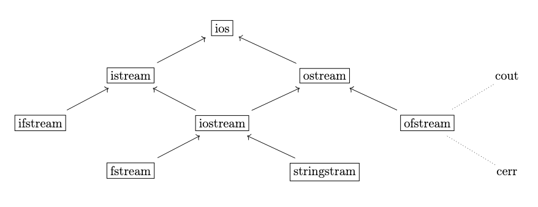

## Ticket 0

### cpp build + compile:

main.cpp
  ↓
preprocessor
  ↓
translation unit
  ↓
compiler
  ↓
object file main.o
  ↓
linker
  ↓
executable program
  ↓
OS loader
  ↓
process in memory
  ↓
CPU executes machine instructions

### some commands:
compile:
```shell 
g++ -std=c++17 -Wall -Wextra -Iinclude -c src/main.cpp -o build/main.o
```

- g++              компилятор C++
- -std=c++17       стандарт языка
- -Wall -Wextra    предупреждения
- -Iinclude        где искать header-файлы
- -c               только скомпилировать, не линковать
- src/main.cpp     входной файл
- -o  build/main.o  выходной object file
linking:
```g++ build/main.o build/Matrix.o -o build/matrix_app```

cmake build:

```shell
cmake -S . -B build
cmake --build build
./build/matrix_app
```

проверка ошибок:
```shell
g++ -std=c++17 -Wall -Wextra -Wpedantic -Wshadow -g main.cpp
```

```
-Wall -Wextra       предупреждения
-Wshadow            ловит затенение имён
-g                  debug-информация
-fsanitize=address  ловит use-after-free, out-of-bounds, double delete
-fsanitize=undefined ловит часть UB
valgrind            поиск утечек и ошибок памяти
gdb/lldb            отладка по шагам
```

### other reminders:

int x = 10;

- x       сам объект int
- &x      адрес объекта x
- int* p  указатель, хранит адрес int
- *p      объект, на который указывает p
- int& r  ссылка, другое имя объекта

---
## Ticket 1 – Classes and objects

Объект – конкретный экземпляр класса в памяти

Example:

```C++
class Matrix
{
private:
    size_t rows_;
    size_t cols_;
    double* data_;

public:
    Matrix(size_t rows, size_t cols);
    ~Matrix();

    double& at(size_t row, size_t col);
    double at(size_t row, size_t col) const;
};
```
### Encapsulation

Инкапсуляция — это идея: **внутреннее устройство класса спрятано, наружу дан контролируемый интерфейс**

### class vs struct

- class – private, struct – public
### constructor

если полей несколько, они инициализируются через список инициализации; если поле пропущено — вызывается дефолтный конструктор; в теле конструктора все поля уже созданы и проинициализированы.

Ининциализация происходит в порядке объявления полей в классе

overload:

```C++
class Matrix
{
private:
    size_t rows_;
    size_t cols_;
    double* data_;

public:
    Matrix()
        : rows_(0)
        , cols_(0)
        , data_(nullptr)
    {
    }

    Matrix(size_t rows, size_t cols)
        : rows_(rows)
        , cols_(cols)
        , data_(new double[rows * cols])
    {
        fill(0.0);
    }

    Matrix(size_t size)
        : Matrix(size, size)
    {
    }

    void fill(double value)
    {
        for (size_t i = 0; i < rows_ * cols_; ++i)
        {
            data_[i] = value;
        }
    }
};
```

С C++11 можно писать значения по умолчанию прямо у полей
поля класса можно инициализировать прямо при объявлении, и эта инициализация встроится в любой конструктор, который явно не инициализирует эти поля

```C++
class Matrix
{
private:
    size_t rows_ = 0;
    size_t cols_ = 0;
    double* data_ = nullptr;

public:
    Matrix() = default;

    Matrix(size_t rows, size_t cols)
        : rows_(rows)
        , cols_(cols)
        , data_(new double[rows * cols])
    {
        fill(0.0);
    }

    ~Matrix()
    {
        delete[] data_;
    }

    void fill(double value)
    {
        for (size_t i = 0; i < rows_ * cols_; ++i)
        {
            data_[i] = value;
        }
    }
};
```

При объявлении какого-либо конструктора нельзя вызвать по-умолчанию, придется перегружать его через `=default`

### Construct chaining / delegation constructors

До C++11 часто приходилось дублировать код:

```C++
class Matrix
{
public:
    Matrix(size_t rows, size_t cols)
    {
        // большая инициализация
    }

    Matrix(size_t size)
    {
        // почти такая же большая инициализация
    }
};
```
С C++11 можно вызвать один конструктор из другого:
```C++
class Matrix
{
private:
    size_t rows_ = 0;
    size_t cols_ = 0;
    double* data_ = nullptr;

public:
    Matrix() = default;

    Matrix(size_t rows, size_t cols)
        : rows_(rows)
        , cols_(cols)
        , data_(new double[rows * cols])
    {
        fill(0.0);
    }

    Matrix(size_t size)
        : Matrix(size, size)
    {
    }

    void fill(double value)
    {
        for (size_t i = 0; i < rows_ * cols_; ++i)
        {
            data_[i] = value;
        }
    }
};
```
`Matrix(size)` делегирует работу `Matrix(size, size)`, в нем (делегат) нельзя инициализировать дополнительно поля.

Формы инициализации:
- Type x;        default initialization
- Type x{};      value initialization
- Type x(a, b);  direct initialization
- Type x = a;    copy initialization
- Type x{a, b};  list initialization

```C++
int a;      // мусорное значение
int b{};    // 0

Matrix m1;      // default initialization
Matrix m2{};    // value initialization
Matrix m3(2, 3); // direct initialization
Matrix m4{2, 3}; // list initialization

vector<int> a(10);
vector<int> b{10};

// a — vector из 10 нулей
// b — vector из одного элемента 10
```

Внутри нестатического метода есть скрытый парметр this – указатель на текущий объект

Если метод не меняет объект – делаем const:
```C++
class Matrix
{
private:
    size_t rows_ = 0;
    size_t cols_ = 0;
    double* data_ = nullptr;

public:
    size_t rows() const
    {
        return rows_;
    }

    size_t cols() const
    {
        return cols_;
    }

    double& at(size_t row, size_t col)
    {
        return data_[row * cols_ + col];
    }

    double at(size_t row, size_t col) const
    {
        return data_[row * cols_ + col];
    }
};
```

Почему два at?
```C++
Matrix a(2, 2);
a.at(0, 0) = 5.0;

const Matrix b(2, 2);
b.at(0, 0);      // читать можно
// b.at(0, 0) = 5.0;  // менять нельзя
```

Если деструктор вызвался во время обработки другого исключения, второе исключение из деструктора может привести к аварийному завершению программы.

Правильная идея: деструктор освобождает ресурс тихо, а ошибки закрытия обрабатываются отдельным методом.

--- 
## Ticket 2 – Работа с кучей в C++

### new/delete

### heap

```C++
int main()
{
    Matrix a(2, 2);
    Matrix* b = new Matrix(3, 3);

    delete b;
}
```

```stack:
+----------------+
| a              | объект Matrix
+----------------+
| b              | указатель Matrix*
+----------------+

heap:
+----------------+
| Matrix object  | объект, созданный через new
+----------------+
```

`a` уничтожится автоматически в конце блока.

`b` — это только указатель. Сам объект `*b` живёт в куче, пока ты явно не сделаешь delete

```C++
Matrix* matrix = new Matrix(2, 3);

matrix->at(0, 0) = 5.0;

delete matrix;
```
new:
1. выделяет память под Matrix
2. вызывает конструктор Matrix(2, 3)

delete:
1. вызывает деструктор ~Matrix()
2. освобождает память объекта

`malloc` выделит память, но не вызовет конструктор, а `free` не вызовет деструктор; поэтому для объектов C++ нужны `new/delete`

`new Image[10]` вызывает default constructor для каждого элемента.

`delete[] images` вызывает destructor для каждого элемента.

Если неправильно юзать – UB

### copy constructor

если его не сделать – для для каждого поля будет копия, из-за чего объекты будут одними и теми же, тогда при вызове delete будет double delete.

```C++
Matrix::Matrix(const Matrix& other)
    : rows_(other.rows_)
    , cols_(other.cols_)
    , data_(new double[other.rows_ * other.cols_])
{
    for (size_t i = 0; i < rows_ * cols_; ++i)
    {
        data_[i] = other.data_[i];
    }
}
```

### def operator оператор присваивания

```C++
Matrix a(2, 2);
Matrix b(3, 3);

b = a;
```
copy assignment oprator:
```C++
Matrix& Matrix::operator=(const Matrix& other)
{
    if (this == &other)
    {
        return *this;
    }

    delete[] data_;

    rows_ = other.rows_;
    cols_ = other.cols_;
    data_ = new double[rows_ * cols_];

    for (size_t i = 0; i < rows_ * cols_; ++i)
    {
        data_[i] = other.data_[i];
    }

    return *this;
}
```
чтобы new не бросил исключение:
```C++
Matrix& Matrix::operator=(const Matrix& other)
{
    if (this == &other)
    {
        return *this;
    }

    double* newData = new double[other.rows_ * other.cols_];

    for (size_t i = 0; i < other.rows_ * other.cols_; ++i)
    {
        newData[i] = other.data_[i];
    }

    delete[] data_;

    rows_ = other.rows_;
    cols_ = other.cols_;
    data_ = newData;

    return *this;
}
```

### C++ `=delete`

```C++
class FileHandle
{
private:
    FILE* file_ = nullptr;

public:
    FileHandle(const char* path)
    {
        file_ = fopen(path, "r");
    }

    ~FileHandle()
    {
        if (file_ != nullptr)
        {
            fclose(file_);
        }
    }

    FileHandle(const FileHandle& other) = delete;
    FileHandle& operator=(const FileHandle& other) = delete;
};
```
– запрет копирования

Потому что если два `FileHandle` будут владеть одним `FILE*`, оба в деструкторе вызовут `fclose`

до `C++=11:`
```C++
class FileHandle
{
private:
    FileHandle(const FileHandle& other);
    FileHandle& operator=(const FileHandle& other);
};
```
после `C++=11:`
```C++
FileHandle(const FileHandle& other) = delete;
FileHandle& operator=(const FileHandle& other) = delete;
```

`delete nullptr:`
```C++
double* p = nullptr;
delete[] p; // OK
```

утечка памяти:
```C++
void bad()
{
    Matrix* matrix = new Matrix(2, 2);

    throw runtime_error("error");

    delete matrix;
}
```
delete не выполнится, лучше без него, воспользовавшись RAII

возврат ссылки на локальную переменную:
```C++
int& bad()
{
    int x = 10;
    return x;
}
```
– в локальной памяти уничтожится x, ссылка стала висячей

висячий указатель:
```C++
int* p = new int(10);
delete p;

cout << *p << endl; // UB
```
– указатель есть, но объекта нет

```C++
double* data = new double[1000000000000];
```
– bad_alloc
### Rule of three (four actually)

Класс в ручную управляет ресурсом + имеет что то из копирования, деструткор $\Rightarrow$ нужны все три

Потому что:

- деструктор освобождает `data_`;
- значит, копирование по умолчанию опасно;
- значит, надо определить copy constructor;
- значит, надо определить copy assignment.

А современная цель — **Rule of Zero**: использовать `vector`, `string`, `unique_ptr`, чтобы не писать эти функции руками.

### copy elision

компилятор убирает лишнее копирование/перемещение объекта и создает его в нужном месте

с C++17 в некоторых случаях вообще не создает лишний временный объект
```C++
Matrix makeMatrix()
{
    Matrix result(2, 2);
    return result;
}

int main()
{
    Matrix a = makeMatrix();
}
```
без copy elision:
```
1. создать result внутри makeMatrix
2. скопировать result во временный объект возврата
3. скопировать временный объект в a
4. уничтожить лишние временные объекты
```
с:
создать Matrix сразу в памяти объекта a


---
## Ticket 3 – Inheritance and polymorhism

### Inheritance and poly

```C++
void drawAll(vector<Shape*>& shapes)
{
    for (size_t i = 0; i < shapes.size(); ++i)
    {
        shapes[i]->draw();
    }
}
```
– наследованные shapes, а т.к. функция работает для всех – полиморфизм

### virtual

static dispatch:
```C++
#include <iostream>

using namespace std;

class Shape
{
public:
    void draw() const
    {
        cout << "Drawing generic shape" << endl;
    }
};

class Circle : public Shape
{
public:
    void draw() const
    {
        cout << "Drawing circle" << endl;
    }
};

int main()
{
    Circle circle;
    Shape* shape = &circle;

    shape->draw();

    return 0;
}
```
– связывает с статическим типом указателя на shape, поэтому выведет его метод
`virtual:`
```C++
#include <iostream>

using namespace std;

class Shape
{
public:
    virtual void draw() const
    {
        cout << "Drawing generic shape" << endl;
    }
};

class Circle : public Shape
{
public:
    void draw() const override
    {
        cout << "Drawing circle" << endl;
    }
};

int main()
{
    Circle circle;
    Shape* shape = &circle;

    shape->draw();

    return 0;
}
```
– dynamic dispatch, работает через таблицу виртуальных функций

### protected

```
public     доступно всем
private    доступно только самому классу
protected  доступно самому классу и наследникам
```
лучше делать защищенные методы:
```C++
class Shape
{
private:
    double x_ = 0.0;
    double y_ = 0.0;

protected:
    double x() const
    {
        return x_;
    }

    double y() const
    {
        return y_;
    }
};
```

Circle лежит внутри shape, поэтому по стеку вызовов – констуркторы от объемлющего множества, а деструкторы – из самого внутреннего

```C++
virtual double area() const = 0;
```
– abstract func

если хочется удалить наследника через указатель – делать виртуальный деструктор:
```C++
Shape* shape = new Circle(0, 0, 5);
delete shape;

virtual ~Shape()
{
}
```

### virtual table

```C++
class Shape
{
public:
    virtual double area() const = 0;
    virtual void print(ostream& out) const = 0;
    virtual ~Shape()
    {
    }
};
```
Shape:
```vtable for Shape:
+----------------------+
| pointer to area      |
+----------------------+
| pointer to print     |
+----------------------+
| pointer to destructor|
+----------------------+
```
Circle:
```vtable for Circle:
+---------------------------+
| pointer to Circle::area   |
+---------------------------+
| pointer to Circle::print  |
+---------------------------+
| pointer to Circle::~Circle|
+---------------------------+
```

```
Circle object:
+------------------+
| vptr             | ----> vtable for Circle
+------------------+
| Shape::x_        |
+------------------+
| Shape::y_        |
+------------------+
| Circle::radius_  |
+------------------+
```

```C++
Shape* shape = new Circle(0, 0, 5);
shape->print(cout);
```
```under_the_hood
1. взять указатель shape
2. по нему найти объект Circle
3. из объекта прочитать hidden vptr
4. по vptr найти vtable for Circle
5. взять из таблицы адрес print
6. вызвать Circle::print
```
virtual call дороже обычного вызова, но дает полиморфизм

### static/dynamic dispatch
static:
```C++
class Shape
{
public:
    void print() const
    {
        cout << "Shape" << endl;
    }
};

class Circle : public Shape
{
public:
    void print() const
    {
        cout << "Circle" << endl;
    }
};

Circle c;
Shape* p = &c;
p->print();
```
-> Shape

Dynamic
```C++
class Shape
{
public:
    virtual void print() const
    {
        cout << "Shape" << endl;
    }
};

class Circle : public Shape
{
public:
    void print() const override
    {
        cout << "Circle" << endl;
    }
};

Circle c;
Shape* p = &c;
p->print();
```
-> Circle

### override

позволяет компилятору перепроверить, не virtual ли метод

overload: 
```C++
class Shape
{
public:
    virtual void scale(double factor)
    {
    }
};

class Circle : public Shape
{
public:
    void scale(int factor)
    {
    }
};
```

– это перегрузка, а не переопределение $\Rightarrow$
```C++
class Circle : public Shape
{
public:
    void scale(double factor) override
    {
    }
};
```

### Object slicing

```C++
class Shape
{
public:
    virtual void print() const
    {
        cout << "Shape" << endl;
    }
};

class Circle : public Shape
{
private:
    double radius_ = 5.0;

public:
    void print() const override
    {
        cout << "Circle" << endl;
    }
};

int main()
{
    Circle c;
    Shape s = c;

    s.print();

    return 0;
}
```

Здесь `s` — отдельный объект типа `Shape`.

В него скопировалась только базовая часть `Circle`.

Часть `Circle` с `radius_` отрезалась.

Это называется **object slicing**.

Вывод будет:

```
Shape
```

Чтобы сохранить полиморфизм, работаем через указатели или ссылки:

```
Shape& s = c;
s.print(); // Circle
```

или:

```
Shape* s = &c;
s->print(); // Circle
```

### corner cases:
```C++
class Shape
{
public:
    Shape()
    {
        print();
    }

    virtual void print() const
    {
        cout << "Shape" << endl;
    }
};

class Circle : public Shape
{
public:
    void print() const override
    {
        cout << "Circle" << endl;
    }
};
```
– при Circle c будет Shape, т.к.
Во время выполнения конструктора `Shape` часть `Circle` ещё не построена. Поэтому виртуальный вызов внутри конструктора базового класса не dispatch-ится в наследника.

Аналогично в деструкторе: когда выполняется деструктор базового класса, часть наследника уже разрушена.

Правило:

> Не полагайся на virtual dispatch в конструкторах и деструкторах.

### type cast
```C++
Circle* circle = new Circle(0, 0, 5);
Shape* shape = circle;
```
– safe, as it's explicit – **upcast** 
при downcast если не делать явного преобразование типа, что компилятор может не понять, там circle или rectangle

---
## Ticket 4 – smart pointers

**Умный указатель** — это объект, который внутри хранит обычный указатель и автоматически освобождает ресурс в своём деструкторе.

```
unique_ptr<T>  ровно один владелец
shared_ptr<T>  несколько совместных владельцев
scoped_ptr<T>  один владелец внутри одного scope
```

### RAII

RAII — Resource Acquisition Is Initialization.

without:
```C++
void process()
{
    Matrix* matrix = new Matrix(100, 100);

    riskyFunction();

    delete matrix;
}
```

with:
```C++
void process()
{
    unique_ptr<Matrix> matrix(new Matrix(100, 100));

    riskyFunction();
}
```


### scoped_ptr

`scoped_ptr` нельзя копировать и нельзя передать владение
```
объект живёт ровно внутри одного scope
копировать нельзя
передавать владение нельзя
в деструкторе вызывает delete
```
похож на старый `boost::scoped_ptr`, не является стандартом, введен в качестве примера

```C++
#include <iostream>

using namespace std;

class Matrix
{
private:
    size_t rows_ = 0;
    size_t cols_ = 0;

public:
    Matrix(size_t rows, size_t cols)
        : rows_(rows)
        , cols_(cols)
    {
        cout << "Matrix constructor" << endl;
    }

    ~Matrix()
    {
        cout << "Matrix destructor" << endl;
    }

    void print() const
    {
        cout << "Matrix " << rows_ << "x" << cols_ << endl;
    }
};

class ScopedMatrixPtr
{
private:
    Matrix* ptr_ = nullptr;

public:
    explicit ScopedMatrixPtr(Matrix* ptr)
        : ptr_(ptr)
    {
    }

    ~ScopedMatrixPtr()
    {
        delete ptr_;
    }

    Matrix* get() const
    {
        return ptr_;
    }

    Matrix& operator*() const
    {
        return *ptr_;
    }

    Matrix* operator->() const
    {
        return ptr_;
    }

    explicit operator bool() const
    {
        return ptr_ != nullptr;
    }

    ScopedMatrixPtr(const ScopedMatrixPtr& other) = delete;
    ScopedMatrixPtr& operator=(const ScopedMatrixPtr& other) = delete;
};

int main()
{
    ScopedMatrixPtr matrix(new Matrix(2, 3));

    matrix->print();

    if (matrix)
    {
        cout << "matrix exists" << endl;
    }

    return 0;
}
```
```output
Matrix constructor
Matrix 2x3
matrix exists
Matrix destructor
```

разрешим копирование:
```
a.ptr_ ----+
           +----> один Matrix
b.ptr_ ----+
```

### unique_ptr

`unique_ptr<T>` — стандартный умный указатель с уникальным владением.

```
ровно один unique_ptr владеет объектом
копировать нельзя
перемещать можно
при уничтожении unique_ptr удаляет объект
```

```C++
#include <iostream>
#include <memory>

using namespace std;

class Matrix
{
public:
    Matrix()
    {
        cout << "Matrix constructor" << endl;
    }

    ~Matrix()
    {
        cout << "Matrix destructor" << endl;
    }

    void print() const
    {
        cout << "Matrix" << endl;
    }
};

int main()
{
    unique_ptr<Matrix> matrix(new Matrix());

    matrix->print();

    return 0;
}
```

Если надо передать владение – в сигнатуре пишем уникальный указатель, а при передаче – std::move, тогда после выполнения объект будет пустым:
```C++
void consumeMatrix(unique_ptr<Matrix> matrix)
{
    matrix->print();
}

unique_ptr<Matrix> matrix(new Matrix());

consumeMatrix(move(matrix));
```

C++<14:
```C++
unique_ptr<Matrix> createMatrix()
{
    unique_ptr<Matrix> matrix(new Matrix());

    return matrix;
}
```
C++14:
```C++
unique_ptr<Matrix> createMatrix()
{
    return make_unique<Matrix>();
}
```

`get()`
```C++
unique_ptr<Matrix> matrix(new Matrix(2, 2));

Matrix* raw = matrix.get();
```
`get()` возвращает сырой указатель, но **не отдаёт владение**.


```C++
unique_ptr<Matrix> matrix(new Matrix(2, 2));

Matrix* raw = matrix.release();
```
`release()` отдаёт сырой указатель и прекращает владение, придется самому delete для raw

```C++
unique_ptr<Matrix> matrix(new Matrix(2, 2));

matrix.reset(new Matrix(3, 3));
```
удалит объект и сделает указатель nullptr

### shared_ptr

`shared_ptr<T>` — умный указатель с совместным владением.

```
несколько shared_ptr могут владеть одним объектом
объект удаляется, когда исчезает последний shared_ptr
```

realization:
```C++
class SharedMatrixPtr
{
private:
    Matrix* ptr_ = nullptr;
    size_t* count_ = nullptr;

public:
    explicit SharedMatrixPtr(Matrix* ptr)
        : ptr_(ptr)
        , count_(new size_t(1))
    {
    }

    SharedMatrixPtr(const SharedMatrixPtr& other)
        : ptr_(other.ptr_)
        , count_(other.count_)
    {
        ++(*count_);
    }

    SharedMatrixPtr& operator=(const SharedMatrixPtr& other)
    {
        if (this == &other)
        {
            return *this;
        }

        release();

        ptr_ = other.ptr_;
        count_ = other.count_;
        ++(*count_);

        return *this;
    }

    ~SharedMatrixPtr()
    {
        release();
    }

    void release()
    {
        if (count_ == nullptr)
        {
            return;
        }

        --(*count_);

        if (*count_ == 0)
        {
            delete ptr_;
            delete count_;
        }

        ptr_ = nullptr;
        count_ = nullptr;
    }

    Matrix& operator*() const
    {
        return *ptr_;
    }

    Matrix* operator->() const
    {
        return ptr_;
    }

    size_t use_count() const
    {
        if (count_ == nullptr)
        {
            return 0;
        }

        return *count_;
    }
};
```

но настоящая сложнее:
```
поддерживает custom deleter
поддерживает weak_ptr
control block устроен сложнее
счётчики атомарны для многопоточности
есть aliasing constructor
```

```C++
#include <iostream>
#include <memory>

using namespace std;

class Texture
{
private:
    string name_;

public:
    Texture(const string& name)
        : name_(name)
    {
        cout << "load texture " << name_ << endl;
    }

    ~Texture()
    {
        cout << "destroy texture " << name_ << endl;
    }

    void bind() const
    {
        cout << "bind texture " << name_ << endl;
    }
};

int main()
{
    shared_ptr<Texture> grass(new Texture("grass.png"));

    {
        shared_ptr<Texture> sameGrass = grass;

        cout << "use_count = " << grass.use_count() << endl;

        sameGrass->bind();
    }

    cout << "use_count = " << grass.use_count() << endl;

    return 0;
}
```
```output
load texture grass.png
use_count = 2
bind texture grass.png
use_count = 1
destroy texture grass.png
```

```under_the_hood
shared_ptr object:
+--------------------------+
| pointer to T             |
+--------------------------+
| pointer to control block |
+--------------------------+

control block:
+------------------------+
| strong reference count |
+------------------------+
| weak reference count   |
+------------------------+
| deleter / allocator    |
+------------------------+
```

Лучше писать:
```C++
shared_ptr<Texture> texture = make_shared<Texture>("grass.png");
```

```
1. короче
2. exception-safe
3. часто делает одну аллокацию вместо двух:
   объект + control block рядом
```

Но у `shared_ptr` есть главная проблема: циклические ссылки.
### weak_ptr

```C++
class Node
{
public:
    shared_ptr<Node> next;
    shared_ptr<Node> prev;

    ~Node()
    {
        cout << "Node destructor" << endl;
    }
};

int main()
{
    shared_ptr<Node> a = make_shared<Node>();
    shared_ptr<Node> b = make_shared<Node>();

    a->next = b;
    b->prev = a;

    return 0;
}
```

```
a ссылается на b
b ссылается на a
счётчики не становятся 0
деструкторы не вызываются
```

```C++
class Node
{
public:
    shared_ptr<Node> next;
    weak_ptr<Node> prev;
};
```

### corner cases

```C++
class Widget
{
public:
    shared_ptr<Widget> getPtr()
    {
        return shared_ptr<Widget>(this);
    }
};
```
Почему плохо?

Если объект уже управляется `shared_ptr`, создание нового `shared_ptr` из `this` создаст новый control block.

Правильный способ — `enable_shared_from_this`.

---

## Ticket 5 – operators overload

нельзя перегружать:
```
.
.*
::
?:
sizeof
typeid
alignof
```

1. Нельзя придумать новый оператор.
2. Нельзя изменить приоритет оператора.
3. Нельзя изменить ассоциативность.
4. Нельзя изменить количество аргументов.
5. Хотя бы один аргумент перегруженного оператора должен быть пользовательского типа.
```C++
int operator+(int a, int b)
{
    return a - b;
}
```
– no

### Binary and unary operators

#### Binary: 

```C++
class Rational
{
private:
    int numerator_ = 0;
    int denominator_ = 1;

public:
    Rational operator+(const Rational& other) const
    {
        return Rational(
            numerator_ * other.denominator_ + other.numerator_ * denominator_,
            denominator_ * other.denominator_
        );
    }
};
```
```C++
a.operator+(b)
```
– левый this, понимает для a + b

```C++
Rational operator+(const Rational& a, const Rational& b)
{
    return Rational(
        a.numerator() * b.denominator() + b.numerator() * a.denominator(),
        a.denominator() * b.denominator()
    );
}
```
```C++
operator+(a, b)
```
– понимает для a + b

#### Unary:

```C++
-a
+a
!a
++a
a++
--a
*a
&a
```

```C++
class Rational
{
private:
    int numerator_ = 0;
    int denominator_ = 1;

public:
    Rational(int numerator, int denominator)
        : numerator_(numerator)
        , denominator_(denominator)
    {
        if (denominator_ == 0)
        {
            throw invalid_argument("zero denominator");
        }
    }

    Rational operator-() const
    {
        return Rational(-numerator_, denominator_);
    }
};
```

#### postfix/prefix
```C++
++x  → x.operator++()
x++  → x.operator++(0)
```
```
prefix ++x обычно возвращает T&
postfix x++ обычно возвращает старую копию T
```

### operator[]

```C++
class Array
{
private:
    vector<int> data_;

public:
    Array(size_t size)
        : data_(size)
    {
    }

    int& operator[](size_t index)
    {
        return data_[index];
    }

    const int& operator[](size_t index) const
    {
        return data_[index];
    }
};
```

приходится реализовывать два `operator[]` — const и non-const; неконстантный возвращает ссылку, чтобы можно было присваивать, а константный возвращает значение или `const`-ссылку.

```C++
Array a(10);
a[0] = 42;

const Array b(10);
cout << b[0] << endl;
```

C++17,23:
```C++
operator[](size_t row, size_t col)
operator() // equivalent
```

#### operator <<, >>
```C++
ostream& operator<<(ostream& out, const Matrix& matrix)
{
    for (size_t row = 0; row < matrix.rows(); ++row)
    {
        for (size_t col = 0; col < matrix.cols(); ++col)
        {
            out << matrix(row, col) << " ";
        }

        out << endl;
    }

    return out;
}
```
– свободная функция, не можем добавить метод в ostream
### In/out class

In:

```C++
class BigInt
{
public:
    BigInt operator+(const BigInt& other) const;
};
```
```C++
BigInt a = 10;
BigInt b = a + 3;
```
– works
```C++
BigInt c = 3 + a;
```
– no

Out:

```C++
BigInt operator+(const BigInt& a, const BigInt& b);
```
```C++
BigInt a = 10;

BigInt x = a + 3;
BigInt y = 3 + a;
```
– both work

Practical rule:
```
operator+=, -=, *=, /=       метод класса
operator+, -, *, /           свободная функция через +=
operator==, <, >             часто свободные функции
operator<<, >>               свободные функции
operator[]                   метод
operator()                   метод
operator->                   метод
operator=                    только метод
conversion operator          только метод
```

### Compound assignment
```C++
a += b;
a -= b;
a *= b;
```

```C++
class Matrix
{
public:
    Matrix& operator+=(const Matrix& other)
    {
        // меняем текущий объект
        return *this;
    }
};

Matrix operator+(Matrix left, const Matrix& right)
{
    left += right;
    return left;
}
```

```C++
#include <cstddef>
#include <iostream>
#include <stdexcept>
#include <vector>

using namespace std;

class Matrix
{
private:
    size_t rows_ = 0;
    size_t cols_ = 0;
    vector<double> data_;

    size_t index(size_t row, size_t col) const
    {
        if (row >= rows_ || col >= cols_)
        {
            throw out_of_range("Matrix index is out of range");
        }

        return row * cols_ + col;
    }

public:
    Matrix() = default;

    Matrix(size_t rows, size_t cols)
        : rows_(rows)
        , cols_(cols)
        , data_(rows * cols, 0.0)
    {
    }

    size_t rows() const
    {
        return rows_;
    }

    size_t cols() const
    {
        return cols_;
    }

    double& at(size_t row, size_t col)
    {
        return data_[index(row, col)];
    }

    double at(size_t row, size_t col) const
    {
        return data_[index(row, col)];
    }

    Matrix& operator+=(const Matrix& other)
    {
        if (rows_ != other.rows_ || cols_ != other.cols_)
        {
            throw invalid_argument("Matrix sizes are different");
        }

        for (size_t i = 0; i < data_.size(); ++i)
        {
            data_[i] += other.data_[i];
        }

        return *this;
    }

    void print(ostream& out) const
    {
        for (size_t row = 0; row < rows_; ++row)
        {
            for (size_t col = 0; col < cols_; ++col)
            {
                out << at(row, col) << " ";
            }

            out << endl;
        }
    }
};

Matrix operator+(Matrix left, const Matrix& right)
{
    left += right;
    return left;
}

int main()
{
    Matrix a(2, 2);
    Matrix b(2, 2);

    a.at(0, 0) = 1;
    a.at(0, 1) = 2;
    a.at(1, 0) = 3;
    a.at(1, 1) = 4;

    b.at(0, 0) = 10;
    b.at(0, 1) = 20;
    b.at(1, 0) = 30;
    b.at(1, 1) = 40;

    Matrix c = a + b;

    c.print(cout);

    return 0;
}
```

### friend

свободному оператору нужен доступ к private полям $\Rightarrow$ fiend

```C++
class Matrix
{
private:
    size_t rows_;
    size_t cols_;
    vector<double> data_;

public:
    friend ostream& operator<<(ostream& out, const Matrix& matrix);
};
```
`friend` означает:

> Эта функция не является методом класса, но имеет доступ к private/protected-членам класса.

ослабляет инкапсуляцию

#### operator <=>

C++20:
There’s a new three-way comparison operator, `<=>`. The expression `a <=> b` returns an object that compares `<0` if `a < b`, compares `>0` if `a > b`, and compares `==0` if `a` and `b` are equal/equivalent.

### type cast

#### constructor cast

```C++
class Rational
{
public:
    Rational(int value)
        : numerator_(value)
        , denominator_(1)
    {
    }
};

Rational r = 5;
```

запретить такое неявное преобразование:

```C++
class Rational
{
public:
    explicit Rational(int value)
        : numerator_(value)
        , denominator_(1)
    {
    }
};
```
```C++
Rational r(5);
Rational q = Rational(5);
```

type cast operator:
```C++
class Rational
{
private:
    int numerator_ = 0;
    int denominator_ = 1;

public:
    explicit operator double() const
    {
        return static_cast<double>(numerator_) / denominator_;
    }
};
```
```C++
Rational r(1, 2);

double x = static_cast<double>(r);
```

иначе можно было бы (что опасно):
```C++
double x = r;
```

#### explicit bool
```C++
class FileHandle
{
private:
    FILE* file_ = nullptr;

public:
    explicit operator bool() const
    {
        return file_ != nullptr;
    }
};

FileHandle file;

if (file)
{
    // файл открыт
}
```
but can not:
```C++
bool b = file; // ошибка, если operator bool explicit
```

до C++11 для такого поведения использовали странные трюки вроде safe bool idiom, а с C++11 появился `explicit operator bool()`

### corner cases

```C++
if (p != nullptr && p->valid())
{
}
```

лучше не перегружать, иначе можно нарушить short-circuit

### all operators that could be possibly overloaded on C++26

```operators
1.  operator new
2.  operator delete
3.  operator new[]
4.  operator delete[]

5.  operator co_await

6.  operator()
7.  operator[]
8.  operator->
9.  operator->*

10. operator~
11. operator!
12. operator+
13. operator-
14. operator*
15. operator/
16. operator%
17. operator^
18. operator&
19. operator|

20. operator=
21. operator+=
22. operator-=
23. operator*=
24. operator/=
25. operator%=
26. operator^=
27. operator&=
28. operator|=

29. operator==
30. operator!=
31. operator<
32. operator>
33. operator<=
34. operator>=
35. operator<=>

36. operator&&
37. operator||

38. operator<<
39. operator>>
40. operator<<=
41. operator>>=

42. operator++
43. operator--

44. operator,
```

Но если считать **формы**, будет больше, потому что некоторые операторы бывают и унарными, и бинарными. Стандарт отдельно говорит, что унарные и бинарные формы `+`, `-`, `*`, `&` могут быть перегружены.

couldn't be overloaded:
```operators
.
.*
::
?:
```

---

## Ticket 6 – misc

```
const                 обещание "не менять"
function overloading  одно имя, разные параметры
default arguments     часть аргументов можно не писать
static                сущность не привязана к конкретному объекту
```

### const

```C++
int x;
const int& ref = x;

ref = 20; // UB
x = 20; //OK
```

```C++
int a = 10;
int b = 20;

const int* p = &a;

// *p = 30; // нельзя
p = &b;     // можно
```

```C++
int a = 10;
int b = 20;

int* const p = &a;

*p = 30;    // можно
// p = &b;  // нельзя
```

```C++
void printMatrix(const Matrix& matrix)
{
    matrix.print(cout);
}
```
```C++
void bad(Matrix matrix);          // копирует
void good(const Matrix& matrix);  // не копирует и не меняет
```

константные методы можно вызывать только у константных, аналог для неконст

```C++
class Array
{
private:
    vector<int> data_;

public:
    int& at(size_t index)
    {
        return data_.at(index);
    }

    const int& at(size_t index) const
    {
        return data_.at(index);
    }
};
```
```C++
Array a;
a.at(0) = 42;

const Array b;
cout << b.at(0) << endl;
// b.at(0) = 42; // нельзя
```
```explain
неконстантный объект  → можно вернуть T&
константный объект    → можно вернуть const T&
```

### mutable

instrument for lazy loading, mutex, caches

```C++
class Text
{
private:
    string data_;
    mutable bool cached_ = false;
    mutable size_t cachedLength_ = 0;

public:
    explicit Text(const string& data)
        : data_(data)
    {
    }

    size_t length() const
    {
        if (!cached_)
        {
            cachedLength_ = data_.size();
            cached_ = true;
        }

        return cachedLength_;
    }
};
```

### functions overload

could be:
```C++
int maxValue(int x, int y)
{
    return x > y ? x : y;
}

int maxValue(int x, int y, int z)
{
    return maxValue(maxValue(x, y), z);
}

double maxValue(double x, double y)
{
    return x > y ? x : y;
}
```

error:
```C++
int get();
double get(); // ошибка
```
– function call doesn't give compiler any insstructions (signature is the same)
also error:
```C++
double x = get();
```

### Overload resolution

compiler picks by conversion ranking:
```
maxValue(int, int)
maxValue(int, int, int)
maxValue(double, double)
...
```
```C++
void f(int x)
{
    cout << "int" << endl;
}

void f(double x)
{
    cout << "double" << endl;
}

int main()
{
    f(10);    // int
    f(3.14);  // double
}
```

but:
```C++
void f(long x)
{
}

void f(double x)
{
}

int main()
{
    f(10); // может быть ambiguous в зависимости от набора overloads
}
```

list of ranks:
**1 (Lowest)**`bool
**2** signed char`, `unsigned char`, `char
**3** short int`, `unsigned short int
**4**int`, `unsigned int
**5**long int`, `unsigned long int
**6** (Highest)**`long long int`, `unsigned long long int`

### name mangling

```C++
int max(int x, int y);
int max(int x, int y, int z);
double max(double x, double y);
```

for example on linux:

```bash
readelf -s file.o
```

```shell
_Z3maxii
_Z3maxiii
_Z3maxdd
```

for C to exclude name mangling for compatibility with C ABI:
```C++
extern "C"
{
    void plugin_init();
}
```

### default arguments

error:
```C++
void f(int x = 10, int y);
```

OK – from right to left:
```C++
void f(int x, int y = 10);
void g(int x, int y = 10, int z = 20);
```

could be described in `.hpp`, and then u can write without them in `.cpp`, as compiler sets default values in a place of calling

**default arguments + overload = shit**

```C++
void log(int level, const string& message = "empty")
{
}

void log(int level)
{
}
```
```C++
log(1);
```
– wtf?

### static

#### static local variable

```C++
int nextId()
{
    static int id = 0;

    ++id;

    return id;
}
```
– static local variable lives between callings:
```C++
cout << nextId() << endl; // 1
cout << nextId() << endl; // 2
cout << nextId() << endl; // 3
```
```
id хранится не на стеке каждого вызова,
а в static storage duration области программы
```
– initializes ones.

C++>=11 static local variable initialization is thread-safe: 

#### static field

```C++
class Object
{
private:
    static size_t count_;
    string name_;

public:
    Object(const string& name)
        : name_(name)
    {
        ++count_;
    }

    ~Object()
    {
        --count_;
    }

    static size_t count()
    {
        return count_;
    }
};

size_t Object::count_ = 0;
```
– name_ is static field that is one for all class

C++11/14
static field is defined at .cpp cause memory is allocated at translation unit, otherwise – linking error:
```
undefined reference to Object::count_
```

C++>=17:
```C++
class Object
{
private:
    inline static size_t count_ = 0;
};
```
– could be defined at .hpp

#### static class method

```C++
class Object
{
private:
    static size_t count_;
    string name_;

public:
    static size_t count()
    {
        return count_;
    }
};
```
```explanation
не имеет this
не привязан к конкретному объекту
не может обращаться к нестатическим полям напрямую
```
– also one for the whole class

error:
```C++
static void printName()
{
    cout << name_ << endl; // ошибка
}
```

static methods call could be for all class or for one object of this class – callings are the same due to uniqueness of static method for one class

#### internal linkage

on file/namespace level is seen only in this translation unit

anonymus namespace:
```C++
namespace
{
    void helper()
    {
    }
}
```

### corner cases

```C++
const int x = 42;

int* p = const_cast<int*>(&x);

*p = 67; // UB
```

#### static object initialization order fiasco

order of initialization between global/static is not guaranteed:

bad:
```C++
// Logger.cpp
Logger globalLogger;

// Config.cpp
Config globalConfig(globalLogger);
```

solution:
```C++
Logger& logger()
{
    static Logger instance;
    return instance;
}
```

---

## Ticket 7 – inheritance: parts

### C-style approach

```
void*
размер элемента
function pointer
ручное приведение типов
```

```C++
#include <cstdlib>
#include <iostream>

using namespace std;

struct Point
{
    int x;
    int y;
};

int comparePoints(const void* left, const void* right)
{
    const Point* a = static_cast<const Point*>(left);
    const Point* b = static_cast<const Point*>(right);

    int distA = a->x * a->x + a->y * a->y;
    int distB = b->x * b->x + b->y * b->y;

    if (distA < distB)
    {
        return -1;
    }

    if (distA > distB)
    {
        return 1;
    }

    return 0;
}

int main()
{
    Point points[3] = {
        {3, 4},
        {1, 1},
        {10, 0}
    };

    qsort(points, 3, sizeof(Point), comparePoints);

    for (size_t i = 0; i < 3; ++i)
    {
        cout << points[i].x << " " << points[i].y << endl;
    }

    return 0;
}
```

```pros
1. Работает в C.
2. Можно использовать для разных типов.
3. Не требует наследования.
4. Можно сортировать даже примитивные типы.
```
```cons
compiler doesn't checks
void* стирает тип;
нужны ручные cast'ы;
легко ошибиться в sizeof;
function pointer обычно мешает inline;
нет нормальной работы с объектами C++ и исключениями;
сложнее писать безопасный код.
```
```C++
int numbers[3] = {3, 1, 2};

qsort(numbers, 3, sizeof(int), comparePoints);

// int (*)(const void*, const void*)
// => UB
```

### OOP-style approach

```C++
// interface
class Comparable
{
public:
    virtual int compare(const Comparable* other) const = 0;

    virtual ~Comparable()
    {
    }
};

// inherit
class Point : public Comparable
{
private:
    int x_ = 0;
    int y_ = 0;

public:
    Point(int x, int y)
        : x_(x)
        , y_(y)
    {
    }

    int compare(const Comparable* other) const override
    {
        const Point* point = static_cast<const Point*>(other);

        int thisDistance = x_ * x_ + y_ * y_;
        int otherDistance = point->x_ * point->x_ + point->y_ * point->y_;

        if (thisDistance < otherDistance)
        {
            return -1;
        }

        if (thisDistance > otherDistance)
        {
            return 1;
        }

        return 0;
    }
};

// sort
void sortComparable(Comparable** array, size_t size)
{
    for (size_t i = 0; i < size; ++i)
    {
        for (size_t j = i + 1; j < size; ++j)
        {
            if (array[j]->compare(array[i]) < 0)
            {
                Comparable* tmp = array[i];
                array[i] = array[j];
                array[j] = tmp;
            }
        }
    }
}

// usage
int main()
{
    Comparable* points[3];

    points[0] = new Point(3, 4);
    points[1] = new Point(1, 1);
    points[2] = new Point(10, 0);

    sortComparable(points, 3);

    for (size_t i = 0; i < 3; ++i)
    {
        delete points[i];
    }

    return 0;
}
```
```pros
1. Есть общий интерфейс.
2. Можно работать с разными наследниками единообразно.
3. Можно добавлять новые классы без переписывания sort.
4. Хорошо подходит для runtime polymorphism:
   GUI widgets, game entities, plugins, interfaces.
```
```cons
Нужно хранить объекты через указатели или ссылки.
```
```C++
Point points[10];
sortComparable(points, 10); // не то
```
```cons
Нужны virtual calls.

Virtual call труднее заинлайнить.

Примитивные типы неудобны.
Типобезопасность всё ещё неполная
```

### Template-style approach

```C++
template <typename T>
void sortArray(T* array, size_t size)
{
    for (size_t i = 0; i < size; ++i)
    {
        for (size_t j = i + 1; j < size; ++j)
        {
            if (array[j] < array[i])
            {
                T tmp = array[i];
                array[i] = array[j];
                array[j] = tmp;
            }
        }
    }
}
```
```C++
int numbers[3] = {3, 1, 2};
sortArray(numbers, 3);

double values[3] = {3.5, 1.5, 2.5};
sortArray(values, 3);
```
```C++
class Point
{
private:
    int x_ = 0;
    int y_ = 0;

public:
    Point() = default;

    Point(int x, int y)
        : x_(x)
        , y_(y)
    {
    }

    int distanceSquared() const
    {
        return x_ * x_ + y_ * y_;
    }

    bool operator<(const Point& other) const
    {
        return distanceSquared() < other.distanceSquared();
    }

    void print() const
    {
        cout << x_ << " " << y_ << endl;
    }
};

int main()
{
    Point points[3] = {
        Point(3, 4),
        Point(1, 1),
        Point(10, 0)
    };

    sortArray(points, 3);

    for (size_t i = 0; i < 3; ++i)
    {
        points[i].print();
    }

    return 0;
}
```
```pros
1. Типобезопасно.
2. Работает с примитивными типами.
3. Не требует базового класса.
4. Не требует virtual.
5. Компилятор может inline-ить comparator/operator<.
6. Часто быстрее runtime polymorphism.
7. Удобно для STL.
```
```cons
1. Код должен быть виден компилятору, поэтому шаблоны обычно в headers.
2. Ошибки компиляции могут быть длинными.
3. Может увеличивать размер бинарника из-за разных instantiations.
4. Не даёт runtime polymorphism сам по себе.
```

### comparison
```
C-style:
  универсальность через void*
  типы почти не проверяются
  ручные cast'ы
  function pointer
  может привести к UB
  C-compatible

OOP-style:
  универсальность через общий базовый класс
  runtime polymorphism
  virtual calls
  нужен pointer/reference
  удобно для интерфейсов и плагинов
  не идеально для примитивов и value-semantics

Template-style:
  универсальность через compile-time type parameter
  типобезопасность
  inline и оптимизация
  отлично для STL и алгоритмов
  код обычно в headers
  нет runtime polymorphism без дополнительных техник
```

### public/private/protected

```C++
class Derived : public Base
{
};

class Derived : protected Base
{
};

class Derived : private Base
{
};
```

по умолчанию private

#### public

```C++
class Shape
{
public:
    void move(double dx, double dy)
    {
    }

protected:
    double x_ = 0.0;
    double y_ = 0.0;

private:
    int internalId_ = 0;
};

class Circle : public Shape
{
public:
    void print()
    {
        cout << x_ << " " << y_ << endl; // OK
        // cout << internalId_ << endl; // ошибка
    }
};

int main()
{
    Circle circle;
    circle.move(1.0, 2.0); // OK, move остался public
}
```

```
public    → public в Derived
protected → protected в Derived
private   → недоступно напрямую в Derived
```

#### protected

```
public Base members    → protected в Derived
protected Base members → protected в Derived
private Base members   → недоступны напрямую
```

```C++
class Base
{
public:
    void foo()
    {
    }
};

class Derived : protected Base
{
};

int main()
{
    Derived d;

    // d.foo(); // ошибка: foo стал protected
}

class MoreDerived : public Derived
{
public:
    void bar()
    {
        foo(); // OK
    }
};
```

#### private

```
public Base members    → private в Derived
protected Base members → private в Derived
private Base members   → недоступны напрямую
```

```C++
class Engine
{
public:
    void start()
    {
        cout << "engine start" << endl;
    }
};

class Car : private Engine
{
public:
    void drive()
    {
        start();
        cout << "drive" << endl;
    }
};

int main()
{
    Car car;

    car.drive(); // OK
    // car.start(); // ошибка
}
```

composition is better:
```C++
class Car
{
private:
    Engine engine_;

public:
    void drive()
    {
        engine_.start();
        cout << "drive" << endl;
    }
};
```

```table
Base member      public inheritance   protected inheritance   private inheritance

public           public               protected               private
protected        protected            protected               private
private          недоступно напрямую   недоступно напрямую     недоступно напрямую
```
```further
public inheritance:
  Derived is a Base

private inheritance:
  Derived implemented in terms of Base

protected inheritance:
  почти как private, но доступ сохраняется для дальнейших наследников
```

### C++11: override/final

#### override

```C++
class Button
{
public:
    virtual void draw()
    {
    }
};

class ColoredButton : public Button
{
public:
    void draw() override
    {
    }
};
```

#### name hiding/ using

```C++
class Base
{
public:
    virtual void foo(int x)
    {
        cout << "Base int" << endl;
    }

    virtual void foo(double x)
    {
        cout << "Base double" << endl;
    }
};

class Derived : public Base
{
public:
    void foo(int x) override
    {
        cout << "Derived int" << endl;
    }
};

int main()
{
    Derived d;

    d.foo(10);   // Derived int
    d.foo(3.14); // неожиданно?
}
```

better:
```C++
class Derived : public Base
{
public:
    using Base::foo;

    void foo(int x) override
    {
        cout << "Derived int" << endl;
    }
};
```

#### final

```C++
class Token final
{
};

class SpecialToken : public Token
{
}; // UB
```

virtual-method:
```C++
class Base
{
public:
    virtual void run()
    {
    }
};

class Derived : public Base
{
public:
    void run() final
    {
    }
};

class MoreDerived : public Derived
{
public:
    // void run() override {} // ошибка
};
```

#### override final together

```C++
class Derived : public Base
{
public:
    void run() override final
    {
    }
};

void run() final override
{
}
```
```explanation
override: я переопределяю базовый virtual method
final: дальше переопределять нельзя
```

### public inheritance vs composition

bad:
```C++
class Vector
{
public:
    void push_back(int value)
    {
    }
};

class Stack : public Vector
{
};
```

good:
```C++
class Stack
{
private:
    Vector data_;

public:
    void push(int value)
    {
        data_.push_back(value);
    }

    void pop()
    {
        // ...
    }
};
```

public = Derived is a Base
```
Circle is a Shape
SavingsAccount is an Account
File is a Readable
File is a Writable
```

composition > private

### compile time vs run time polymorphism

runtime
```C++
class Shape
{
public:
    virtual double area() const = 0;

    virtual ~Shape()
    {
    }
};

double totalArea(const vector<unique_ptr<Shape>>& shapes)
{
    double result = 0.0;

    for (size_t i = 0; i < shapes.size(); ++i)
    {
        result += shapes[i]->area();
    }

    return result;
}
```
```pros
можно хранить разные типы в одной коллекции через Base*
можно загружать плагины
можно добавлять новые наследники без пересборки части кода
```
```cons
virtual call
heap/pointer/reference
сложнее ownership
object slicing risk
```

compile time
```C++
template <typename Shape>
double totalArea(const vector<Shape>& shapes)
{
    double result = 0.0;

    for (size_t i = 0; i < shapes.size(); ++i)
    {
        result += shapes[i].area();
    }

    return result;
}
```
```pros
нет virtual call
можно inline
работает value-semantics
типобезопасно
```
```cons
нельзя легко хранить Circle и Rectangle в одном vector<Shape>
код должен быть известен на compile-time
может раздувать binary
```

### C++20 – concepts

C++11/14/17 error:
```C++
template <typename T>
void printArea(const T& object)
{
    cout << object.area() << endl;
}
```

у int нет area()

C++20:
```C++
template <typename T>
concept HasArea = requires(const T& object)
{
    { object.area() };
};

template <HasArea T>
void printArea(const T& object)
{
    cout << object.area() << endl;
}
```

### corner cases

```C++
class Shape
{
public:
    virtual void draw()
    {
    }
};

class Circle : Shape
{
public:
    void draw() override
    {
    }
};
```
– private inherit $\Rightarrow$ error
```C++
Circle circle;
Shape* shape = &circle; // ошибка
```

```C++
class Base
{
public:
    ~Base()
    {
    }
};

class Derived : public Base
{
private:
    int* data_;

public:
    Derived()
        : data_(new int[100])
    {
    }

    ~Derived()
    {
        delete[] data_;
    }
};

Base* ptr = new Derived();
delete ptr; // UB
```

---

## Ticket 8 – inheritance

В лекции это прямо отмечено: при множественном наследовании приведение указателя к базовому классу может потребовать сдвинуть указатель.

```
MemoryFile object:
+----------------------+
| Readable subobject   |
|   vptr Readable      |
+----------------------+
| Writable subobject   |
|   vptr Writable      |
+----------------------+
| MemoryFile fields    |
|   data_              |
|   position_          |
+----------------------+
```
```C++
MemoryFile file;

MemoryFile* p0 = &file;
Readable* p1 = &file;
Writable* p2 = &file;

cout << p0 << endl;
cout << p1 << endl;
cout << p2 << endl;
```
```output
MemoryFile*  0x1000
Readable*    0x1000
Writable*    0x1008
```

### name conflicts

```C++
class Readable
{
protected:
    size_t totalBytes_ = 0;

public:
    size_t totalBytes() const
    {
        return totalBytes_;
    }
};

class Writable
{
protected:
    size_t totalBytes_ = 0;

public:
    size_t totalBytes() const
    {
        return totalBytes_;
    }
};

class File : public Readable, public Writable
{
};
```
– ambigous

use:
```C++
cout << file.Readable::totalBytes() << endl;
cout << file.Writable::totalBytes() << endl;
```
or:
```C++
class File : public Readable, public Writable
{
public:
    size_t bytesRead() const
    {
        return Readable::totalBytes_;
    }

    size_t bytesWritten() const
    {
        return Writable::totalBytes_;
    }
};
```

### interface inheritance

```C++
class User : public Hashable, public Comparable
{
private:
    int id_ = 0;
    string name_;

public:
    User(int id, const string& name)
        : id_(id)
        , name_(name)
    {
    }

    size_t hash() const override
    {
        return static_cast<size_t>(id_);
    }

    bool equals(const Comparable& other) const override
    {
        const User* user = dynamic_cast<const User*>(&other);

        if (user == nullptr)
        {
            return false;
        }

        return id_ == user->id_;
    }
};
```
– normal, Java and C# allows only this inheritance

#### Diamond problem

```C++
class IOBase
{
protected:
    size_t totalBytes_ = 0;
};

class Readable : public IOBase
{
};

class Writable : public IOBase
{
};

class File : public Readable, public Writable
{
};
```
```result
        IOBase
       /      \
 Readable    Writable
       \      /
        File
```
```problem
File содержит два IOBase-подобъекта:
1. IOBase внутри Readable
2. IOBase внутри Writable
```

если оба базовых класса сами наследуются от одного общего класса, возникает diamond problem; без виртуального наследования у обоих базовых классов будет своя копия подобъекта `IOBase`, значит в `File` будут два подобъекта `IOBase`

### virtual inheritance

one IOBase:
```C++
class Readable : public virtual IOBase
{
};

class Writable : public virtual IOBase
{
};
```

```C++
#include <iostream>

using namespace std;

class IOBase
{
protected:
    size_t totalBytes_ = 0;

public:
    void addBytes(size_t bytes)
    {
        totalBytes_ += bytes;
    }

    size_t totalBytes() const
    {
        return totalBytes_;
    }
};

class Readable : public virtual IOBase
{
public:
    void read()
    {
        addBytes(10);
    }
};

class Writable : public virtual IOBase
{
public:
    void write()
    {
        addBytes(20);
    }
};

class File : public Readable, public Writable
{
};

int main()
{
    File file;

    file.read();
    file.write();

    cout << file.totalBytes() << endl;

    return 0;
}
```
– diamond problem solution

without virtual:
```
File:
+---------------------------+
| Readable                  |
|   IOBase                  |
|     totalBytes_           |
+---------------------------+
| Writable                  |
|   IOBase                  |
|     totalBytes_           |
+---------------------------+
```
with virtual:
```
File:
+---------------------------+
| Readable                  |
|   pointer/offset to IOBase |
+---------------------------+
| Writable                  |
|   pointer/offset to IOBase |
+---------------------------+
| File fields               |
+---------------------------+
| shared IOBase             |
|   totalBytes_             |
+---------------------------+
```

#### virtual inheritance constructors

```C++
class IOBase
{
private:
    int flags_ = 0;

public:
    explicit IOBase(int flags)
        : flags_(flags)
    {
        cout << "IOBase" << endl;
    }
};

class Readable : public virtual IOBase
{
public:
    Readable()
        : IOBase(1)
    {
        cout << "Readable" << endl;
    }
};

class Writable : public virtual IOBase
{
public:
    Writable()
        : IOBase(2)
    {
        cout << "Writable" << endl;
    }
};

class File : public Readable, public Writable
{
public:
    File()
        : IOBase(3)
        , Readable()
        , Writable()
    {
        cout << "File" << endl;
    }
};
```

IOBase is constructed by File (the most derived class):
```C++
File()
    : IOBase(3)
```

порядок:
```
1. virtual bases, если есть
2. обычные base classes в порядке объявления в списке наследования
3. поля класса
4. тело конструктора
```

в общем случае приведение указателя на наследника к указателю на базовый класс — нетривиальная операция; при множественном наследовании может потребоваться сдвинуть указатель, а при виртуальном наследовании — прочитать из памяти адрес базового подобъекта.

### corner cases

```C++
Derived* derivedArray[10];

Base** baseArray = derivedArray; // нельзя, use by each element casting
```

один из нескольких типов:
```C++
variant<Circle, Rectangle, Triangle> shape;
```

---

## Ticket 9 – templates

### C-style

if to try C-preprocesses:
```
1. Макрос — это простая текстовая подстановка.
2. Препроцессор не знает типы.
3. Препроцессор не знает области видимости.
4. Ошибки хуже читаются.
5. Отладка хуже.
6. Можно легко получить странные конфликты имён.
```

```C++
#include <cstddef>
#include <stdexcept>
#include <iostream>

using namespace std;

#define DEFINE_ARRAY(TYPE, NAME)                          \
class NAME                                                \
{                                                         \
private:                                                  \
    TYPE* data_ = nullptr;                                \
    size_t size_ = 0;                                     \
                                                          \
public:                                                   \
    explicit NAME(size_t size)                            \
        : data_(new TYPE[size])                           \
        , size_(size)                                     \
    {                                                     \
    }                                                     \
                                                          \
    ~NAME()                                               \
    {                                                     \
        delete[] data_;                                   \
    }                                                     \
                                                          \
    TYPE& operator[](size_t index)                        \
    {                                                     \
        if (index >= size_)                               \
        {                                                 \
            throw out_of_range("index is out of range");  \
        }                                                 \
                                                          \
        return data_[index];                              \
    }                                                     \
};

DEFINE_ARRAY(int, IntArray)
DEFINE_ARRAY(double, DoubleArray)

int main()
{
    IntArray a(10);
    a[0] = 42;

    DoubleArray b(10);
    b[0] = 3.14;

    cout << a[0] << endl;
    cout << b[0] << endl;

    return 0;
}
```
```cons
1. Ошибка внутри макроса часто выглядит ужасно.
2. Нет настоящей проверки типов на уровне макроса.
3. Нельзя нормально дебажить как обычный template.
4. IntArray и DoubleArray — просто два несвязанных класса.
5. Макросы не уважают scope как нормальный C++.
```

#### token parsing
```C++
#define MAKE_VARIABLE(TYPE, NAME) TYPE variable_##NAME

int main()
{
    MAKE_VARIABLE(int, count) = 10;
    MAKE_VARIABLE(double, price) = 3.14;

    cout << variable_count << endl;
    cout << variable_price << endl;

    return 0;
}
```

max, double compute:
```C++
#include <iostream>

using namespace std;

#define MAX(a, b) ((a) > (b) ? (a) : (b))

int main()
{
    int x = 1;
    int y = 2;

    int z = MAX(++x, y);

    cout << x << endl;
    cout << z << endl;

    return 0;
}
```
```++_mulitple_times
int z = ((++x) > (y) ? (++x) : (y));
```

better:
```C++
template <typename T>
const T& maxValue(const T& a, const T& b)
{
    if (a < b)
    {
        return b;
    }

    return a;
}
```
### templates

```C++
#include <cstddef>
#include <stdexcept>
#include <iostream>

using namespace std;

template <typename T>
class Array
{
private:
    T* data_ = nullptr;
    size_t size_ = 0;

public:
    explicit Array(size_t size)
        : data_(new T[size])
        , size_(size)
    {
    }

    ~Array()
    {
        delete[] data_;
    }

    size_t size() const
    {
        return size_;
    }

    T& operator[](size_t index)
    {
        if (index >= size_)
        {
            throw out_of_range("Array index is out of range");
        }

        return data_[index];
    }

    const T& operator[](size_t index) const
    {
        if (index >= size_)
        {
            throw out_of_range("Array index is out of range");
        }

        return data_[index];
    }
};

int main()
{
    Array<int> numbers(3);

    numbers[0] = 10;
    numbers[1] = 20;
    numbers[2] = 30;

    cout << numbers[1] << endl;

    Array<string> words(2);

    words[0] = "hello";
    words[1] = "templates";

    cout << words[1] << endl;

    return 0;
}
```

then compiler do instancing – creating Array_* for each new object implemented

#### typename vs class

next are equivalent:
```C++
template <typename T>
class Array
{
};

template <class T>
class Array
{
};
```
, but can not do struct T

### template funcs, methods

inner:
```C++
template <typename T>
class Array
{
public:
    T& operator[](size_t index)
    {
        return data_[index];
    }
};
```

defined in, implemented out:
```C++
template <typename T>
class Array
{
private:
    T* data_ = nullptr;
    size_t size_ = 0;

public:
    explicit Array(size_t size);
    ~Array();

    T& operator[](size_t index);
    const T& operator[](size_t index) const;
};

template <typename T>
Array<T>::Array(size_t size)
    : data_(new T[size])
    , size_(size)
{
}

template <typename T>
Array<T>::~Array()
{
    delete[] data_;
}

template <typename T>
T& Array<T>::operator[](size_t index)
{
    if (index >= size_)
    {
        throw out_of_range("Array index is out of range");
    }

    return data_[index];
}

template <typename T>
const T& Array<T>::operator[](size_t index) const
{
    if (index >= size_)
    {
        throw out_of_range("Array index is out of range");
    }

    return data_[index];
}
```

if u want in .cpp:
```C++
// Array.cpp
#include "Array.h"

template <typename T>
Array<T>::Array(size_t size)
{
}

template class Array<int>;
template class Array<double>;
```

### template functions

swap:
```C++
template <typename T>
void mySwap(T& a, T& b)
{
    T temp = a;
    a = b;
    b = temp;
}
```
```C++
int x = 10;
int y = 20;

mySwap<int>(x, y);
```

parameters:
```C++
template <typename T, typename U>
auto maxValue(const T& a, const U& b)
{
    if (a < b)
    {
        return b;
    }

    return a;
}
```

#### default params

```C++
template <typename T = double>
class Vector3
{
private:
    T x_ = {};
    T y_ = {};
    T z_ = {};

public:
    Vector3() = default;

    Vector3(const T& x, const T& y, const T& z)
        : x_(x)
        , y_(y)
        , z_(z)
    {
    }
};
```
```C++
Vector3<> a;       // Vector3<double>
Vector3<int> b;    // Vector3<int>
Vector3<float> c;  // Vector3<float>
```

#### non-type params
```C++
template <typename T, size_t N>
class StaticArray
{
private:
    T data_[N];

public:
    size_t size() const
    {
        return N;
    }

    T& operator[](size_t index)
    {
        return data_[index];
    }

    const T& operator[](size_t index) const
    {
        return data_[index];
    }
};
```
– size is in compile-time

```pros
не нужна heap allocation
размер известен компилятору
можно оптимизировать
объект сам содержит массив
```
```cons
размер нельзя поменять runtime
StaticArray<int, 10> и StaticArray<int, 20> — разные типы
```

C++11:
```types
целочисленные значения
enum
указатели/ссылки с external linkage
```
```nowadays
C++17: auto non-type template parameters
C++20: structural class types как NTTP в некоторых условиях
```
```C++
template <auto Value>
class Constant
{
public:
    static constexpr auto value = Value;
};

Constant<42> x;
Constant<'a'> y;
```

### template template

```C++
template <typename T, template <typename> class Container>
class Stack
{
private:
    Container<T> data_;

public:
    void push(const T& value)
    {
        data_.push_back(value);
    }

    bool empty() const
    {
        return data_.empty();
    }

    T pop()
    {
        T value = data_.back();
        data_.pop_back();
        return value;
    }
};
```
```C++
Stack<int, vector> stack;
```

### type aliases: typedef, using
standard alias:
```C++
using IntArray = Array<int>;

IntArray a(10); // = Array<int> a(10);
```

template alias:
```C++
template <typename T>
using Matrix = vector<vector<T>>;
```
```C++
Matrix<int> m;
Matrix<double> d;
```
– not a new type, псевдоним – nickname

### specialization

#### full
```C++
template <typename T>
class TypeName
{
public:
    static string name()
    {
        return "unknown";
    }
};
```

int:
```C++
template <>
class TypeName<int>
{
public:
    static string name()
    {
        return "int";
    }
};
```

double:
```C++
template <>
class TypeName<double>
{
public:
    static string name()
    {
        return "double";
    }
};
```

```C++
cout << TypeName<int>::name() << endl;    // int
cout << TypeName<char>::name() << endl;   // unknown
```

#### partial

```C++
template <typename T>
struct IsPointer
{
    static const bool value = false;
};

template <typename T>
struct IsPointer<T*>
{
    static const bool value = true;
};
```
```C++
cout << IsPointer<int>::value << endl;   // 0
cout << IsPointer<int*>::value << endl;  // 1
```

for class:
```C++
template <typename T>
class Array
{
public:
    static string kind()
    {
        return "Array<T>";
    }
};

template <typename T>
class Array<T*>
{
public:
    static string kind()
    {
        return "Array<T*>";
    }
};
```
```C++
cout << Array<int>::kind() << endl;   // Array<T>
cout << Array<int*>::kind() << endl;  // Array<T*>
```

partial for functions is prohibited:
```C++
template <typename T>
void print(T value)
{
}

template <typename T>
void print<T*>(T* value) // нельзя
{
}
```

use overload instead:
```C++
template <typename T>
void print(T value)
{
    cout << value << endl;
}

template <typename T>
void print(T* value)
{
    if (value == nullptr)
    {
        cout << "null" << endl;
    }
    else
    {
        cout << *value << endl;
    }
}
```

#### dependency names
```C++
template <typename Container>
void printFirst(const Container& container)
{
    typename Container::value_type x = container[0];

    cout << x << endl;
}
```

```C++
template <typename Parser>
void parse(Parser& parser)
{
    parser.template read<int>();
}
```

### C++14 – variable templates

```C++
template <typename T>
constexpr T pi = T(3.1415926535897932385);

double x = pi<double>;
float y = pi<float>;
```
```C++
is_integral<T>::value
is_integral_v<T> // same
```

### C++11 – variadic templates
```C++
template <typename... Args>
void printAll(const Args&... args)
{
    // C++17 fold expression:
    ((cout << args << " "), ...);
    cout << endl;
}
```

no fold expressions, so recursion:
```C++
void printAll()
{
    cout << endl;
}

template <typename T, typename... Args>
void printAll(const T& first, const Args&... rest)
{
    cout << first << " ";
    printAll(rest...);
}
```

C++17 – fold expressions:
```C++
template <typename... Args>
auto sum(const Args&... args)
{
    return (args + ...);
}
```

### CTAD – class template argument deduction
C++11:
```C++
pair<int, string> p(1, "one");
```
C++17:
```C++
pair p(1, string("one"));
vector v = {1, 2, 3};
```

### corner cases

```C++
template <typename T>
class Array
{
private:
    T* data_;

public:
    explicit Array(size_t size)
        : data_(new T[size])
    {
    }
};
```
– bad, new T[] must be default constructible

```C++
class NoDefault
{
public:
    explicit NoDefault(int value)
    {
    }
};
```
```C++
Array<NoDefault> a(10);
```
– wont compile, compile-time error

---

## Ticket 10 – exceptions

### C-style exception handler

```C++
int findIndex(const vector<int>& values, int target)
{
    for (size_t i = 0; i < values.size(); ++i)
    {
        if (values[i] == target)
        {
            return static_cast<int>(i);
        }
    }

    return -1;
}
```

```C++
#include <iostream>

using namespace std;

bool divide(double a, double b, double& result)
{
    if (b == 0.0)
    {
        return false;
    }

    result = a / b;
    return true;
}

int main()
{
    double result = 0.0;

    if (!divide(10.0, 0.0, result))
    {
        cout << "division failed" << endl;
        return 1;
    }

    cout << result << endl;

    return 0;
}
```

```C++
errno = 0;
double x = sqrt(-1.0);

if (errno != 0)
{
    // ошибка
}
```

```cons:
1. Глобальное состояние.
2. Нужно помнить сбрасывать errno.
3. Не все функции используют errno.
4. Неудобно для сложных ошибок.
```

### throw, try, catch

```C++
#include <iostream>
#include <stdexcept>

using namespace std;

int divide(int a, int b)
{
    if (b == 0)
    {
        throw invalid_argument("division by zero");
    }

    return a / b;
}

int main()
{
    try
    {
        cout << divide(10, 0) << endl;
    }
    catch (const invalid_argument& error)
    {
        cout << "invalid argument: " << error.what() << endl;
    }

    return 0;
}
```

```explanation
1. divide обнаруживает ошибку.
2. throw создаёт exception object.
3. Нормальный поток выполнения divide прерывается.
4. C++ ищет подходящий catch выше по стеку.
5. catch получает exception object.
```

#### stack unwinding

```C++
#include <iostream>
#include <stdexcept>

using namespace std;

int divide(int a, int b)
{
    if (b == 0)
    {
        throw invalid_argument("division by zero");
    }

    return a / b;
}

int f(int x)
{
    return divide(1000, x);
}

int g(int x)
{
    return f(x - 42);
}

int main()
{
    try
    {
        cout << g(42) << endl;
    }
    catch (const invalid_argument& error)
    {
        cout << error.what() << endl;
    }

    return 0;
}
```
```stack
main
  g(42)
    f(0)
      divide(1000, 0)
        throw
```
```after_throw
divide → f → g → main
```

#### exception hierarchy
classes:
```C++
#include <exception>
#include <iostream>
#include <string>

using namespace std;

class AppError : public exception
{
private:
    string message_;

public:
    explicit AppError(const string& message)
        : message_(message)
    {
    }

    const char* what() const noexcept override
    {
        return message_.c_str();
    }
};

class NetworkError : public AppError
{
public:
    explicit NetworkError(const string& message)
        : AppError(message)
    {
    }
};

class ConnectionLost : public NetworkError
{
public:
    ConnectionLost()
        : NetworkError("connection lost")
    {
    }
};
```
```C++
try
{
    throw ConnectionLost();
}
catch (const ConnectionLost& error)
{
    cout << "connection lost: " << error.what() << endl;
}
catch (const NetworkError& error)
{
    cout << "network error: " << error.what() << endl;
}
catch (const AppError& error)
{
    cout << "app error: " << error.what() << endl;
}
```

as there's stack unwinding:
```
сначала наследники,
потом базовые классы.
```

#### catch(...)

```C++
try
{
    runServer();
}
catch (...)
{
    cout << "unknown error" << endl;
}
```
– any type

can be thrown any type:
```C++
throw 42;
throw "Oops";
throw nullptr;
```

#### rethrow

```C++
try
{
    runServer();
}
catch (const NetworkError& error)
{
    cerr << "network error: " << error.what() << endl;
    throw;
}
catch (...)
{
    cerr << "unknown error" << endl;
    throw;
}
```
– throw; throws the same exception further

```C++
throw error;
```
– creates a new error, leads to slicing if error was caught as base type

### exceptions and destructors

```C++
#include <iostream>
#include <stdexcept>

using namespace std;

class Tracer
{
private:
    string name_;

public:
    explicit Tracer(const string& name)
        : name_(name)
    {
        cout << "construct " << name_ << endl;
    }

    ~Tracer()
    {
        cout << "destruct " << name_ << endl;
    }
};

void f()
{
    Tracer a("a");
    Tracer b("b");

    throw runtime_error("error");

    Tracer c("c");
}

int main()
{
    try
    {
        f();
    }
    catch (const runtime_error& error)
    {
        cout << "caught: " << error.what() << endl;
    }

    return 0;
}
```
```output
construct a
construct b
destruct b
destruct a
caught: error
```

```C++
void f()
{
    int* array = new int[100];

    throw runtime_error("error");

    delete[] array;
}
```
– no delete, memory leak

### RAII – Resource Acquisition Is Initialization

ресурс берём в конструкторе,
освобождаем в деструкторе.

```C++
#include <iostream>
#include <stdexcept>

using namespace std;

class IntArray
{
private:
    int* data_ = nullptr;
    size_t size_ = 0;

public:
    explicit IntArray(size_t size)
        : data_(new int[size])
        , size_(size)
    {
    }

    ~IntArray()
    {
        delete[] data_;
    }

    int& operator[](size_t index)
    {
        return data_[index];
    }
};

void f()
{
    IntArray array(100);

    throw runtime_error("error");
}
```

exceptions in constructor with RAII field:
```C++
#include <vector>

using namespace std;

class AudioEffect
{
private:
    vector<float> buffer_;

public:
    explicit AudioEffect(const char* effect)
        : buffer_(1024)
    {
        checkSupported(effect);
    }
};
```

destructors mustn't throw exceptions

### exception guarantees

#### I. no-throw guarantee

```C++
void swap(Matrix& other) noexcept
{
    using std::swap;

    swap(rows_, other.rows_);
    swap(cols_, other.cols_);
    swap(data_, other.data_);
}
```
– using noexcept we say that this func won't throw an exception

#### II. strong guarantee

```C++
Matrix& operator=(const Matrix& other)
{
    if (this == &other)
    {
        return *this;
    }

    double* newData = new double[other.rows_ * other.cols_];

    for (size_t i = 0; i < other.rows_ * other.cols_; ++i)
    {
        newData[i] = other.data_[i];
    }

    delete[] data_;

    rows_ = other.rows_;
    cols_ = other.cols_;
    data_ = newData;

    return *this;
}
```

#### III. basic guarantee

Если исключение произошло, объект остаётся в валидном, но не обязательно прежнем состоянии.

Например, после неудачной операции контейнер может быть не тем же самым, но его можно безопасно уничтожить, вызвать методы, присвоить новое значение.

#### IV. no guarantee

После исключения состояние объекта неизвестно, кроме минимального “программа ещё не в UB” — такого лучше избегать.

### copy-and-swap (CAS) idiom

pattern for strong guarantee:
```C++
class Matrix
{
private:
    size_t rows_ = 0;
    size_t cols_ = 0;
    double* data_ = nullptr;

public:
    Matrix() = default;

    Matrix(const Matrix& other)
        : rows_(other.rows_)
        , cols_(other.cols_)
        , data_(new double[other.rows_ * other.cols_])
    {
        for (size_t i = 0; i < rows_ * cols_; ++i)
        {
            data_[i] = other.data_[i];
        }
    }

    ~Matrix()
    {
        delete[] data_;
    }

    void swap(Matrix& other) noexcept
    {
        using std::swap;

        swap(rows_, other.rows_);
        swap(cols_, other.cols_);
        swap(data_, other.data_);
    }

    Matrix& operator=(Matrix other)
    {
        swap(other);
        return *this;
    }
};
```

### better to catch by link
```C++
catch (const AppError& error)
{
}
```

```
no slicing
no copy
```

RULE:
```
throw by value,
catch by const reference.
```

### corner cases

already all corner cases were shown

---

## Ticket 11 – cout/cin in C++

```
cin       стандартный ввод
cout      стандартный вывод
cerr      стандартный вывод ошибок

ifstream  чтение из файла
ofstream  запись в файл
fstream   чтение/запись файла

istringstream чтение из строки как из потока
ostringstream запись в строку как в поток
stringstream  чтение/запись строки
```

```shell
./app > output.txt 2> errors.txt
```

### classes hierarchy


```
ios_base
  ↓
basic_ios<char>
  ↓
basic_istream<char>   basic_ostream<char>
        ↓                    ↓
      istream              ostream
```
### operator>>,<< overload

```C++
#include <iostream>
#include <stdexcept>

using namespace std;

class Rational
{
private:
    int numerator_ = 0;
    int denominator_ = 1;

public:
    Rational() = default;

    Rational(int numerator, int denominator)
        : numerator_(numerator)
        , denominator_(denominator)
    {
        if (denominator_ == 0)
        {
            throw invalid_argument("zero denominator");
        }
    }

    int numerator() const
    {
        return numerator_;
    }

    int denominator() const
    {
        return denominator_;
    }
};

ostream& operator<<(ostream& out, const Rational& value)
{
    out << value.numerator() << "/" << value.denominator();
    return out;
}

int main()
{
    Rational r(3, 4);

    cout << "r = " << r << endl;

    return 0;
}
```

### threads conditions

```
goodbit  всё хорошо
eofbit   достигнут конец файла
failbit  операция ввода/вывода логически не удалась
badbit   серьёзная ошибка потока/буфера
```

check:
```C++
if (cin)
{
    // поток в хорошем состоянии
}

if (!cin)
{
    // failbit или badbit
}
```

helpful commands:
```C++
cin.clear(); // read next
cin.ignore(10000, '\n'); // ignore smth
```

```
clear()   сбросить failbit
ignore()  удалить мусор из входного буфера
```

read full string instead ending on whitespaces:
```C++
getline(cin, name);
```

```C++
cin >> age;
cin.ignore(numeric_limits<streamsize>::max(), '\n');
getline(cin, name);
```

`eof()` становится true только после попытки чтения за концом файла. Поэтому можно обработать старое значение `x` лишний раз

### flags
```
ios::in      чтение
ios::out     запись
ios::app     дозапись в конец
ios::trunc   очистить файл при открытии
ios::binary  бинарный режим
ios::ate     открыть и сразу перейти в конец
```

#### setw, setprecision, fixed

```C++
#include <iomanip>
#include <iostream>

using namespace std;

int main()
{
    double pi = 3.1415926535;

    cout << pi << endl;
    cout << fixed << setprecision(2) << pi << endl;

    cout << setw(10) << 42 << endl;

    return 0;
}
```
```output
3.14159
3.14
        42
```

### manipulators in iomanip

```
setw(n)          ширина следующего поля
setprecision(n)  точность
fixed            фиксированное число знаков после точки
scientific       научная запись
left/right       выравнивание
setfill(c)       символ заполнения
```

### format flags

```C++
#include <iostream>

using namespace std;

int main()
{
    int x = 255;

    cout << dec << x << endl;
    cout << hex << x << endl;
    cout << oct << x << endl;

    cout << boolalpha << true << endl;
    cout << noboolalpha << true << endl;

    return 0;
}
```
```output
255
ff
377
true
1
```

### save flags

```C++
void printHex(ostream& out, int value)
{
    ios::fmtflags oldFlags = out.flags();

    out << hex << value;

    out.flags(oldFlags);
}
```

setprecision:
```C++
streamsize oldPrecision = out.precision();
out << setprecision(3) << value;
out.precision(oldPrecision);
```

### exceptions in threads

```C++
ifstream input("data.txt");

input.exceptions(ios::failbit | ios::badbit);
```
– throws ios_base::failure during error

example:
```C++
#include <fstream>
#include <iostream>
#include <stdexcept>

using namespace std;

int main()
{
    try
    {
        ifstream input("missing.txt");

        input.exceptions(ios::failbit | ios::badbit);

        int x = 0;
        input >> x;
    }
    catch (const ios_base::failure& error)
    {
        cerr << "I/O error: " << error.what() << endl;
    }

    return 0;
}
```
### binary cin/cout

```C++
#include <fstream>
#include <iostream>

using namespace std;

int main()
{
    {
        ofstream output("number.bin", ios::binary);

        int x = 123456;

        output.write(reinterpret_cast<const char*>(&x), sizeof(x));
    }

    {
        ifstream input("number.bin", ios::binary);

        int x = 0;

        input.read(reinterpret_cast<char*>(&x), sizeof(x));

        cout << x << endl;
    }

    return 0;
}
```
```careful
1. Бинарный формат зависит от endian-ности.
2. Размер int может отличаться.
3. Нельзя безопасно так писать объекты со string/vector/pointers.
4. Нельзя просто write(&object, sizeof(object)) для сложного класса.
```

```C++
class User
{
private:
    string name_;
    int age_;
};

User user;

output.write(reinterpret_cast<const char*>(&user), sizeof(user)); // плохо
```
– `string` внутри хранит указатель/буфер/размер/allocator. Ты запишешь внутреннее представление, а не текст имени.

### C++20: `<format>`, C++23: `<print>`

```C++
#include <format>
#include <iostream>

using namespace std;

int main()
{
    string text = format("x = {}, y = {}", 10, 20);

    cout << text << endl;

    return 0;
}
```

C++23:
```C++
#include <print>

using namespace std;

int main()
{
    print("x = {}, y = {}\n", 10, 20);

    return 0;
}
```

### corner cases

endl at the end
```C++
for (int i = 0; i < 1000000; ++i)
{
    cout << i << endl;
}
```
– flushes every time
better:
```C++
for (int i = 0; i < 1000000; ++i)
{
    cout << i << '\n';
}
```

---

## Ticket 12 – type casting

### C-style cast

```C
int x = (int)3.14;
int* p = (int*)ptr;
```

В C++ их стараются не использовать, потому что C-style cast умеет слишком много и плохо показывает намерение программиста.`(int*)p`, `(float)42`, `(int)myBigInt` — это C-style cast, и в C++ его принято не использовать; вместо этого есть четыре специализированных оператора: `static_cast`, `reinterpret_cast`, `const_cast`, `dynamic_cast`

```C++
const int value = 42;

int* p = (int*)&value;

*p = 100; // UB
```
– c-style deleted const

```C++
double d = 3.14;

int* p = (int*)&d;

cout << *p << endl; // UB / бессмысленная интерпретация памяти
```

### static cast

`static_cast` умеет всё, что умеют неявные (implicit) приведения, downcast от указателя на базовый класс к указателю на наследника и преобразование `void*` к другому указателю; он лучше выражает намерение программиста.

number:
```C++
double d = 3.14;

int x = static_cast<int>(d);

cout << x << endl; // 3
```

#### explicit conversion operator call
```C++
class Rational
{
private:
    int numerator_ = 0;
    int denominator_ = 1;

public:
    Rational(int numerator, int denominator)
        : numerator_(numerator)
        , denominator_(denominator)
    {
    }

    explicit operator double() const
    {
        return static_cast<double>(numerator_) / denominator_;
    }
};

int main()
{
    Rational r(1, 2);

    double x = static_cast<double>(r);

    cout << x << endl;
}
```

#### upcast
```C++
class Base
{
public:
    virtual ~Base()
    {
    }
};

class Derived : public Base
{
};

Derived* d = new Derived();

Base* b = static_cast<Base*>(d);
```
– but upcast is implicit, so not necessary

#### downcast
```C++
Base* b = new Derived();

Derived* d = static_cast<Derived*>(b);
```

but doesn't checks runtime-type:
```C++
class Other : public Base
{
};

Base* b = new Other();

Derived* d = static_cast<Derived*>(b);

d->someDerivedMethod(); // UB
```

#### void* ->/<-
```C++
int x = 42;

void* raw = &x;

int* p = static_cast<int*>(raw);

cout << *p << endl;
```
– OK

```C++
double d = 3.14;

void* raw = &d;

int* p = static_cast<int*>(raw);

cout << *p << endl; // UB
```

### reinterpret cast

`reinterpret_cast<T>(x)` — низкоуровневое переосмысление битов/адреса.

Он почти всегда опасен.

```C++
int x = 42;

char* bytes = reinterpret_cast<char*>(&x);
```
– nice if u want to see bytes of an object

but:
```C++
double d = 3.14;

int* p = reinterpret_cast<int*>(&d);

cout << *p << endl; // UB / strict aliasing issue
```

`reinterpret_cast` не “конвертирует значение” математически. Он говорит:

> рассмотри эти биты/адрес как другой тип.

it's necessary if:
```
1. системное программирование;
2. работа с memory-mapped I/O;
3. сериализация байтов;
4. взаимодействие с C API;
5. низкоуровневые структуры протоколов;
6. плагины/dlsym/GetProcAddress.
```

### const cast

`const_cast<T>(x)` добавляет или убирает `const`/`volatile`.

```C++
void print(char* text)
{
    cout << text << endl;
}

int main()
{
    const char* text = "hello";

    print(const_cast<char*>(text)); // опасно, если print изменит строку
}
```

В лекциях: `const_cast` позволяет добавить или убрать константность у указателя/ссылки, но модифицировать изначально `const`-объект — undefined behavior; чаще всего он нужен для реализации парных const/non-const методов.

```C++
const int x = 42;

int& r = const_cast<int&>(x);

r = 100; // UB
```

```C++
int x = 42;

const int& cr = x;

int& r = const_cast<int&>(cr);

r = 100; // OK
```

Потому что исходный объект `x` не был `const`. Просто у нас был const-доступ к нему.

#### const/non-const methods
```C++
template <typename Key, typename Value>
class map
{
public:
    const Value& at(const Key& key) const
    {
        // поиск в дереве
    }

    Value& at(const Key& key)
    {
        return const_cast<Value&>(
            const_cast<const map&>(*this).at(key)
        );
    }
};
```

### dynamic cast

`dynamic_cast<T>(x)` используется для безопасных приведений в полиморфных иерархиях.

`dynamic_cast` — безопасное приведение указателя/ссылки на базовый класс к указателю/ссылке на наследника; если приведение указателя некорректно, возвращается нулевой указатель, а для ссылки бросается `std::bad_cast`

#### for pointers
```C++
#include <iostream>

using namespace std;

class Animal
{
public:
    virtual ~Animal()
    {
    }
};

class Dog : public Animal
{
public:
    void bark() const
    {
        cout << "woof" << endl;
    }
};

class Cat : public Animal
{
public:
    void meow() const
    {
        cout << "meow" << endl;
    }
};

void makeSound(Animal* animal)
{
    Dog* dog = dynamic_cast<Dog*>(animal);

    if (dog != nullptr)
    {
        dog->bark();
        return;
    }

    Cat* cat = dynamic_cast<Cat*>(animal);

    if (cat != nullptr)
    {
        cat->meow();
        return;
    }

    cout << "unknown animal" << endl;
}

int main()
{
    Dog dog;
    Cat cat;

    makeSound(&dog);
    makeSound(&cat);

    return 0;
}
```

#### for links
```C++
void process(Animal& animal)
{
    try
    {
        Dog& dog = dynamic_cast<Dog&>(animal);
        dog.bark();
    }
    catch (const bad_cast& error)
    {
        cout << "not a dog" << endl;
    }
}
```

#### cross cast in multi inheritance
```C++
class Readable
{
public:
    virtual void read() = 0;

    virtual ~Readable()
    {
    }
};

class Writable
{
public:
    virtual void write() = 0;

    virtual ~Writable()
    {
    }
};

class File : public Readable, public Writable
{
public:
    void read() override
    {
    }

    void write() override
    {
    }
};

int main()
{
    File file;

    Readable* readable = &file;

    Writable* writable = dynamic_cast<Writable*>(readable);

    if (writable != nullptr)
    {
        writable->write();
    }

    return 0;
}
```

### RTTI – Run-Time Type Information

Это механизм C++, который хранит информацию о динамическом типе полиморфного объекта.

for:
```
dynamic_cast
typeid
```

```
object
  ↓ vptr
vtable
  ↓
type_info
```

#### typeid

typeid(x) returns type_info:
```C++
#include <iostream>
#include <typeinfo>

using namespace std;

class Base
{
public:
    virtual ~Base()
    {
    }
};

class Derived : public Base
{
};

int main()
{
    Derived d;
    Base& b = d;

    cout << typeid(b).name() << endl;
    cout << typeid(d).name() << endl;

    return 0;
}
```

если тип полиморфный и выражение — ссылка/разыменованный указатель, `typeid` может дать динамический тип.

```C++
Base& b = d;

typeid(b) == typeid(Derived)
```

Если тип не полиморфный, `typeid` работает по статическому тип

```C++
Base* p = nullptr;

cout << typeid(*p).name() << endl;
```

Если `Base` полиморфный, `typeid(*p)` при `p == nullptr` бросит `bad_typeid`.

### corner cases

```C++
Base* p = nullptr;

cout << typeid(*p).name() << endl;
```
– for polymorph base returns bad_typeid

`volatile` означает:

> значение объекта может измениться по причинам, которые компилятор не видит.

```C++
#include <cstdint>

using namespace std;

int main()
{
    volatile uint32_t* statusRegister =
        reinterpret_cast<volatile uint32_t*>(0x40000000);

    while ((*statusRegister & 1u) == 0u)
    {
        // ждём, пока железо выставит бит
    }

    return 0;
}
```

---

## Ticket 13 – sequence containers

```
vector       динамический массив
list         двусвязный список
string       строка, почти vector<char>, но со строковой спецификой
string_view  невладеющий взгляд на строку, C++17
array        массив фиксированного размера
deque         двусторонняя очередь
forward_list  односвязный список
```

### vector

```C++
#include <iostream>
#include <vector>

using namespace std;

int main()
{
    vector<int> values;

    values.push_back(10);
    values.push_back(20);
    values.push_back(30);

    for (size_t i = 0; i < values.size(); ++i)
    {
        cout << values[i] << endl;
    }

    return 0;
}
```

`vector` хранит элементы непрерывно в памяти, выделяет память с запасом, при исчерпании запаса увеличивает память, часто примерно в 2 раза, и копирует/перемещает элементы; `size()` — число элементов, `capacity()` — общий запас памяти в элементах.

model:
```
data_ ----> [10][20][30][ ][ ][ ][ ][ ]
             ^^^^^^^^^
             size = 3

capacity = 8
```

`push_back` в конец — **амортизированное O(1)**, а не строго O(1) каждый раз. В лекции также сказано: добавление/удаление в конец у `vector` амортизированно `O(1)`, добавление/удаление в середине `O(N)`, доступ по индексу `O(1)`

```
reserve:
	v.size() == 0
	v.capacity() >= 100
resize:
	v.size() == 100
v[i]     не проверяет границы, выход за границу = UB
v.at(i)  проверяет границы, при ошибке бросает исключение
```

default cause:
```
1. элементы лежат подряд в памяти;
2. хорошо работает cache;
3. CPU prefetching помогает читать следующие элементы;
4. доступ по индексу O(1);
5. push_back в среднем O(1);
6. меньше лишних аллокаций, чем в list.
```

### list

```
[node] <-> [node] <-> [node]
```
node:
```C++
template <typename T>
struct Node
{
    Node* prev;
    Node* next;
    T value;
};
```

operations:
```C++
push_back
push_front
pop_back
pop_front
insert
erase
splice // switching between lists without copy
front
back
```

```
доступ по индексу       нет
переход к следующему    O(1)
вставка по итератору    O(1)
удаление по итератору   O(1)
поиск элемента          O(N)
```

but:
```
1. каждый узел отдельно выделяется в куче;
2. память разбросана;
3. кеш работает плохо;
4. на каждый элемент есть overhead под prev/next;
5. нет быстрого доступа по индексу.
```

### string

`string` похож на `vector<char>`, но со строковой спецификой; для совместимости с C в конце хранит нулевой символ, не учитываемый в `size()`; есть конструктор от строковых литералов, `operator+`, `find`, `substr` и другие строковые операции.

```
string s = "hello"

[h][e][l][l][o][\0]
 ^^^^^^^^^^^^^
 size = 5
```

c string:
```C++
const char* c = s.c_str();
```

operations:
```C++
string s = "hello";

s.size();
s.empty();

s += " world";

s.find("world");
s.substr(0, 5);

s[0];
s.at(0);

s.c_str();
s.data();
```

В C++17 `data()` для неконстантной строки возвращает `char*`, раньше обычно работали через `&s[0]` аккуратно, но это уже тонкости стандартов.

### string_view (C++17)

non-having variant of string:
```C++
#include <iostream>
#include <string>
#include <string_view>

using namespace std;

void print(string_view text)
{
    cout << text << endl;
}

int main()
{
    string s = "hello";

    print(s);
    print("world");

    return 0;
}
```
under the hood:
```C++
class string_view
{
private:
    const char* data_;
    size_t size_;
};
```
idea:
```
string      владеет символами
string_view не владеет символами, только смотрит на них
```

bad:
```C++
string_view view = string("temporary");

string_view getName()
{
    string name = "Alice";

    return string_view(name); // плохо
}
```

```
string_view хорошо принимать параметром;
опасно хранить как поле, если не контролируешь lifetime исходной строки.
```

### array

`array` называется массивом фиксированного размера, аналогом `T[N]`.

under the hood:
```C++
template <typename T, size_t N>
struct array
{
    T data[N];
};
```

C-massive:
```
легко теряет размер при передаче в функцию;
нет методов size(), begin(), end();
неудобно присваивать целиком;
хуже интегрируется со стандартными алгоритмами.
```

array:
```C++
array<int, 3> a = {1, 2, 3};

cout << a.size() << endl;

for (array<int, 3>::iterator it = a.begin(); it != a.end(); ++it)
{
    cout << *it << endl;
}
```

### deque

`deque` поддерживает добавление/удаление с обоих концов за `O(1)`, обычно реализуется как массив указателей на массивы фиксированного размера, гарантирует постоянство ссылок на элементы, доступ по индексу `O(1)`.

```
map of blocks:
[ptr][ptr][ptr]
  |    |    |
 [block][block][block]
```

### forward_list

```
[node] -> [node] -> [node] -> nullptr
```

list diff:
```
list          prev + next, можно идти назад и вперёд
forward_list  только next, можно идти только вперёд
```

### iterators

```C++
vector<int> v = {1, 2, 3};

for (vector<int>::iterator it = v.begin(); it != v.end(); ++it)
{
    cout << *it << endl;
}
```
or:
```C++
for (auto it = v.begin(); it != v.end(); ++it)
{
    cout << *it << endl;
}
```

`begin()` указывает на первый элемент.

`end()` указывает **за последний элемент**, а не на последний.

```C++
cout << *v.end() << endl; // UB
```

#### invalidation

Инвалидация — это когда ссылка/указатель/итератор раньше указывал на элемент, а после операции контейнера больше не может безопасно использоваться

```C++
vector<int> v(10);

int& x = v[5];

v.push_back(1);

cout << x << endl; // плохо
```

`push_back` может перевыделить память, и ссылка `x` может указывать на уже освобождённую память

with iterator:
```C++
vector<int> v(10);

auto it = v.begin() + 5;

v.push_back(1);

cout << *it << endl; // плохо
```

in vector:
```
push_back:
  если capacity хватило — старые ссылки/итераторы обычно остаются;
  если была reallocation — инвалидируются все ссылки/итераторы/указатели.

insert/erase в середине:
  элементы сдвигаются;
  инвалидируются итераторы/ссылки начиная с места изменения.

reserve:
  если увеличил capacity — reallocation, всё инвалидируется.
```

in list:
```
insert:
  не инвалидирует итераторы на другие элементы

erase:
  инвалидирует только итератор/ссылку на удалённый элемент
```

in deque:
```
добавление/удаление может инвалидировать итераторы;
ссылки на элементы обычно стабильнее.
```

#### save delete in cycle

bad:
```C++
vector<int> v = {1, 2, 3, 4, 5, 6};

for (auto it = v.begin(); it != v.end(); ++it)
{
    if (*it % 2 == 0)
    {
        v.erase(it);
    }
}
```
– `erase(it)` удаляет элемент и инвалидирует `it`, а потом цикл делает `++it`.

good:
```C++
vector<int> v = {1, 2, 3, 4, 5, 6};

for (auto it = v.begin(); it != v.end(); )
{
    if (*it % 2 == 0)
    {
        it = v.erase(it);
    }
    else
    {
        ++it;
    }
}
```

### corner cases

```C++
vector<int> v = {1, 2, 3};

int* raw = v.data();

v.push_back(4);

cout << raw[0] << endl; // может быть UB
```
`data()` хорош для временного взаимодействия с C API, но нельзя хранить этот указатель, если контейнер потом может перераспределить память.

```C++
string_view view = string("hello");

cout << view << endl; // плохо
```
– temporary string is already removed

change string while string_view is alive:
```C++
string s = "hello";
string_view v = s;

s += " very very very long text";

cout << v << endl; // может быть плохо
```

Если `string` перевыделила память, `string_view` смотрит в старую память

why invalidation is happening?

```vector
старый массив:
[1][2][3]

push_back, capacity закончилась

новый массив:
[1][2][3][4][ ][ ]

старый массив удалён
```
```list
узлы отдельно:

A <-> B <-> C

erase(B):

A <-> C

A и C физически не переехали.
```
```deque
есть блоки с элементами и отдельный массив указателей на блоки

если этот массив указателей переехал,
итераторы могут сломаться,
но сами элементы в блоках могли остаться на месте.
```

---

## Ticket 14 – associative containers

ассоциативные контейнеры хранят элементы “по-особому” для быстрого поиска. Упорядоченные контейнеры `set`, `multiset`, `map`, `multimap` обычно реализуются как красно-чёрное дерево и требуют отношение порядка, например `operator<`; операции выполняются за `O(log N)`. Неупорядоченные контейнеры `unordered_set`, `unordered_map` и их multi-варианты реализуются как хеш-таблицы с закрытой адресацией, требуют хеш-функцию и работают за `O(1)` в среднем, но за `O(N)` в худшем случае.

### set

```C++
#include <iostream>
#include <set>
#include <string>

using namespace std;

int main()
{
    set<string> names;

    names.insert("Alice");
    names.insert("Bob");
    names.insert("Alice");

    cout << names.size() << endl;

    for (auto it = names.begin(); it != names.end(); ++it)
    {
        cout << *it << endl;
    }

    return 0;
}
```
```output
2
Alice
Bob
```

comparator `less<T>`:
```C++
set<int> values;

values.insert(30);
values.insert(10);
values.insert(20);
```

operations:
```
insert(value)       вставка
erase(value)        удаление по ключу
erase(iterator)     удаление по итератору
find(value)         поиск
count(value)        0 или 1 для set
lower_bound(value)  первый элемент >= value
upper_bound(value)  первый элемент > value
equal_range(value)  пара lower_bound/upper_bound
```

complexity: `O(log N)`

### multiset

```C++
#include <iostream>
#include <set>

using namespace std;

int main()
{
    multiset<int> values;

    values.insert(10);
    values.insert(10);
    values.insert(20);

    cout << values.count(10) << endl;

    for (auto it = values.begin(); it != values.end(); ++it)
    {
        cout << *it << endl;
    }

    return 0;
}
```
```output
2
10
10
20
```

```difference
set:
  каждый ключ максимум один раз

multiset:
  одинаковый ключ может встречаться несколько раз
```

### map

```
key -> value
```
```C++
#include <iostream>
#include <map>
#include <string>

using namespace std;

int main()
{
    map<string, int> age;

    age["Alice"] = 20;
    age["Bob"] = 19;

    cout << age["Alice"] << endl;

    return 0;
}
```
```output
20
```

contains:
```C++
pair<const string, int>
```

key - const

Если не хочешь создавать элемент при поиске, используй `find`:

```
auto it = m.find("unknown");if (it != m.end()){    cout << it->second << endl;}
```

Или `at`:

```
cout << m.at("unknown") << endl;
```

`at` бросит исключение, если ключа нет.

operations:
```
insert(pair)
operator[]
at(key)
find(key)
erase(key)
erase(iterator)
count(key)
lower_bound(key)
upper_bound(key)
equal_range(key)
```

complexity: `O(log N)`

### multimap

`multimap<Key, Value>` — это `map`, где один ключ может соответствовать нескольким значениям.

```C++
#include <iostream>
#include <map>
#include <string>

using namespace std;

int main()
{
    multimap<string, int> grades;

    grades.insert(make_pair("Alice", 90));
    grades.insert(make_pair("Alice", 95));
    grades.insert(make_pair("Bob", 80));

    auto range = grades.equal_range("Alice");

    for (auto it = range.first; it != range.second; ++it)
    {
        cout << it->first << " " << it->second << endl;
    }

    return 0;
}
```
```output
Alice 90
Alice 95
```

### structure

red black tree with nodes:
```C++
template <typename T>
struct Node
{
    T value;
    Node* left;
    Node* right;
    Node* parent;
    bool color;
};
```
```complexity
find    O(log N)
insert  O(log N)
erase   O(log N)
```

```equivalent_elements_if
!(a < b) && !(b < a)
```

### own comparator

```C++
#include <iostream>
#include <set>
#include <string>

using namespace std;

struct LengthCompare
{
    bool operator()(const string& left, const string& right) const
    {
        if (left.size() != right.size())
        {
            return left.size() < right.size();
        }

        return left < right;
    }
};

int main()
{
    set<string, LengthCompare> words;

    words.insert("aaaa");
    words.insert("b");
    words.insert("ccc");
    words.insert("dd");

    for (auto it = words.begin(); it != words.end(); ++it)
    {
        cout << *it << endl;
    }

    return 0;
}
```

### unordered_set

`unordered_set<T>` — хеш-множество уникальных элементов.

```C++
#include <iostream>
#include <string>
#include <unordered_set>

using namespace std;

int main()
{
    unordered_set<string> words;

    words.insert("cat");
    words.insert("dog");
    words.insert("cat");

    cout << words.size() << endl;

    if (words.find("dog") != words.end())
    {
        cout << "found dog" << endl;
    }

    return 0;
}
```

```
unordered_set:
  быстрый поиск в среднем
  порядок элементов не отсортирован
```

#### structure
```
buckets:
0: nullptr
1: [cat] -> [car]
2: nullptr
3: [dog]
4: [apple] -> [angle]
```
```find
1. считаем hash(key)
2. берём bucket_index = hash % bucket_count
3. ищем внутри бакета
```

неупорядоченные контейнеры реализуются как хеш-таблица с закрытой адресацией, требуют функцию, вычисляющую хеш, и имеют `O(1)` в среднем, `O(N)` в худшем случае

```terminology
bucket       ячейка таблицы
collision    два ключа попали в один bucket
chain        цепочка элементов в bucket
rehash       перестройка таблицы с новым числом bucket'ов
load_factor  size / bucket_count
```

### unordered_map

```C++
#include <iostream>
#include <string>
#include <unordered_map>

using namespace std;

int main()
{
    unordered_map<string, int> count;

    count["cat"] = 3;
    count["dog"] = 5;

    ++count["cat"];

    cout << count["cat"] << endl;

    return 0;
}
```
```complexity
find/insert/erase:
  O(1) в среднем
  O(N) в худшем случае
```

for own types:
```C++
#include <iostream>
#include <string>
#include <unordered_set>

using namespace std;

class Point
{
private:
    int x_ = 0;
    int y_ = 0;

public:
    Point() = default;

    Point(int x, int y)
        : x_(x)
        , y_(y)
    {
    }

    int x() const
    {
        return x_;
    }

    int y() const
    {
        return y_;
    }
};

bool operator==(const Point& left, const Point& right)
{
    return left.x() == right.x() && left.y() == right.y();
}

struct PointHash
{
    size_t operator()(const Point& point) const
    {
        size_t h1 = hash<int>()(point.x());
        size_t h2 = hash<int>()(point.y());

        return h1 * 239017 + h2;
    }
};

int main()
{
    unordered_set<Point, PointHash> points;

    points.insert(Point(1, 2));
    points.insert(Point(1, 2));
    points.insert(Point(3, 4));

    cout << points.size() << endl;

    return 0;
}
```

### operator invalidation

```
insert:
  обычно не инвалидирует существующие итераторы/ссылки

erase:
  инвалидирует только итераторы/ссылки на удалённые элементы
```

Потому что узлы дерева обычно живут отдельно в памяти. При балансировке дерева связи между узлами меняются, но сами узлы не переезжают.

unordered:
```
insert:
  если rehash не произошёл — итераторы обычно остаются;
  если rehash произошёл — итераторы инвалидируются.

erase:
  инвалидирует итератор на удалённый элемент.

references/pointers:
  обычно ссылки на элементы не инвалидируются при rehash,
  потому что сами узлы остаются, меняются bucket'ы.
```

### bounds
```
lower_bound(x):
  первый элемент >= x

upper_bound(x):
  первый элемент > x

equal_range(x):
  пара {lower_bound(x), upper_bound(x)}
```

```C++
set<int> s = {10, 20, 30, 40};

auto it1 = s.lower_bound(25);
auto it2 = s.upper_bound(30);

cout << *it1 << endl; // 30
cout << *it2 << endl; // 40
```

### insert, emplace, try_emplace

try in C++17
```
operator[]:
  найти или создать default Value

insert:
  вставить пару, если ключа нет

emplace:
  сконструировать элемент на месте

try_emplace:
  не конструировать значение, если ключ уже есть
```

---

## Ticket 15 – algos

### functor/functional object

В C++ “функтором” часто называют **функциональный объект** — объект класса, у которого перегружен `operator()`

```C++
#include <iostream>

using namespace std;

struct Add
{
    int operator()(int x, int y) const
    {
        return x + y;
    }
};

int main()
{
    Add add;

    cout << add(3, 4) << endl;

    return 0;
}
```

#### predicates

**Предикат** — это функция/функциональный объект, возвращающий `bool`

```C++
struct IsEven
{
    bool operator()(int x) const
    {
        return x % 2 == 0;
    }
};
```

```
унарный предикат:
  bool pred(x)

бинарный предикат:
  bool pred(x, y)
```

#### mutable functional object

```C++
#include <iostream>

using namespace std;

struct Accumulator
{
    int sum = 0;

    void operator()(int x)
    {
        sum += x;
    }
};

int main()
{
    Accumulator acc;

    acc(10);
    acc(25);
    acc(32);

    cout << acc.sum << endl;

    return 0;
}
```

### std algorithms

in
```C++
#include <algorithm>
```

#### swap
```C++
#include <algorithm>
#include <iostream>

using namespace std;

int main()
{
    int a = 10;
    int b = 20;

    swap(a, b);

    cout << a << " " << b << endl;

    return 0;
}
```
```output
20 10
```

```C++
template <typename T>
void mySwap(T& x, T& y)
{
    T tmp = x;
    x = y;
    y = tmp;
}
```

with move-semantics:
```C++
template <typename T>
void mySwap(T& x, T& y)
{
    T tmp = move(x);
    x = move(y);
    y = move(tmp);
}
```

#### iter_swap

```C++
#include <algorithm>
#include <iostream>
#include <vector>

using namespace std;

int main()
{
    vector<int> v = {10, 20, 30};

    iter_swap(v.begin(), v.begin() + 2);

    for (size_t i = 0; i < v.size(); ++i)
    {
        cout << v[i] << " ";
    }

    cout << endl;

    return 0;
}
```
```output
30 20 10
```

```C++
template <typename It>
void myIterSwap(It a, It b)
{
    swap(*a, *b);
}
```

#### find

```C++
#include <algorithm>
#include <iostream>
#include <vector>

using namespace std;

int main()
{
    vector<int> v = {10, 20, 30, 40};

    auto it = find(v.begin(), v.end(), 30);

    if (it != v.end())
    {
        cout << "found: " << *it << endl;
    }
    else
    {
        cout << "not found" << endl;
    }

    return 0;
}
```
– if not found, returns `end`

```C++
template <typename It, typename T>
It myFind(It begin, It end, const T& value)
{
    for (It it = begin; it != end; ++it)
    {
        if (*it == value)
        {
            return it;
        }
    }

    return end;
}
```

```
итератор должен поддерживать:
  !=
  ++it
  *it

элемент должен поддерживать:
  operator==
```

#### copy

```C++
#include <algorithm>
#include <iostream>
#include <vector>

using namespace std;

int main()
{
    vector<int> from = {1, 2, 3};
    vector<int> to(3);

    copy(from.begin(), from.end(), to.begin());

    for (size_t i = 0; i < to.size(); ++i)
    {
        cout << to[i] << " ";
    }

    cout << endl;

    return 0;
}
```

```C++
vector<int> to;

copy(from.begin(), from.end(), back_inserter(to));
```

`back_inserter` создаёт output iterator, который вызывает `push_back`

```C++
template <typename InputIt, typename OutputIt>
OutputIt myCopy(InputIt begin, InputIt end, OutputIt out)
{
    for (InputIt it = begin; it != end; ++it)
    {
        *out = *it;
        ++out;
    }

    return out;
}
```

```
InputIt:
  !=, ++, *

OutputIt:
  *, ++, присваивание в *out
```

#### sort

```C++
#include <algorithm>
#include <iostream>
#include <vector>

using namespace std;

int main()
{
    vector<int> v = {5, 1, 4, 2, 3};

    sort(v.begin(), v.end());

    for (size_t i = 0; i < v.size(); ++i)
    {
        cout << v[i] << " ";
    }

    cout << endl;

    return 0;
}
```

sort with comparator
```C++
#include <algorithm>
#include <iostream>
#include <vector>

using namespace std;

struct Point
{
    int x;
    int y;
};

struct LessByX
{
    bool operator()(const Point& left, const Point& right) const
    {
        return left.x < right.x;
    }
};

int main()
{
    vector<Point> points = {
        {3, 10},
        {1, 20},
        {2, 30}
    };

    sort(points.begin(), points.end(), LessByX());

    for (size_t i = 0; i < points.size(); ++i)
    {
        cout << points[i].x << " " << points[i].y << endl;
    }

    return 0;
}
```

`sort` требует random access iterators, не работает с list
instead use method:
```C++
list<int> values;

values.sort();
```

#### unique

`unique(begin, end)` удаляет **соседние дубликаты логически**, но не меняет размер контейнера.

```C++
#include <algorithm>
#include <iostream>
#include <vector>

using namespace std;

int main()
{
    vector<int> v = {1, 1, 2, 2, 2, 3, 1, 1};

    auto newEnd = unique(v.begin(), v.end());

    for (auto it = v.begin(); it != newEnd; ++it)
    {
        cout << *it << " ";
    }

    cout << endl;

    return 0;
}
```
```output
1 2 3 1
```

doesn't change container's size
#### remove_if

`remove_if(begin, end, pred)` логически удаляет элементы, удовлетворяющие предикату.

doesn't change container's size

```C++
#include <algorithm>
#include <iostream>
#include <vector>

using namespace std;

struct IsEven
{
    bool operator()(int x) const
    {
        return x % 2 == 0;
    }
};

int main()
{
    vector<int> v = {1, 2, 3, 4, 5, 6};

    auto newEnd = remove_if(v.begin(), v.end(), IsEven());

    v.erase(newEnd, v.end());

    for (size_t i = 0; i < v.size(); ++i)
    {
        cout << v[i] << " ";
    }

    cout << endl;

    return 0;
}
```

```under_the_hood
исходно:
[1][2][3][4][5][6]

remove_if even:
[1][3][5][?][?][?]
          ^
       newEnd
```

#### lower_bound

`lower_bound(begin, end, value)` работает на **отсортированном диапазоне** и возвращает первый элемент, который `>= value`

```C++
#include <algorithm>
#include <iostream>
#include <vector>

using namespace std;

int main()
{
    vector<int> v = {10, 20, 30, 40};

    auto it = lower_bound(v.begin(), v.end(), 25);

    if (it != v.end())
    {
        cout << *it << endl;
    }

    return 0;
}
```
```output
30
```

bad:
```C++
vector<int> v = {30, 10, 40, 20};

auto it = lower_bound(v.begin(), v.end(), 25); // логически неверно
```

```C++
template <typename It, typename T>
It myLowerBound(It begin, It end, const T& value)
{
    while (begin < end)
    {
        It middle = begin + (end - begin) / 2;

        if (*middle < value)
        {
            begin = middle + 1;
        }
        else
        {
            end = middle;
        }
    }

    return begin;
}
```

### realization of algorithms through iterators

#### myCount

```C++
template <typename It, typename T>
size_t myCount(It begin, It end, const T& value)
{
    size_t result = 0;

    for (It it = begin; it != end; ++it)
    {
        if (*it == value)
        {
            ++result;
        }
    }

    return result;
}
```

#### myCountIf

```C++
template <typename It, typename Pred>
size_t myCountIf(It begin, It end, Pred pred)
{
    size_t result = 0;

    for (It it = begin; it != end; ++it)
    {
        if (pred(*it))
        {
            ++result;
        }
    }

    return result;
}
```

#### myRemoveIf

```C++
template <typename It, typename Pred>
It myRemoveIf(It begin, It end, Pred pred)
{
    It out = begin;

    for (It it = begin; it != end; ++it)
    {
        if (!pred(*it))
        {
            *out = *it;
            ++out;
        }
    }

    return out;
}
```

### categories of iterators

```
find:
  достаточно input/forward-итератора

copy:
  input iterator + output iterator

sort:
  нужен random access iterator

lower_bound:
  логически binary search;
  эффективно на random access,
  но стандартно может работать шире

unique/remove_if:
  нужен forward iterator и возможность записи в элементы
```

forward iterator умеет `*it` и `++it`, 
bidirectional iterator ещё `--it`,
random access iterator ещё `it += n` и `it -= n`; 

итераторы по `vector/deque` — random access, 
по `list/set/map` — bidirectional, 
по `forward_list` — forward.

### corner cases

how to delete all duplicates:
```C++
sort(v.begin(), v.end());

auto newEnd = unique(v.begin(), v.end());

v.erase(newEnd, v.end());
```

```C++
auto newEnd = remove_if(v.begin(), v.end(), IsEven());

v.erase(newEnd, v.end());

// старые итераторы после erase могут быть инвалидированы
```

---

## Ticket 16 – realization of own iterator and algos

### own iterator

```C++
#include <cstddef>
#include <iostream>

using namespace std;

class IntArray
{
private:
    int* data_ = nullptr;
    size_t size_ = 0;

public:
    explicit IntArray(size_t size)
        : data_(new int[size])
        , size_(size)
    {
        for (size_t i = 0; i < size_; ++i)
        {
            data_[i] = 0;
        }
    }

    ~IntArray()
    {
        delete[] data_;
    }

    IntArray(const IntArray& other) = delete;
    IntArray& operator=(const IntArray& other) = delete;

    size_t size() const
    {
        return size_;
    }

    int& operator[](size_t index)
    {
        return data_[index];
    }

    const int& operator[](size_t index) const
    {
        return data_[index];
    }
};
```

```C++
class IntArray
{
public:
    class Iterator
    {
    private:
        int* ptr_ = nullptr;

    public:
        explicit Iterator(int* ptr)
            : ptr_(ptr)
        {
        }

        int& operator*() const
        {
            return *ptr_;
        }

        Iterator& operator++()
        {
            ++ptr_;
            return *this;
        }

        bool operator==(const Iterator& other) const
        {
            return ptr_ == other.ptr_;
        }

        bool operator!=(const Iterator& other) const
        {
            return !(*this == other);
        }
    };

private:
    int* data_ = nullptr;
    size_t size_ = 0;

public:
    explicit IntArray(size_t size)
        : data_(new int[size])
        , size_(size)
    {
        for (size_t i = 0; i < size_; ++i)
        {
            data_[i] = 0;
        }
    }

    ~IntArray()
    {
        delete[] data_;
    }

    IntArray(const IntArray& other) = delete;
    IntArray& operator=(const IntArray& other) = delete;

    int& operator[](size_t index)
    {
        return data_[index];
    }

    Iterator begin()
    {
        return Iterator(data_);
    }

    Iterator end()
    {
        return Iterator(data_ + size_);
    }
};
```

prefix:
```C++
Iterator& operator++()
{
    ++ptr_;
    return *this;
}
```

postfix:
```C++
Iterator operator++(int)
{
    Iterator old = *this;
    ++(*this);
    return old;
}
```

#### const_iterator

if object const – value can not be returned, we need const iter:
```C++
class ConstIterator
{
private:
    const int* ptr_ = nullptr;

public:
    explicit ConstIterator(const int* ptr)
        : ptr_(ptr)
    {
    }

    const int& operator*() const
    {
        return *ptr_;
    }

    ConstIterator& operator++()
    {
        ++ptr_;
        return *this;
    }

    ConstIterator operator++(int)
    {
        ConstIterator old = *this;
        ++(*this);
        return old;
    }

    bool operator==(const ConstIterator& other) const
    {
        return ptr_ == other.ptr_;
    }

    bool operator!=(const ConstIterator& other) const
    {
        return !(*this == other);
    }
};
```

```C++
Iterator begin()
{
    return Iterator(data_);
}

Iterator end()
{
    return Iterator(data_ + size_);
}

ConstIterator begin() const
{
    return ConstIterator(data_);
}

ConstIterator end() const
{
    return ConstIterator(data_ + size_);
}
```

### value_type, iterator_category

```C++
using value_type = int;
using iterator_category = forward_iterator_tag;
```

в `iterator_traits` и в самих классах итераторов указывается категория итератора; например `list::iterator` может иметь `using iterator_category = bidirectional_iterator_tag`, а для указателей есть специализация `iterator_traits<T*>`, где категория — random access

`value_type` — тип элемента, на который указывает итератор

```C++
vector<int>::iterator
```
has:
```C++
value_type = int
```

for what? needable type can be created:
```C++
typename iterator_traits<It>::value_type tmp = *it;
```

#### iterator_category

`iterator_category` — категория итератора

```examples
forward_iterator_tag
bidirectional_iterator_tag
random_access_iterator_tag
```

hierarchy:
```C++
struct forward_iterator_tag {};
struct bidirectional_iterator_tag : forward_iterator_tag {};
struct random_access_iterator_tag : bidirectional_iterator_tag {};
```

```C++
class Iterator
{
private:
    int* ptr_ = nullptr;

public:
    using value_type = int;
    using difference_type = ptrdiff_t;
    using pointer = int*;
    using reference = int&;
    using iterator_category = forward_iterator_tag;

    explicit Iterator(int* ptr)
        : ptr_(ptr)
    {
    }

    int& operator*() const
    {
        return *ptr_;
    }

    Iterator& operator++()
    {
        ++ptr_;
        return *this;
    }

    Iterator operator++(int)
    {
        Iterator old = *this;
        ++(*this);
        return old;
    }

    bool operator==(const Iterator& other) const
    {
        return ptr_ == other.ptr_;
    }

    bool operator!=(const Iterator& other) const
    {
        return !(*this == other);
    }
};
```

now we can:
```C++
iterator_traits<IntArray::Iterator>::value_type
iterator_traits<IntArray::Iterator>::iterator_category
```

#### iterator_traits

`iterator_traits<It>` — это шаблон, который достаёт информацию об итераторе.

`std::iterator_traits<It>` предоставляет информацию об итераторе — категорию, `value_type` и т.д.; по умолчанию берёт информацию из самого типа итератора, но содержит специализации для указателей

```C++
template <typename It>
void f(It it)
{
    typename iterator_traits<It>::value_type x = *it;
}
```

specialization:
```C++
template <typename T>
struct iterator_traits<T*>
{
    using value_type = T;
    using difference_type = ptrdiff_t;
    using pointer = T*;
    using reference = T&;
    using iterator_category = random_access_iterator_tag;
};
```

`iterator_traits<T*>` задаёт категорию `random_access_iterator_tag`

### std::advance

`advance(it, n)` сдвигает итератор на `n` элементов

```C++
vector<int> v = {10, 20, 30, 40};

auto it = v.begin();

advance(it, 2);

cout << *it << endl; // 30
```
```C++
list<int> l = {10, 20, 30, 40};

auto it = l.begin();

advance(it, 2);

cout << *it << endl; // 30
```

```C++
template <typename It>
void myAdvance(It& it, int n)
{
    for (int i = 0; i < n; ++i)
    {
        ++it;
    }
}
```

#### tag dispatching

перегружаются функции для разных тегов; например для bidirectional итератора сдвиг делается циклом `++it`, а для random access — сразу `it += n`

```C++
#include <iterator>
#include <list>
#include <vector>
#include <iostream>

using namespace std;

template <typename It>
void myAdvanceImpl(It& it, int n, forward_iterator_tag)
{
    for (int i = 0; i < n; ++i)
    {
        ++it;
    }
}

template <typename It>
void myAdvanceImpl(It& it, int n, bidirectional_iterator_tag)
{
    if (n >= 0)
    {
        for (int i = 0; i < n; ++i)
        {
            ++it;
        }
    }
    else
    {
        for (int i = 0; i < -n; ++i)
        {
            --it;
        }
    }
}

template <typename It>
void myAdvanceImpl(It& it, int n, random_access_iterator_tag)
{
    it += n;
}

template <typename It>
void myAdvance(It& it, int n)
{
    using Category = typename iterator_traits<It>::iterator_category;

    myAdvanceImpl(it, n, Category());
}

int main()
{
    vector<int> v = {10, 20, 30, 40};
    list<int> l = {10, 20, 30, 40};

    auto vit = v.begin();
    auto lit = l.begin();

    myAdvance(vit, 2);
    myAdvance(lit, 2);

    cout << *vit << endl;
    cout << *lit << endl;

    return 0;
}
```

### std::distance

`distance(first, last)` возвращает, на сколько надо сдвинуть `first`, чтобы получить `last`

```C++
vector<int> v = {10, 20, 30, 40};

cout << distance(v.begin(), v.end()) << endl; // 4
```
```C++
list<int> l = {10, 20, 30, 40};

cout << distance(l.begin(), l.end()) << endl; // 4
```

```C++
template <typename It>
int myDistance(It first, It last)
{
    int result = 0;

    while (first != last)
    {
        ++first;
        ++result;
    }

    return result;
}
```

#### tag dispatching

```C++
#include <iterator>

using namespace std;

template <typename It>
typename iterator_traits<It>::difference_type myDistanceImpl(
    It first,
    It last,
    forward_iterator_tag
)
{
    typename iterator_traits<It>::difference_type result = 0;

    while (first != last)
    {
        ++first;
        ++result;
    }

    return result;
}

template <typename It>
typename iterator_traits<It>::difference_type myDistanceImpl(
    It first,
    It last,
    random_access_iterator_tag
)
{
    return last - first;
}

template <typename It>
typename iterator_traits<It>::difference_type myDistance(It first, It last)
{
    using Category = typename iterator_traits<It>::iterator_category;

    return myDistanceImpl(first, last, Category());
}
```

Почему нет отдельной версии для bidirectional?

Можно, но не обязательно. `bidirectional_iterator_tag` наследуется от `forward_iterator_tag`, поэтому версия для forward подходит

### random access for IntArray
```C++
#include <cstddef>
#include <iostream>
#include <iterator>

using namespace std;

class IntArray
{
public:
    class Iterator
    {
    private:
        int* ptr_ = nullptr;

    public:
        using value_type = int;
        using difference_type = ptrdiff_t;
        using pointer = int*;
        using reference = int&;
        using iterator_category = random_access_iterator_tag;

        explicit Iterator(int* ptr)
            : ptr_(ptr)
        {
        }

        int& operator*() const
        {
            return *ptr_;
        }

        int* operator->() const
        {
            return ptr_;
        }

        Iterator& operator++()
        {
            ++ptr_;
            return *this;
        }

        Iterator operator++(int)
        {
            Iterator old = *this;
            ++(*this);
            return old;
        }

        Iterator& operator--()
        {
            --ptr_;
            return *this;
        }

        Iterator operator--(int)
        {
            Iterator old = *this;
            --(*this);
            return old;
        }

        Iterator& operator+=(difference_type n)
        {
            ptr_ += n;
            return *this;
        }

        Iterator& operator-=(difference_type n)
        {
            ptr_ -= n;
            return *this;
        }

        Iterator operator+(difference_type n) const
        {
            Iterator copy = *this;
            copy += n;
            return copy;
        }

        Iterator operator-(difference_type n) const
        {
            Iterator copy = *this;
            copy -= n;
            return copy;
        }

        difference_type operator-(const Iterator& other) const
        {
            return ptr_ - other.ptr_;
        }

        int& operator[](difference_type n) const
        {
            return *(ptr_ + n);
        }

        bool operator==(const Iterator& other) const
        {
            return ptr_ == other.ptr_;
        }

        bool operator!=(const Iterator& other) const
        {
            return !(*this == other);
        }

        bool operator<(const Iterator& other) const
        {
            return ptr_ < other.ptr_;
        }

        bool operator>(const Iterator& other) const
        {
            return other < *this;
        }

        bool operator<=(const Iterator& other) const
        {
            return !(other < *this);
        }

        bool operator>=(const Iterator& other) const
        {
            return !(*this < other);
        }
    };

private:
    int* data_ = nullptr;
    size_t size_ = 0;

public:
    explicit IntArray(size_t size)
        : data_(new int[size])
        , size_(size)
    {
        for (size_t i = 0; i < size_; ++i)
        {
            data_[i] = 0;
        }
    }

    ~IntArray()
    {
        delete[] data_;
    }

    IntArray(const IntArray& other) = delete;
    IntArray& operator=(const IntArray& other) = delete;

    int& operator[](size_t index)
    {
        return data_[index];
    }

    size_t size() const
    {
        return size_;
    }

    Iterator begin()
    {
        return Iterator(data_);
    }

    Iterator end()
    {
        return Iterator(data_ + size_);
    }
};

int main()
{
    IntArray a(5);

    for (size_t i = 0; i < a.size(); ++i)
    {
        a[i] = static_cast<int>(i * 10);
    }

    auto it = a.begin();

    it += 3;

    cout << *it << endl;        // 30
    cout << it[-1] << endl;     // 20
    cout << a.end() - a.begin() << endl; // 5

    return 0;
}
```

### corner cases

```C++
int& operator*() const
{
    int value = *ptr_;
    return value; // UB
}
```
– temporary link
```C++
int& operator*() const
{
	return *ptr_;
}
```

```C++
vector<int> a = {1, 2};
vector<int> b = {1, 2};

cout << (a.begin() == b.begin()) << endl; // логически неверно
```
– iterators must belong to one container

---
## Ticket 17 – C++11: misc

### anonymous functions and captures

#### lambda

Лямбда — это анонимная функция, которую можно написать прямо в месте использования.

```C++
#include <algorithm>
#include <iostream>
#include <vector>

using namespace std;

int main()
{
    vector<int> values = {5, -1, 3, -10, 2};

    sort(values.begin(), values.end(), [](int left, int right)
    {
        return abs(left) < abs(right);
    });

    for (size_t i = 0; i < values.size(); ++i)
    {
        cout << values[i] << " ";
    }

    cout << endl;

    return 0;
}
```

В лекции лямбды показываются как удобный способ писать компараторы и предикаты прямо в вызове алгоритма: например, сортировать по модулю или найти элемент, кратный 8. Компилятор превращает лямбду в функциональный объект с `operator()`

##### lambda syntax

```C++
[capture](parameters) -> return_type
{
    body
}
```

```C++
auto sqr = [](int x) -> int
{
    return x * x;
};
```
or if compiler does it himself:
```C++
auto sqr = [](int x)
{
    return x * x;
};
```

under the hood:
```C++
auto sqr = [](int x)
{
    return x * x;
};

// equivalent to

struct SqrLambda
{
    int operator()(int x) const
    {
        return x * x;
    }
};

SqrLambda sqr;
```

#### captures (захваты)

Лямбда может использовать переменные снаружи через **capture list**

```C++
int border = 10;

auto lessThanBorder = [border](int x)
{
    return x < border;
};
```
– this copies border into lambda

у лямбд есть список захвата; переменную можно захватить по значению `[x]`, тогда внутри лямбды будет копия, или по ссылке `[&x]`, тогда внутри будет ссылка на исходную переменную

```C++
int border = 10;

auto pred = [border](int x)
{
    return x < border;
};

border = 100;

cout << pred(50) << endl; // false
```
– Потому что лямбда запомнила старое значение `border == 10`

```C++
int border = 10;

auto pred = [&border](int x)
{
    return x < border;
};

border = 100;

cout << pred(50) << endl; // true
```

mixed:
```C++
int count = 0;
int border = 10;

auto pred = [&count, border](int x)
{
    ++count;
    return x < border;
};
```

`std::partition(begin, end, [&count, ref](int x){ ++count; return x < ref; });`; эквивалентный код без лямбды — структура с полем-ссылкой `int& count` и полем-копией `int ref`

#### auto capture

```C++
auto f1 = [=](int x)
{
    return x < border;
};
```
– `[=]` — автоматически захватить используемые переменные по значению

```C++
auto f2 = [&](int x)
{
    return x < border;
};
```
– `[&]` — автоматически захватить по ссылке.

could be mixed

#### C++14 – init-capture

```C++
int border = 10;

auto f = [limit = border * 2](int x)
{
    return x < limit;
};
```

### auto

```C++
auto x = 10;      // int
auto y = 3.14;    // double
auto s = "hello"; // const char*
```

usage:
```C++
map<string, vector<int>> m;

for (map<string, vector<int>>::const_iterator it = m.begin(); it != m.end(); ++it)
{
}
```

`auto` убирает ссылку и top-level const

```C++
const int x = 10;

auto a = x; // int, не const int

auto& r = x; // const int&


int value = 10;
int* p = &value;

auto x = *p;  // int, копия
auto& y = *p; // int&, ссылка на value
```

range-based for

```C++
vector<string> words = {"cat", "dog", "elephant"};

for (auto word : words)
{
    // word — копия
}

for (const auto& word : words)
{
    // word — ссылка, без копирования, нельзя менять
}

for (auto& word : words)
{
    // можно менять элементы
}
```

rule:
```
для чтения больших объектов:
  const auto&

для изменения:
  auto&

для маленьких типов int/double:
  auto можно
```

### decltype

`decltype(expr)` возвращает тип выражения

```C++
decltype(10) x = 20;      // int
decltype(1 + 2.5) y = 0;  // double
```

```C++
int* p = ...;

decltype(p + 10) q = ...; // int*
decltype(p[10]) r = ...;  // int&
```

```C++
int x = 10;

decltype(x) a = x;   // int
decltype((x)) b = x; // int&
```
```
decltype(x):
  если x — просто имя переменной, берётся объявленный тип

decltype((x)):
  (x) — lvalue-выражение, поэтому получается int&
```

```C++
template <typename T, typename U>
auto add(const T& a, const U& b) -> decltype(a + b)
{
    return a + b;
}
```
C++14:
```C++
template <typename T, typename U>
auto add(const T& a, const U& b)
{
    return a + b;
}
```

### initializer_list

синтаксис `Type x = {a, b, c}` может вызвать конструктор от этих аргументов, агрегатно инициализировать поля, инициализировать массив или вызвать конструктор от `std::initializer_list`

`initializer_list<T>` — специальный объект, который позволяет принять список значений из фигурных скобок

```C++
#include <initializer_list>
#include <iostream>
#include <vector>

using namespace std;

class IntVector
{
private:
    vector<int> data_;

public:
    IntVector(initializer_list<int> values)
    {
        for (auto it = values.begin(); it != values.end(); ++it)
        {
            data_.push_back(*it);
        }
    }

    void print() const
    {
        for (size_t i = 0; i < data_.size(); ++i)
        {
            cout << data_[i] << " ";
        }

        cout << endl;
    }
};

int main()
{
    IntVector v = {1, 2, 3, 4};

    v.print();

    return 0;
}
```

`std::initializer_list<T>` обычно ссылается на массив элементов, созданный компилятором; у него есть `begin`, `end`, `data`, `size`, `empty`, и все стандартные контейнеры имеют такие конструкторы

```C++
vector<int> a(10);  // 10 нулей
vector<int> b{10};  // один элемент 10

vector<int> c(10, 5); // 10 элементов со значением 5
vector<int> d{10, 5}; // два элемента: 10 и 5
```

### unique_ptr usage

```C++
#include <iostream>
#include <memory>

using namespace std;

class User
{
public:
    void hello() const
    {
        cout << "hello" << endl;
    }
};

int main()
{
    unique_ptr<User> user(new User());

    user->hello();

    return 0;
}
```

`unique_ptr` нельзя копировать, но можно перемещать; он позволяет передавать владение, и только один `unique_ptr` указывает на объект

C++14:
```C++
auto user = make_unique<User>(); // = unique_ptr<User> user(new User());
```

```C++
unique_ptr<User> a(new User());

// unique_ptr<User> b = a; // ошибка

unique_ptr<User> b = move(a); // OK
```
```after
b владеет объектом
a пустой
```

#### polymorphism with unique_ptr

```C++
#include <iostream>
#include <memory>
#include <vector>

using namespace std;

class Shape
{
public:
    virtual double area() const = 0;

    virtual ~Shape()
    {
    }
};

class Circle : public Shape
{
private:
    double radius_ = 0.0;

public:
    explicit Circle(double radius)
        : radius_(radius)
    {
    }

    double area() const override
    {
        return 3.141592653589793 * radius_ * radius_;
    }
};

int main()
{
    vector<unique_ptr<Shape>> shapes;

    shapes.push_back(unique_ptr<Shape>(new Circle(10.0)));

    for (size_t i = 0; i < shapes.size(); ++i)
    {
        cout << shapes[i]->area() << endl;
    }

    return 0;
}
```
C++14:
```C++
shapes.push_back(make_unique<Circle>(10.0));
```

### shared_ptr usage

```C++
#include <iostream>
#include <memory>

using namespace std;

class User
{
public:
    ~User()
    {
        cout << "destroy User" << endl;
    }
};

int main()
{
    shared_ptr<User> a(new User());

    {
        shared_ptr<User> b = a;

        cout << a.use_count() << endl; // 2
    }

    cout << a.use_count() << endl; // 1

    return 0;
}
```

```C++
auto user = make_shared<User>(); // = shared_ptr<User> user(new User());
```

bad:
```C++
struct Node
{
    shared_ptr<Node> next;
    shared_ptr<Node> prev;
};
```

better:
```C++
struct Node
{
    shared_ptr<Node> next;
    weak_ptr<Node> prev;
};
```

### corner cases

capture of link lives longer than variable:
```C++
function<bool(int)> makePredicate()
{
    int border = 10;

    return [&border](int x)
    {
        return x < border;
    };
}
```

better:
```C++
function<bool(int)> makePredicate()
{
    int border = 10;

    return [border](int x)
    {
        return x < border;
    };
}
```

dangling reference if auto capture in long-living lambda:
```C++
auto callback = [&]()
{
    cout << local << endl;
};
```

save initializer_list:
```C++
class Bad
{
private:
    initializer_list<int> values_;

public:
    Bad(initializer_list<int> values)
        : values_(values)
    {
    }
};
```
`initializer_list` обычно ссылается на массив, созданный компилятором. Не стоит хранить его как долгоживущее поле. Лучше скопировать в `vector`

---

## Ticket 18 – move semantics

move-семантика нужна для типов, которые дорого или невозможно копировать: большие динамические массивы, файлы, сетевые сокеты, обёртки ресурсов; даже если копирование возможно, оно создаёт накладные расходы.

### rvalue and lvalue

**lvalue** — выражение, которое обозначает объект, живущий дольше одного выражения
```
именованная переменная
разыменованный указатель
элемент массива
обращение по ссылке
```
```C++
int x = 10;

x = 20;, // x - lvalue
```

`rvalue` – temporary value
```C++
42
x + 1
string("hello")
Buffer(100)
```

lvalue — именованные переменные, разыменование указателя, обращение по индексу массива и по ссылке; они существуют вне выражения и имеют адрес. rvalue — временные значения, уничтожаемые после вычисления выражения

```help
lvalue:
  можно спросить "где это лежит?"

rvalue:
  временный результат вычисления
```

то не абсолютное правило. В современном C++ есть ещё `xvalue`, `glvalue`, `prvalue`, но для экзамена обычно хватает базового понимания `lvalue/rvalue`. Лекция тоже отмечает, что точные правила сложнее, но в большинстве случаев достаточно базового деления.

### addition: xvalue, glvalue, prvalue

before new C++:
```
lvalue = объект с именем / объект, у которого есть место
rvalue = временное значение
```

now:
```
expression
├── glvalue
│   ├── lvalue
│   └── xvalue
└── prvalue
```
```
glvalue = has identity
prvalue = pure temporary value
xvalue  = expiring object
```

```C++
int x = 10;

x;      // lvalue
*xPtr;  // lvalue
arr[0]; // lvalue

string s = "hello";

s; // lvalue

// prvalues
42
x + 1
string("hello")
makeString()

string s = "hello";

move(s); // xvalue

string makeString()
{
    return "hello";
}

string&& r = makeString();
// connected with rvalue link may be xvalue, but:

void f(string&& s)
{
    string a = s;       // s — lvalue, потому что у него есть имя
    string b = move(s); // move(s) — xvalue
}

// rvalue = prvalue или xvalue
```

### rvalue links

Обычная ссылка:

```
int& r = x;
```

обычно привязывается к lvalue.

`const`-ссылка может привязаться к временному:

```
const int& r = 42;
```

Но через `const int&` нельзя “украсть ресурс”, потому что объект `const`

rvalue links:
```C++
int&& r = 42;

Buffer&& r = Buffer(100);
```

`T&&` в обычном нешаблонном контексте означает:

> ссылка на временный объект, из которого можно безопасно забрать ресурсы.

### move constructor

```C++
Buffer(const Buffer& other);
Buffer(Buffer&& other);
```
```explanation
const Buffer& other:
  копирование, источник должен остаться таким же

Buffer&& other:
  перемещение, можно забрать ресурс у источника
```

`move constructor`:

```C++
#include <cstddef>
#include <iostream>
#include <utility>

using namespace std;

class Buffer
{
private:
    size_t size_ = 0;
    int* data_ = nullptr;

public:
    Buffer() = default;

    explicit Buffer(size_t size)
        : size_(size)
        , data_(new int[size])
    {
        cout << "constructor" << endl;

        for (size_t i = 0; i < size_; ++i)
        {
            data_[i] = 0;
        }
    }

    Buffer(const Buffer& other)
        : size_(other.size_)
        , data_(new int[other.size_])
    {
        cout << "copy constructor" << endl;

        for (size_t i = 0; i < size_; ++i)
        {
            data_[i] = other.data_[i];
        }
    }

    Buffer(Buffer&& other) noexcept
        : size_(other.size_)
        , data_(other.data_)
    {
        cout << "move constructor" << endl;

        other.size_ = 0;
        other.data_ = nullptr;
    }

    ~Buffer()
    {
        delete[] data_;
    }

    size_t size() const
    {
        return size_;
    }
};
```
```explanation
this забрал size_ и data_ у other;
other оставили пустым;
теперь this владеет массивом;
other больше не удалит этот массив.
```

Если не сделать:

```
other.data_ = nullptr;
```

то будет double delete:

```
новый объект удалит data_;
старый объект тоже удалит тот же data_;
```

`move assignment`:
Move constructor создаёт новый объект из временного.

Move assignment присваивает уже существующему объекту.

```C++
Buffer& operator=(Buffer&& other) noexcept
{
    cout << "move assignment" << endl;

    if (this == &other)
    {
        return *this;
    }

    delete[] data_;

    size_ = other.size_;
    data_ = other.data_;

    other.size_ = 0;
    other.data_ = nullptr;

    return *this;
}
```
```order
1. если это самоприсваивание — выйти;
2. освободить свой старый ресурс;
3. забрать ресурс у other;
4. занулить other;
5. вернуть *this.
```

### std::move

Самое важное:

> `std::move` ничего не перемещает сам.

Он только превращает выражение в rvalue.

```
Buffer a(10);
Buffer b = move(a);
```

`move(a)` говорит компилятору:

> я больше не рассчитываю на старое содержимое `a`; 
> можно вызвать move constructor.

То есть:

```
move(a) не переносит данные;
move(a) разрешает вызвать move-конструктор/assignment.
```

example:
```C++
unique_ptr<int> p(new int(42));

unique_ptr<int> q = move(p);
```
```afterwards
q владеет int;
p пустой.
```

### TRAP!

```C++
void consume(Buffer&& buffer)
{
    Buffer a = buffer;       // copy
    Buffer b = move(buffer); // move
}
```

Почему первая строка — copy?

Потому что `buffer` имеет имя.

А любое именованное выражение — lvalue.

Даже если тип переменной:

```
Buffer&&
```

само выражение:

```
buffer
```

является lvalue.

Поэтому внутри move constructor/assignment для полей часто тоже нужно писать `move`.

```C++
#include <iostream>
#include <memory>
#include <utility>

using namespace std;

int main()
{
    unique_ptr<int> a(new int(42));

    // unique_ptr<int> b = a; // ошибка

    unique_ptr<int> b = move(a);

    if (!a)
    {
        cout << "a is empty" << endl;
    }

    cout << *b << endl;

    return 0;
}
```

### Rule of five or zero

Если класс вручную владеет ресурсом, обычно нужны пять функций:

```
destructor
copy constructor
copy assignment
move constructor
move assignment
```

Это называется **Rule of Five**.

```C++
class Buffer
{
public:
    ~Buffer();

    Buffer(const Buffer& other);
    Buffer& operator=(const Buffer& other);

    Buffer(Buffer&& other) noexcept;
    Buffer& operator=(Buffer&& other) noexcept;
};
```

Но лучше, если возможно, **Rule of Zero**:

> не владеть сырым ресурсом напрямую, а использовать `vector`, `string`, `unique_ptr`, `shared_ptr`.

Тогда компилятор сам сгенерирует корректные copy/move/destructor.

Например:

```C++
class BetterBuffer
{
private:
    vector<int> data_;
};
```

Здесь не нужен свой destructor/copy/move.

#### noexcept with move

Контейнеры вроде `vector` при расширении памяти должны перенести элементы в новое место.

Если move может бросить исключение, `vector` может предпочесть copy, чтобы сохранить strong exception guarantee.

Поэтому правило:

```
move constructor — желательно noexcept;move assignment — желательно noexcept;swap — желательно noexcept.
```

```C++
Buffer makeBuffer()
{
    Buffer buffer(100);

    return move(buffer);
}


// BETTER
Buffer makeBuffer()
{
    Buffer buffer(100);

    return buffer;
}
```

Компилятор может применить NRVO — создать `buffer` сразу в месте результата.

Если написать `return move(buffer);`, можно помешать NRVO.

В лекции про copy elision: NRVO позволяет создать локальный объект сразу на месте возвращаемого значения; общее название таких оптимизаций — copy elision, а начиная с C++17 часть случаев обязательна.

### NRVO, copy elision

Copy elision — это когда компилятор убирает лишнее копирование/перемещение и строит объект сразу там, где он нужен.

```C++
Buffer makeBuffer()
{
    return Buffer(100);
}

Buffer b = makeBuffer();
```
```compiler_may_do
создать Buffer сразу в b
```

RVO/URVO: временный объект, который сразу должен быть возвращён, можно создать прямо на месте возвращаемого значения. Общее название таких оптимизаций — copy elision; с C++17 URVO стал обязательным в соответствующих случаях

NRVO — Named Return Value Optimization

```C++
Buffer makeBuffer()
{
    Buffer buffer(100);

    return buffer;
}
```
– `buffer` — named object, поэтому это NRVO.

idea is the same like with URVO

### corner cases

```C++
void f(const Buffer&& buffer)
{
}
```
– not necessary

```move_is_helpful_if
heap memory
file
socket
large vector/string
unique_ptr
```

---

## Ticket 19 – Metaprogramming I

### C-style approach

Перед компиляцией C++-код проходит через препроцессор.

Препроцессор обрабатывает директивы:

```
#include
#define
#ifdef
#ifndef
#if
#else
#endif
```
```
препроцессор не понимает C++ типы;
он делает текстовые подстановки;
работает до настоящей компиляции.
```

```C
#define BUFFER_SIZE 1024

char buffer[BUFFER_SIZE];

//after preprocess
char buffer[1024];
```
```problem
нет типа;
нет области видимости как у обычной переменной;
может конфликтовать с другими именами.
```

C++:
```C++
constexpr size_t BufferSize = 1024;
```

#### macros

```C
#define SQUARE(x) ((x) * (x))

int a = SQUARE(5); // 25

// problem:
int x = 5;

int y = SQUARE(++x);
```
– ++ multiple times

C++:
```C++
template <typename T>
constexpr T square(T x)
{
    return x * x;
}
```

templates with C-style and preprocessor:
```C
#define Array(T) class Array_##T { \
private: \
    T* data; \
    size_t size; \
public: \
    T& operator[](size_t index) { \
        return data[index]; \
    } \
};
```

```C
Array(int)
Array(float)
// ->
Array_int
Array_float
```

это простая текстовая подстановка, неудобно отлаживается, а `Array_int` и `Array_float` никак не связаны между собой. В C++ вместо этого используют настоящие шаблоны, где подстановку делает компилятор, знающий типы и области видимости

#### token pasting

```C
Array_##T
```
– clays tokens

```C
#define MAKE_VARIABLE(name) int variable_##name = 0

MAKE_VARIABLE(count);
```

DEBUG-macros
```C++
#ifdef DEBUG
#define DBG(x) do { cout << "DEBUG: " << x << endl; } while (false)
#else
#define DBG(x) do {} while (false)
#endif
```

#### include guards

```C++
// array.h
#ifndef ARRAY_H
#define ARRAY_H

class Array
{
};

#endif
```

now:
```C++
#pragma once
```

### constexpr

`constexpr` переменная или функция могут быть вычислены в compile-time; пример — рекурсивная `constexpr` функция `factorial`. У `constexpr`-функций есть ограничения, например они не могут быть виртуальными и не должны иметь побочных эффектов в старом смысле C++11.

```C++
constexpr int square(int x)
{
    return x * x;
}

int main()
{
    constexpr int x = square(5);

    int array[x];

    return 0;
}
```

```C++
constexpr size_t Size = 10;

int data[Size];
```
– variable is automatically const

`onstexpr` переменная будет автоматически `const`; `consteval` функция всегда вычисляется в compile-time, а `constinit` переменная инициализируется в compile-time, но не становится автоматически `const`.

func:
```C++
constexpr unsigned int factorial(unsigned int n)
{
    if (n == 0)
    {
        return 1;
    }

    return n * factorial(n - 1);
}

constexpr unsigned int value = factorial(5);

// OR
unsigned int x = 0;
cin >> x;

cout << factorial(x) << endl;
```
```
constexpr функция может быть compile-time,
но не обязана всегда.
```

Для “обязана всегда compile-time” есть C++20 `consteval`

```
const:
  нельзя изменить после инициализации

constexpr:
  можно использовать как compile-time constant
```

### static_assert

`static_assert` позволяет сделать compile-time проверку условия; текст ошибки опционален, есть примеры проверки `sizeof(int) == 4`, размера структуры и свойства `std::atomic<int>::is_always_lock_free`.

```C++
static_assert(sizeof(int) == 4, "unsupported platform");
```

```C++
struct Vec3
{
    float x;
    float y;
    float z;
};

static_assert(sizeof(Vec3) == 12, "Vec3 must be 12 bytes");
```

```C++
template <size_t N>
class StaticArray
{
private:
    int data_[N];

public:
    static_assert(N > 0, "StaticArray size must be positive");

    int& operator[](size_t index)
    {
        return data_[index];
    }
};
```

before constexpr:
```C++
template <unsigned int N>
struct Factorial
{
    static const unsigned int value = N * Factorial<N - 1>::value;
};

template <>
struct Factorial<0>
{
    static const unsigned int value = 1;
};
```

now:
```C++
constexpr unsigned int factorial(unsigned int n)
{
    if (n == 0)
    {
        return 1;
    }

    return n * factorial(n - 1);
}
```

### variadic templates for functions

```C++
template <typename... Args>
void print(const Args&... args);
```

variadic template — это шаблон функции или класса, параметризующийся произвольным списком типов; синтаксис `typename ... Args`, а к типам можно добавлять `const` и ссылки, например `const Args& ... args`.

```
template <typename... Args>void print(const Args&... args){}
```

Здесь:

```
Args — pack типов
args — pack значений
```

Если вызвать:

```
print(10, 3.14, "hello");
```

то:

```
Args = int, double, const char*
args = 10, 3.14, "hello"
```

C++11:
```C++
#include <iostream>

using namespace std;

void print()
{
    cout << endl;
}

template <typename T, typename... Args>
void print(const T& first, const Args&... args)
{
    cout << first << " ";
    print(args...);
}

int main()
{
    print(10, 3.14, "hello");

    return 0;
}
```
```explanation
print(10, 3.14, "hello")
  печатает 10
  вызывает print(3.14, "hello")
    печатает 3.14
    вызывает print("hello")
      печатает hello
      вызывает print()
        база рекурсии
```

C++17 – fold expressions:
```C++
template <typename... Args>
auto sum(const Args&... args)
{
    return (args + ...);
}
```

fold expressions бывают правые и левые; например `(args + ...)` превращается в `arg0 + (arg1 + (arg2 + ...))`, а `(... + args)` — в `((arg0 + arg1) + arg2) + ...`

```C++
template <typename... Args>
void print(const Args&... args)
{
    (cout << ... << args);
}
```

fabric of objects:
```C++
template <typename T, typename... Args>
unique_ptr<T> makeUnique(Args&&... args)
{
    return unique_ptr<T>(new T(forward<Args>(args)...));
}
```

### corner cases

constexpr appeared at

Плохо:

```C++
#define DOUBLE(x) x + xint y = 10 * DOUBLE(2);
```

После подстановки:

```C++
int y = 10 * 2 + 2; // 22, а не 40
```

Лучше:

```C++
#define DOUBLE(x) ((x) + (x))
```

Но ещё лучше — `constexpr` функция.

для рекурсии нужна всегда отдельная база.

```C++
template <typename... Args>
void f(const Args&... args)
{
    cout << args << endl; // ошибка: pack надо раскрывать
}
```

static_assert with run-time cond:
```C++
int x = 0;
cin >> x;

static_assert(x > 0, "x must be positive"); // ошибка
```

### in addition

```
C++11:
  constexpr функции с серьёзными ограничениями;
  static_assert;
  variadic templates;
  рекурсивная обработка packs.

C++14:
  constexpr стал менее ограниченным;
  больше обычного кода можно писать внутри constexpr.

C++17:
  fold expressions;
  if constexpr.

C++20:
  consteval;
  constinit;
  concepts.
```

---

## Ticket 20 – Metaprogramming II

### type traits

**Type trait** — шаблон, который сообщает информацию о типе.

```C++
is_integral<int>::value      // true
is_integral<double>::value   // false
is_pointer<int*>::value      // true
is_pointer<int>::value       // false
```

`iterator_traits` приводится как пример traits: он хранит информацию об итераторе — категорию, `value_type` и т.п.; такие шаблоны, содержащие информацию о типах, называются type traits.

```C++
#include <iostream>

using namespace std;

template <typename T>
struct IsVoid
{
    static const bool value = false;
};

template <>
struct IsVoid<void>
{
    static const bool value = true;
};

int main()
{
    cout << IsVoid<int>::value << endl;  // 0
    cout << IsVoid<void>::value << endl; // 1

    return 0;
}
```
```C++
template <typename T>
struct IsPointer
{
    static const bool value = false;
};

template <typename T>
struct IsPointer<T*>
{
    static const bool value = true;
};
```
```C++
template <typename T>
struct IsIntegral
{
    static const bool value = false;
};

template <>
struct IsIntegral<bool>
{
    static const bool value = true;
};

template <>
struct IsIntegral<char>
{
    static const bool value = true;
};

template <>
struct IsIntegral<short>
{
    static const bool value = true;
};

template <>
struct IsIntegral<int>
{
    static const bool value = true;
};

template <>
struct IsIntegral<long>
{
    static const bool value = true;
};

template <>
struct IsIntegral<long long>
{
    static const bool value = true;
};

template <>
struct IsIntegral<unsigned char>
{
    static const bool value = true;
};

template <>
struct IsIntegral<unsigned short>
{
    static const bool value = true;
};

template <>
struct IsIntegral<unsigned int>
{
    static const bool value = true;
};

template <>
struct IsIntegral<unsigned long>
{
    static const bool value = true;
};

template <>
struct IsIntegral<unsigned long long>
{
    static const bool value = true;
};
```

IRL:
```C++
#include <type_traits>

using namespace std;

is_integral<int>::value
is_integral_v<int> // C++17
```

Наша простая версия:

```
IsIntegral<const int>::value
```

даст `false`, если мы не добавили специализацию для `const int`

so:

```C++
template <typename T>
struct RemoveConst
{
    using type = T;
};

template <typename T>
struct RemoveConst<const T>
{
    using type = T;
};

template <typename T>
struct IsIntegralFixed
{
    static const bool value = IsIntegral<typename RemoveConst<T>::type>::value;
};
```

type transformations вроде `add/remove_const`, `add/remove_pointer`, `make_signed/unsigned`; их результат — не значение, а тип, и для них есть `_t`-алиасы.

### SFINAE

SFINAE = Substitution Failure Is Not An Error.

если при подстановке шаблонного типа в сигнатуру функции получается ошибка, компилятор не падает сразу, а просто исключает эту перегрузку; ошибка будет только если не осталось ни одной подходящей функции.

```C++
#include <iostream>
#include <vector>

using namespace std;

template <typename T>
void printIteratorType(const T& value, typename T::iterator* = nullptr)
{
    cout << "has iterator" << endl;
}

void printIteratorType(...)
{
    cout << "unknown" << endl;
}

int main()
{
    vector<int> v;

    printIteratorType(v);
    printIteratorType(10);

    return 0;
}
```

C++11 overload test:
```C++
#include <iostream>
#include <vector>

using namespace std;

template <typename T>
struct HasIterator
{
private:
    template <typename U>
    static char test(typename U::iterator*);

    template <typename U>
    static long test(...);

public:
    static const bool value = sizeof(test<T>(nullptr)) == sizeof(char);
};

int main()
{
    cout << HasIterator<vector<int>>::value << endl; // 1
    cout << HasIterator<int>::value << endl;         // 0

    return 0;
}
```

C++17 with void_t:
```C++
#include <iostream>
#include <type_traits>
#include <vector>

using namespace std;

template <typename...>
using VoidT = void;

template <typename T, typename = void>
struct HasIterator
{
    static const bool value = false;
};

template <typename T>
struct HasIterator<T, VoidT<typename T::iterator>>
{
    static const bool value = true;
};

int main()
{
    cout << HasIterator<vector<int>>::value << endl; // 1
    cout << HasIterator<int>::value << endl; // 0

    return 0;
}
```

```
если typename T::iterator существует:
  VoidT<typename T::iterator> превращается в void
  выбирается специализация true

если не существует:
  специализация не подходит
  остаётся общий false
```

`std::enable_if` — шаблон, который помогает за счёт SFINAE специализировать функции по условию. Если условие истинно, внутри есть `type`; если ложно, `type` отсутствует, и перегрузка убирается по SFINAE.

```C++
template <bool Condition, typename T>
struct EnableIf
{
    using type = T;
};

template <typename T>
struct EnableIf<false, T>
{
};
```
```C++
typename EnableIf<true, int>::type x;  // int
// typename EnableIf<false, int>::type y; // нет type
```

for integral types:
```C++
#include <iostream>
#include <type_traits>

using namespace std;

template <typename T>
typename enable_if<is_integral<T>::value, T>::type twice(T x)
{
    return x * 2;
}

int main()
{
    cout << twice(10) << endl;

    // cout << twice(3.14) << endl; // нет подходящей функции

    return 0;
}
```

В C++14/17 можно писать короче через `_t` и `_v`

```C++
#include <iostream>
#include <type_traits>
#include <vector>

using namespace std;

template <typename T>
struct IsPrintable
{
private:
    template <typename U>
    static char test(decltype(cout << declval<U>())*);

    template <typename U>
    static long test(...);

public:
    static const bool value = sizeof(test<T>(nullptr)) == sizeof(char);
};

int main()
{
    cout << IsPrintable<int>::value << endl;
    cout << IsPrintable<vector<int>>::value << endl;

    return 0;
}
```
```
если выражение cout << U возможно:
  decltype(...) существует
  первая перегрузка подходит

если невозможно:
  первая перегрузка убирается по SFINAE
  остаётся test(...)
```

### C++20 concepts

сам концепт — по сути булевая константа, параметризованная типом, известная на момент компиляции; концепты появились в C++20 и стали аналогом SFINAE/`enable_if`, но с нормальным синтаксисом и поддержкой компилятора.

```C++
#include <type_traits>

using namespace std;

template <typename T>
concept Integral = is_integral_v<T>;
```

```C++
template <Integral T>
T twice(T x)
{
    return x * 2;
}
```
or:
```C++
template <typename T>
requires Integral<T>
T twice(T x)
{
    return x * 2;
}
```

```C++
template <typename T>
concept LessComparable = requires (T left, T right)
{
    left < right;
};
```
```C++
template <LessComparable T>
T minValue(T left, T right)
{
    if (right < left)
    {
        return right;
    }

    return left;
}
```
`requires (T x, T y) { x < y; }` как compile-time булево выражение и `requires Condition` как ограничение шаблона.

anonymous requires:
```C++
template <typename T>
requires requires (T left, T right)
{
    left < right;
}
T minValue(T left, T right)
{
    if (right < left)
    {
        return right;
    }

    return left;
}
```

for container with iterator:
```C++
template <typename T>
concept HasIteratorConcept = requires
{
    typename T::iterator;
};

template <HasIteratorConcept T>
void printContainer(const T& container)
{
    for (const auto& element : container)
    {
        cout << element << " ";
    }

    cout << endl;
}
```

---

## Ticket 21 – multithreading

### process

```
Process A:
  memory: [code][heap][stack][globals]

Process B:
  memory: [code][heap][stack][globals]
```

### thread

every thread has it's own
```
стек;
регистры CPU;
текущая инструкция;
состояние выполнения.
```

of one process:
```
heap;
глобальные переменные;
статические переменные;
открытые файлы;
адресное пространство.
```

model:
```
Process:
  heap: shared
  globals: shared

  Thread 1:
    stack 1
    registers 1

  Thread 2:
    stack 2
    registers 2
```

### context switching

**Переключение контекста** — это когда ОС останавливает выполнение одного потока и продолжает выполнение другого.

ОС должна сохранить состояние старого потока:

```
регистры;
instruction pointer;
stack pointer;
служебную информацию.
```

И восстановить состояние другого потока.

если результат выполнения программы зависит от порядка, в котором выполнялись инструкции в разных потоках, это называется race condition.

```C++
#include <iostream>
#include <thread>
#include <vector>

using namespace std;

void hello()
{
    cout << "Hello from " << this_thread::get_id() << endl;
}

int main()
{
    vector<thread> threads;

    for (int i = 0; i < 5; ++i)
    {
        threads.emplace_back(hello);
    }

    for (auto& thread : threads)
    {
        thread.join();
    }

    return 0;
}
```

если один поток пишет в некоторую память, а одновременно один или несколько потоков эту память читают, это data race; в общем случае результат data race — неопределённое поведение. Там же подчёркивается, что операции языка часто компилируются в несколько инструкций CPU, а оптимизации компилятора могут менять порядок инструкций.

```C++
#include <iostream>
#include <thread>
#include <vector>

using namespace std;

int main()
{
    int counter = 0;

    vector<thread> threads;

    for (int i = 0; i < 5; ++i)
    {
        threads.emplace_back([&counter]()
        {
            for (int j = 0; j < 1000; ++j)
            {
                ++counter;
            }
        });
    }

    for (auto& thread : threads)
    {
        thread.join();
    }

    cout << counter << endl;

    return 0;
}
```

`thread` — объект стандартной библиотеки C++, управляющий отдельным потоком выполнения

```C++
#include <iostream>
#include <thread>

using namespace std;

void hello()
{
    cout << "Hello from thread" << endl;
}

int main()
{
    thread t(hello);

    t.join();

    return 0;
}
```
```
thread t(hello);
  создаёт новый поток, который выполняет hello

t.join();
  main ждёт завершения потока t
```

```C++
#include <iostream>
#include <string>
#include <thread>

using namespace std;

void printMessage(string message)
{
    cout << message << endl;
}

int main()
{
    thread t(printMessage, "hello");

    t.join();

    return 0;
}
```

```C++
#include <iostream>
#include <thread>
#include <functional>

using namespace std;

void increment(int& x)
{
    ++x;
}

int main()
{
    int value = 0;

    thread t(increment, ref(value));

    t.join();

    cout << value << endl;

    return 0;
}
```

thread – move only

### mutex

`mutex` = mutual exclusion.

```C++
#include <iostream>
#include <mutex>
#include <thread>
#include <vector>

using namespace std;

int main()
{
    int counter = 0;
    mutex counterMutex;

    vector<thread> threads;

    for (int i = 0; i < 5; ++i)
    {
        threads.emplace_back([&counter, &counterMutex]()
        {
            for (int j = 0; j < 1000; ++j)
            {
                counterMutex.lock();
                ++counter;
                counterMutex.unlock();
            }
        });
    }

    for (auto& thread : threads)
    {
        thread.join();
    }

    cout << counter << endl;

    return 0;
}
```

```C++
mutex.lock();

dangerousOperation();

mutex.unlock();
```
– dangerous if exception was thrown $\Rightarrow$ use RAII

`lock_guard` — RAII-обёртка над mutex.

```C++
#include <iostream>
#include <mutex>
#include <thread>
#include <vector>

using namespace std;

int main()
{
    int counter = 0;
    mutex counterMutex;

    vector<thread> threads;

    for (int i = 0; i < 5; ++i)
    {
        threads.emplace_back([&counter, &counterMutex]()
        {
            for (int j = 0; j < 1000; ++j)
            {
                lock_guard<mutex> lock(counterMutex);

                ++counter;
            }
        });
    }

    for (auto& thread : threads)
    {
        thread.join();
    }

    cout << counter << endl;

    return 0;
}
```

`unique_lock` похож на `lock_guard`, но гибче.

```
unique_lock<mutex> lock(m);
```

Он позволяет:

```
отложить lock;
вручную unlock;
перемещать lock;
использовать condition_variable.
```

Для базового билета чаще достаточно `lock_guard`, но полезно знать:

```
lock_guard:  
	простой RAII lock/unlock
unique_lock:
  более гибкий lock, нужен для condition_variable и сложных сценариев
```

deadlock

```C++
mutex firstMutex;
mutex secondMutex;

void f()
{
    lock_guard<mutex> firstLock(firstMutex);
    lock_guard<mutex> secondLock(secondMutex);
}

void g()
{
    lock_guard<mutex> secondLock(secondMutex);
    lock_guard<mutex> firstLock(firstMutex);
}
```

В C++17 есть `scoped_lock`, который может захватить несколько mutex безопаснее:

```C++
scoped_lock lock(firstMutex, secondMutex);
```

### atomic

`atomic<int>` позволяет делать некоторые операции атомарно без обычного mutex.

```C++
#include <atomic>
#include <iostream>
#include <thread>
#include <vector>

using namespace std;

int main()
{
    atomic<int> counter = 0;

    vector<thread> threads;

    for (int i = 0; i < 5; ++i)
    {
        threads.emplace_back([&counter]()
        {
            for (int j = 0; j < 1000; ++j)
            {
                ++counter;
            }
        });
    }

    for (auto& thread : threads)
    {
        thread.join();
    }

    cout << counter << endl;

    return 0;
}
```

`condition_variable` — это примитив синхронизации, который позволяет одному потоку **уснуть до наступления условия**, а другому потоку — **разбудить его**.

```C++
#include <condition_variable>
#include <iostream>
#include <mutex>
#include <queue>
#include <thread>

using namespace std;

class TaskQueue
{
private:
    queue<int> tasks_;
    mutex mutex_;
    condition_variable condition_;

public:
    void push(int task)
    {
        {
            lock_guard<mutex> lock(mutex_);

            tasks_.push(task);
        }

        condition_.notify_one();
    }

    int pop()
    {
        unique_lock<mutex> lock(mutex_);

        condition_.wait(lock, [this]()
        {
            return !tasks_.empty();
        });

        int task = tasks_.front();
        tasks_.pop();

        return task;
    }
};

int main()
{
    TaskQueue queue;

    thread producer([&queue]()
    {
        queue.push(42);
    });

    thread consumer([&queue]()
    {
        cout << queue.pop() << endl;
    });

    producer.join();
    consumer.join();

    return 0;
}
```

### futex

**futex** = **fast userspace mutex**.

Это низкоуровневый механизм ядра Linux, на котором часто строятся более высокоуровневые примитивы синхронизации: mutex, condition variable, semaphore и т.п.

```
atomic<int> state = 0;

lock:
  если state удалось поменять 0 -> 1:
    lock взят без syscall
  иначе:
    futex_wait(&state, 1)

unlock:
  state = 0
  futex_wake(&state, 1)
```

---
---

## bonus Ticket 22 – web, misc

### EBO - empty base optimization

В C++ пустой класс обычно имеет размер хотя бы 1 байт:

```C++
struct Empty
{
};

cout << sizeof(Empty) << endl; // обычно 1
```

```C++
struct Empty
{
};

struct MatrixStorage : private Empty
{
    int rows;
    int cols;
};
```

Компилятор может сделать так, что пустая база `Empty` не занимает отдельное место внутри `MatrixStorage`

### attributes

```C++
[[nodiscard]]
int compute();

[[maybe_unused]]
int debugValue = 42;

[[deprecated]]
void oldFunction();

struct Storage
{
    [[no_unique_address]] Empty empty;
};
```
```
[[nodiscard]]
  предупреждать, если результат функции проигнорирован

[[maybe_unused]]
  не предупреждать, что переменная не используется

[[deprecated]]
  предупреждать, что сущность устарела

[[no_unique_address]]
  разрешить полю не иметь уникального адреса
```

---
